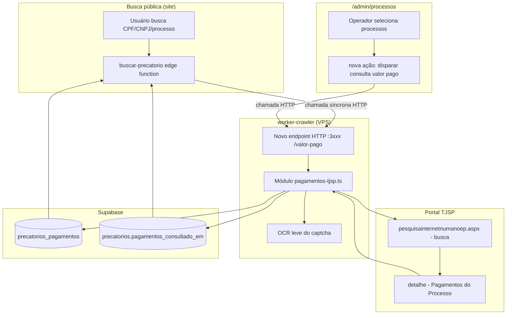

# Arquitetura: Crawler para Valor Pago (FOR-102)

## Visão de alto nível

**Antes:** `precatorios.valor_pago` existe no schema legado mas é dado estático (import manual da
carga inicial). Nem a busca pública nem o admin sabem se um processo `.0500` tem pagamentos, nem
quando essa informação foi verificada pela última vez.

**Depois:** um novo módulo dentro do `worker-crawler` (VPS) sabe navegar o portal TJSP
"Pagamentos Prioridades", resolver o captcha e extrair a lista de pagamentos de um processo `.0500`.
Esse módulo é acionado de duas formas — síncrona pela busca pública, sob demanda pelo admin — e grava
o resultado numa tabela nova, com um campo de controle que registra que a consulta foi feita mesmo
sem pagamentos encontrados.

## Componentes impactados

| Componente | Tipo | Mudança |
|---|---|---|
| `worker-crawler/src/pagamentos-tjsp.ts` | novo arquivo | Navegação do portal TJSP (busca → detalhe), parsing da tabela de pagamentos |
| `worker-crawler/src/captcha.ts` | novo arquivo | OCR leve do captcha (Tesseract ou equivalente); ponto único a trocar se precisar cair pro 2captcha |
| `worker-crawler/src/http-server.ts` | novo arquivo | Servidor HTTP leve (Node `http` nativo, sem framework novo) expondo `POST /valor-pago { processo_depre }`, síncrono |
| `worker-crawler/src/index.ts` | modificado | Sobe o `http-server.ts` junto com o loop de polling existente (dois processos no mesmo `main()`) |
| `worker-crawler/src/supabase.ts` | modificado | Novas funções de upsert em `precatorios_pagamentos` + set de `pagamentos_consultado_em` |
| `supabase/migrations/<timestamp>_for102_pagamentos.sql` | novo | Tabela `precatorios_pagamentos` + coluna `precatorios.pagamentos_consultado_em` + RLS |
| `supabase/functions/buscar-precatorio/index.ts` | modificado | Chamada HTTP síncrona ao worker quando o processo tem `.0500`, antes de montar a resposta |
| `frontend/src/routes/admin.processos.tsx` | modificado | Checkbox de seleção por linha + botão "Buscar valor pago" em lote (**padrão novo** — ver nota abaixo) |
| `frontend/src/lib/api/processos.ts` | modificado | Nova função client para chamar a ação de disparo manual |

## ⚠️ Correção em relação ao `context.md`

O `context.md` afirmava que a seleção em lote no admin seguiria "o mesmo padrão já usado em outras
telas (ex. consulta OAB)". **Isso está incorreto** — investigando `admin.consulta-oab.tsx` (branch
`jjuniorfilho/precatorio-sp` do repo frontend), não existe seleção em lote ali: o botão "Enfileirar"
enfileira **todos** os resultados da busca de uma vez, sem checkbox por linha. Não há nenhum
componente de seleção múltipla em nenhuma tela do admin hoje.

**Consequência:** o checkbox multi-select em `admin.processos.tsx` é um **padrão de UI novo** para
este projeto, não uma reaplicação de algo existente. Trade-off a decidir na implementação:
- **Checkbox por linha + botão em lote** (atende literalmente "quero selecionar quais processos") —
  mais trabalho de UI, estado novo de seleção na tabela.
- **Botão por linha** ("Buscar valor pago" em cada linha da grade) — mais simples de implementar,
  ainda permite escolher processo a processo, só não em lote de uma vez.

*(Corrigido também no `context.md`.)*

## Convenções mantidas

- Migrations em `supabase/migrations/`, nomenclatura `<timestamp>_<slug>.sql`, `IF NOT EXISTS`/
  `CREATE OR REPLACE` para serem re-executáveis (padrão de todas as migrations do FOR-68 e do PR #10).
- RLS: nova tabela `precatorios_pagamentos` segue o mesmo espírito de `precatorios` (leitura pública
  via `anon`, já que dados DEPRE são públicos) — **mas sem CPF/CNPJ**, então não há necessidade de
  mascaramento nessa tabela especificamente (ela só tem data/valor/tipo).
- Naming: snake_case plural (`precatorios_pagamentos`), índice `idx_precatorios_pagamentos_processo_depre`.
- Worker: mesmo estilo de HTTP puro (`undici` + `cheerio`) já usado em `esaj.ts`, evitando introduzir
  Playwright a menos que se prove necessário (ver Premissas).
- Valores monetários em centavos (`BIGINT`), consistente com `critical-rules.md` e o resto do schema.

## Interdependências externas

| Dependência | Novo? | Observação |
|---|---|---|
| `undici` (HTTP client) | não, já existe | Reaproveitado do `esaj.ts` (segue valendo pro e-SAJ) |
| `cheerio` (parse HTML) | não, já existe | Reaproveitado |
| `tesseract` + `imagemagick` (binários de sistema) | **sim, instalado na VPS** | OCR do captcha — 50% de acerto/tentativa, com retry (ver Fase 2 do plan.md) |
| **Playwright** (navegador headless) | **sim — decisão revista na Fase 3** | HTTP puro se provou inviável contra o protocolo AJAX do GeneXus (todas as tentativas retornaram HTTP 440 "Session timeout", causa não isolada mesmo com headers/cookies/URL conferindo com captura real de navegador). Playwright fica restrito a **este fluxo específico** (`pagamentos-tjsp.ts`); o e-SAJ continua HTTP puro. |
| Node `http` nativo | não é lib nova | Suficiente para um endpoint único síncrono; não precisa de Express/Fastify |
| 2captcha (fallback) | condicional | Só se o OCR não for confiável o bastante em produção |

### ⚠️ Restrição de capacidade da VPS (descoberta na Fase 3)

A VPS (`31.97.242.130`) tem **apenas 1 vCPU e ~2GB de RAM livre**, compartilhada com outros
serviços de produção já rodando (`comunica-web-api`, `comunica-saas-api`, `precatorio-crawler`).
Cada instância do Chromium headless consome ~150-300MB de RAM; rodar múltiplas em paralelo (ex.:
2-3 buscas públicas simultâneas de processos `.0500`) arrisca esgotar a memória/CPU da VPS e
degradar **os outros serviços**, não só esta feature.

**Decisão**: o uso do Playwright dentro do `worker-crawler` é **serializado por uma fila interna
(concorrência máxima = 1)** — só um Chromium ativo por vez; requisições concorrentes (tanto do
disparo público síncrono quanto do manual) esperam na fila em vez de rodar em paralelo.
**Consequência aceita**: a busca pública pode ficar mais lenta em picos de tráfego simultâneo pra
processos `.0500` (fila, não erro) — trade-off deliberado pra proteger a estabilidade da VPS
compartilhada em vez de degradar todos os serviços.

## Premissas e limitações

1. **~~Bloqueio de IP~~ CORRIGIDO**: não é geográfico/IP (testado ao vivo da própria VPS, mesmo 403).
   A causa real é falta do token de sessão obtido em `webmenupesquisa.aspx` — fluxo completo (menu →
   token → form → busca → resultado → detalhe) mapeado em `plan.md` Fase 1. Ainda assim, todo teste
   real precisa rodar de um ambiente que alcance `tjsp.jus.br` sem 403 genérico de infra (confirmado
   igual da VPS e do sandbox de dev — não é exclusivo da VPS).
2. **ASP.NET WebForms (.aspx)**: diferente do e-SAJ (Struts/`cpopg`), esse portal provavelmente usa
   `__VIEWSTATE`/`__EVENTVALIDATION` (postback clássico). Isso é mais complexo de replicar via HTTP
   puro que o formulário do e-SAJ, mas ainda é HTTP simples (POST com campos ocultos capturados via
   `cheerio`) — **não deveria** exigir Playwright. Se na prática (só testável da VPS) o
   `__VIEWSTATE` se provar inviável de replicar sem executar JS, Playwright vira necessário —avaliar
   nessa hora, não antecipar a dependência.
3. **Captcha por sessão (hipótese, não confirmada)**: os prints do fluxo busca→detalhe não mostraram
   novo captcha entre os dois passos. Se confirmado, o captcha é resolvido uma vez por sessão
   (cookie), reduzindo o número de OCRs necessários por lote de consultas.
4. **Sem TTL/cache**: por decisão de produto, não há re-consulta automática por tempo — só por evento
   (busca pública nova ou disparo manual). Buscas repetidas do mesmo processo por usuários diferentes
   podem gerar chamadas reais repetidas ao portal. Não mitigado nesta fase (ver Consequências).
5. **Latência da busca pública**: o disparo síncrono pode adicionar segundos (sessão + captcha + form
   + parse) à resposta de `buscar-precatorio`. É uma exceção deliberada à regra de "busca < 2s" do
   `critical-rules.md` — aceita explicitamente pelo usuário do produto.
6. **Timeout de edge function**: `buscar-precatorio` roda em Supabase Edge Function (Deno), que tem
   teto de tempo de execução (~150s, mesmo limite documentado no FOR-73). A chamada síncrona ao
   worker precisa ter timeout interno confortavelmente abaixo disso.

## Trade-offs e alternativas consideradas

| Decisão | Alternativa descartada | Por quê |
|---|---|---|
| Endpoint HTTP dentro do `worker-crawler` | Serviço novo separado | Reaproveita deploy/credenciais/infra já rodando; menos um processo pra manter na VPS |
| Vínculo só por `processo_depre` | FK também para `incidente_id` | Mais simples, funciona pros dois schemas (legado + novo) sem exigir join adicional |
| Entrega manual + automático juntos | Faseamento manual-first | Decisão do usuário — aceita o risco de expor o fluxo síncrono público já na primeira entrega |
| OCR leve primeiro, 2captcha como fallback | 2captcha desde o início | Usuário pediu explicitamente para evitar custo dado quão simples é o captcha observado |
| ~~HTTP puro (undici+cheerio)~~ **→ Playwright** | HTTP puro (tentado primeiro, por consistência) | **Revertido na Fase 3**: todas as tentativas de replicar o protocolo AJAX do GeneXus via HTTP puro retornaram HTTP 440, sem causa isolável no tempo investido. Playwright fica restrito a este fluxo; e-SAJ continua HTTP puro. |
| Playwright serializado (fila, máx. 1 concorrente) | Playwright sem limite de concorrência | VPS tem só 1 vCPU/~2GB livres, compartilhada com outros serviços de produção — concorrência sem limite arrisca derrubar a VPS inteira, não só esta feature |

## Consequências adversas (a monitorar, não bloqueantes)

- Custo/latência crescente se o volume de buscas públicas repetidas para os mesmos processos for alto
  e cair no fallback 2captcha com frequência — sem TTL, não há proteção automática contra isso.
- Se o portal TJSP tiver rate-limiting HTTP (não documentado ainda), disparos síncronos simultâneos de
  vários usuários podem competir/bloquear — sem fila/lock nesta primeira versão (decisão consciente:
  entrega direta, não faseada).

## Arquivos principais a criar/modificar

**Novos:**
- `supabase/migrations/<timestamp>_for102_pagamentos_tjsp.sql`
- `worker-crawler/src/pagamentos-tjsp.ts`
- `worker-crawler/src/captcha.ts`
- `worker-crawler/src/http-server.ts`

**Modificados:**
- `worker-crawler/src/index.ts` (sobe o http-server)
- `worker-crawler/src/supabase.ts` (upsert em `precatorios_pagamentos`)
- `worker-crawler/package.json` (nova dependência de OCR)
- `supabase/functions/buscar-precatorio/index.ts` (chamada síncrona condicional a `.0500`)
- `frontend/src/routes/admin.processos.tsx` (UI de disparo manual)
- `frontend/src/lib/api/processos.ts` (client da nova ação)

---

## ✅ Verificação de Consistência

**Data**: 2026-07-21
**Status**: ⚠️ CORRIGIDO

### Checklist
- [x] context.md e architecture.md consistentes
- [x] Conforme especificação de negócio (issue FOR-102 refinada)
- [x] Conforme padrões/convenções do projeto (migrations, RLS, naming, HTTP puro no worker)
- [x] Valores e regras de negócio conferidos

### Correções Aplicadas
- `context.md` afirmava existir um "padrão já usado" de seleção em lote no admin (ex. consulta OAB).
  Investigação no repo frontend (`admin.consulta-oab.tsx`) mostrou que isso não existe — o botão
  "Enfileirar" ali enfileira todos os resultados de uma busca, sem checkbox por linha. Corrigido em
  ambos os documentos: a seleção em lote em `admin.processos.tsx` é um padrão de UI novo.

### Notas
- Decisão de arquitetura mais sensível (HTTP puro vs Playwright) só pode ser validada rodando da VPS,
  por causa do bloqueio de IP — o plano de execução deve reservar uma fase inicial de reconhecimento
  manual do portal antes de codar o parser definitivo.
