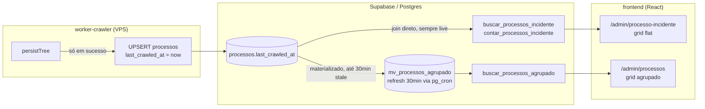

# Architecture: FOR-118 — Data do último crawl (filtro + coluna)

## Visão de alto nível

**Descoberta central da investigação:** o dado já existe e já é mantido em produção.
`processos.last_crawled_at` (coluna `TIMESTAMPTZ`, existe desde o schema original
FOR-69) é setada pelo worker em `worker-crawler/src/supabase.ts:111`, dentro de
`persistTree()` — função chamada **só quando o crawl termina com sucesso** (upsert da
árvore inteira processo→cumprimentos→incidentes→partes). Em erro, o worker nunca chama
`persistTree`, então o valor anterior fica intacto. Essa é exatamente a semântica pedida:
"último sucesso, ignorando falhas recentes". O campo já alimenta o agendamento de
recrawl (`next_crawl_at = COALESCE(last_crawled_at, NOW()) + ttl`, em
`sql/2026-07-24_for112_oc_calculado.sql`), então é um campo vivo, não um resquício morto.

Isso descarta as duas abordagens cogitadas antes da investigação (subquery correlacionada
em `crawler_queue`, ou nova coluna denormalizada + trigger) — nenhuma das duas é
necessária. O trabalho vira: **expor um campo que já existe** nas duas RPCs + grid +
filtro + CSV, mais um índice novo.

## Estado anterior → posterior

| | Antes | Depois |
|---|---|---|
| Coluna "Crawler" (status) | mostra status da tentativa mais recente (`crawler_queue`), sem data | inalterada — continua existindo do lado das novas colunas |
| Data do último sucesso | não exibida em lugar nenhum do admin | nova coluna "Última atualização" nas 2 telas |
| Filtro por atualização | inexistente | De/Até + Sim/Não/Todos nas 2 telas |
| CSV | sem esses campos | inclui as 2 colunas novas |

## Componentes impactados

### Backend (`cortex-v1`)
- **`processos`** (tabela) — nenhuma mudança de schema, só um índice novo:
  `idx_processos_last_crawled_at` (btree simples). Sem `WHERE flag_sp` parcial porque o
  filtro é usado tanto pro flat (`incidentes` join `processos`) quanto pro agrupado
  (MV já pré-filtra `flag_sp`).
- **`mv_processos_agrupado`** (materialized view) — precisa ser recriada (Postgres não
  suporta `ALTER MATERIALIZED VIEW ... ADD COLUMN`) incluindo `p.last_crawled_at` no
  SELECT. Mesmo padrão do FOR-112 (`DROP MATERIALIZED VIEW` + `CREATE` + recriar todos
  os índices + `grant select` + `refresh_mv_processos_agrupado()` manual imediato pra
  não esperar a janela de 30min).
- **`_where_processo_incidente`** (helper `plpgsql`, usado por `buscar_processos_incidente`
  e `contar_processos_incidente`) — adicionar 3 parâmetros
  (`p_crawler_data_de date`, `p_crawler_data_ate date`, `p_crawleado boolean`) e as
  cláusulas correspondentes, comparando direto `p.last_crawled_at` (coluna real, sem
  subquery) — mesmo padrão de literais via `format(...%L)` já usado ali.
- **`buscar_processos_incidente`** — `RETURNS TABLE` ganha coluna `last_crawled_at
  timestamptz`; como o shape de retorno muda, precisa `DROP FUNCTION IF EXISTS` com a
  assinatura atual antes do `CREATE` (Postgres não permite `CREATE OR REPLACE` mudar
  colunas de retorno). Novo `grant execute` com a assinatura completa.
- **`contar_processos_incidente`** — só ganha os 3 parâmetros de filtro (retorno
  continua `bigint`) — `CREATE OR REPLACE` direto, sem DROP.
- **`buscar_processos_agrupado`** — mesma lógica: `RETURNS TABLE` ganha
  `last_crawled_at`, filtros direto em `m.last_crawled_at` (coluna da MV, sem
  subquery/semi-join), precisa `DROP FUNCTION IF EXISTS` + `CREATE` (mesmo precedente do
  FOR-112 ao adicionar `anos_oc_presentes`).
- Arquivo novo: `sql/2026-07-31_for118_data_ultimo_crawl.sql`, aplicado manualmente no
  SQL Editor (sem staging — validar com `EXPLAIN ANALYZE` antes, só leitura).

### Frontend (`frontend`, repo separado)
- **`frontend/src/lib/api/processos.ts`**:
  - `ProcessoIncidenteRow` e `ProcessoAgrupadoRow`: `+ last_crawled_at: string | null`.
  - `BuscarProcessosFiltros`: `+ crawlerDataDe/crawlerDataAte: string | null` e
    `+ crawleado: boolean | null`.
  - `buscarProcessosIncidente`, `contarProcessosIncidente`, `buscarProcessosAgrupado`:
    repassar os 3 novos params (`p_crawler_data_de`, `p_crawler_data_ate`,
    `p_crawleado`) nas chamadas `db.rpc(...)`.
- **`frontend/src/routes/admin.processo-incidente.tsx`**: novo par de campos de filtro
  (padrão idêntico ao bloco "Nesta fase desde" + `FilterSelect` idêntico ao
  `EM_CUMPRIMENTO_OPTIONS`), 2 colunas novas no `<thead>`/`<tbody>`, entradas na URL
  (`ProcessoIncidenteSearch`, `validateSearch`, `armed`, efeito de sync), e no
  `exportCsv`.
- **`frontend/src/routes/admin.processos.tsx`**: mesmo conjunto de mudanças, adaptado à
  estrutura desta tela (`ProcessosSearch`, grid em `ProcessoGroupRows`, `exportCsv`
  próprio).
- Componente de exibição: reaproveitar `formatDate` (já importado nos dois arquivos) pra
  "Última atualização", e o componente `Sim`/badge já existente em
  `admin.processo-incidente.tsx` (ou equivalente simples em `admin.processos.tsx`, que
  hoje não tem esse componente — criar um badge Sim/Não local ali, ou extrair pra
  compartilhado se preferir; decisão de implementação, não bloqueia arquitetura).

## Convenções mantidas
- snake_case em params/colunas SQL; `p_` prefixo em parâmetros de RPC.
- Filtros De/Até como `date` (não `timestamptz`) no parâmetro, comparando contra a coluna
  `timestamptz` com `>= data_de` e `< data_ate + 1` (padrão exclusivo no limite superior,
  evita perder registros do próprio dia final) — mesmo padrão dos filtros de data
  existentes (`fase_desde`, `descoberto`).
- Estado de filtro espelhado na URL (padrão FOR-109), em ambas as telas.
- `DROP FUNCTION IF EXISTS` antes de mudar `RETURNS TABLE`, `CREATE OR REPLACE` quando só
  muda parâmetro — mesmo critério usado nos arquivos SQL anteriores deste projeto.

## Dependências externas
Nenhuma nova. Reaproveita `formatDate`, componentes shadcn/ui já usados nas telas,
`pg_cron` já agendado pra `refresh_mv_processos_agrupado()`.

## Limitações e premissas
- **Sem staging** — validação via `EXPLAIN ANALYZE` direto em produção (somente leitura)
  antes de aplicar o SQL definitivo.
- **Staleness da tela agrupada**: como `buscar_processos_agrupado` lê da MV (refresh a
  cada 30min), "Última atualização"/"Crawleado" ali podem ficar até 30min desatualizados
  em relação à tela flat (que lê `processos` direto, sempre live). Isso já é o
  comportamento existente pra todos os outros campos dessa tela (fase, elegível, etc.) —
  não é uma regressão nova, só uma característica herdada que vale documentar.
- Premissa: `processos.cnj`/`processo_codigo` já é a chave usada em todo o resto do
  sistema pra correlacionar com o worker — `last_crawled_at` é setado por
  `processo_codigo` via upsert, então é confiável pra qualquer processo que já passou
  pelo crawler pelo menos uma vez.

## Trade-offs e alternativas descartadas
1. **Subquery correlacionada em `crawler_queue`** (plano original, baseado no arquivo
   `for111` desatualizado) — descartada: mais cara, dependia de índice parcial novo, e
   se tornou irrelevante assim que `last_crawled_at` foi descoberto.
2. **Coluna denormalizada + trigger em `crawler_queue`** (segunda opção, aprovada antes
   da descoberta) — descartada: replicaria uma coluna que já existe e já é mantida pelo
   worker; criar um segundo mecanismo de escrita pro mesmo dado é redundância pura, com
   risco de os dois divergirem.
3. **Expor `last_crawled_at` sem recriar a MV** (só na tela flat) — descartada porque o
   usuário pediu as duas telas; a MV precisa do campo pra tela agrupada funcionar.

## Consequências adversas
- Recriar a MV (`DROP` + `CREATE`) tem uma janela onde a tela `/admin/processos` fica sem
  dado até o `refresh` manual rodar logo em seguida (mesmo padrão já aceito no FOR-112).
- `DROP FUNCTION IF EXISTS` nas duas RPCs de retorno-tabela invalida brevemente as
  permissões — reafirmadas pelo `grant execute` que já vem em seguida no mesmo script.

## Arquivos principais

**cortex-v1:**
- `sql/2026-07-31_for118_data_ultimo_crawl.sql` (novo — índice, MV, helper, 3 funções)

**frontend:**
- `src/lib/api/processos.ts`
- `src/routes/admin.processo-incidente.tsx`
- `src/routes/admin.processos.tsx`

---

## ✅ Verificação de Consistência

**Data**: 2026-07-31
**Status**: ⚠️ CORRIGIDO

### Checklist
- [x] context.md e architecture.md consistentes
- [x] Conforme especificação de negócio (issue FOR-118 no Linear)
- [x] Conforme padrões/convenções do projeto (nomenclatura, DROP/CREATE, URL state, EXPLAIN ANALYZE antes de aplicar)
- [x] Valores e regras de negócio conferidos

### Correções Aplicadas
- `context.md` ainda descreve a abordagem "subquery em `crawler_queue`" nas seções "Como"
  e "Rollout" — desatualizada em relação a este arquivo. Motivo: a descoberta de
  `processos.last_crawled_at` aconteceu durante a fase de Estruturação Arquitetural,
  depois do `context.md` já salvo e aprovado. `architecture.md` é a fonte da verdade
  técnica a partir daqui; `context.md` será atualizado com uma nota de correção em vez de
  reescrito por completo, pra manter o histórico da sessão legível.
- Issue FOR-118 no Linear também precisa da mesma atualização (pendente — fazer antes de
  `/plan`).

### Notas
A issue no Linear e o `context.md` ainda documentam a "Escopo ampliado" com a subquery em
`crawler_queue` como plano técnico — isso será substituído pelo plano deste arquivo
(`last_crawled_at` já existente) antes de avançar para `/plan`, já que a especificação de
negócio (o quê) não muda, só o "como" técnico, que ficou mais simples.
