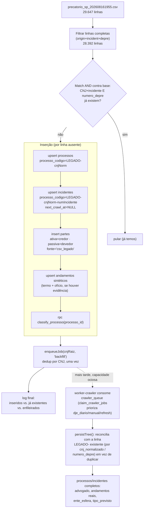

# Architecture: FOR-143 — Importar precatórios de dump CSV legado

## Visão de alto nível

**Antes:** a base própria (`processos`/`incidentes`/`partes`) só é populada pelo crawler e-SAJ
(`worker-crawler`), que descobre processos via DJE diário/backfill e visita cada um. O CSV
legado (29.647 linhas de terceiro) fica fora da base — não há como saber quais desses casos já
temos sem uma comparação manual.

**Depois:** um script one-off, rodado uma vez fora do loop normal do worker, lê o CSV, casa
contra a base atual e insere só os casos ausentes — usando os mesmos helpers de persistência
que o crawler já usa (`upsertReturningId`, `classifyProcesso`), então os dados importados ficam
no mesmo formato/qualidade estrutural que os dados crawleados (exceto pelos campos que o CSV
simplesmente não tem — ver Limitações).



## Componentes impactados

| Componente | Tipo | Descrição |
|---|---|---|
| `worker-crawler/src/import-csv-legado.ts` | **novo** | Script principal, `tsx src/import-csv-legado.ts [--dry-run]` |
| `worker-crawler/src/parse.ts` | **modificado** | Estende `classifyEsfera()` (linha 55) com as entidades do CSV que hoje caem em `'Outro'` |
| `sql/2026-08-16_for143_partes_fonte_csv_legado.sql` | **novo** | `ALTER TABLE partes DROP/ADD CONSTRAINT` pra aceitar `fonte='csv_legado'` |
| `sql/2026-08-16_for143_claim_prioriza_nao_backfill.sql` | **novo** | `CREATE OR REPLACE FUNCTION claim_crawler_jobs` — ordena `CASE WHEN origem='backfill' THEN 1 ELSE 0 END, scheduled_at` em vez de só `scheduled_at`. Backfill só consome capacidade ociosa. |
| `worker-crawler/src/supabase.ts` | **modificado** | `persistTree()` ganha reconciliação: antes do upsert de `processos`/`incidentes`, se existir linha com mesmo `cnj_normalizado`/`numero_depre` e `processo_codigo LIKE 'LEGADO-%'`, atualiza o `processo_codigo` dela pro real em vez de deixar criar uma linha nova |
| `worker-crawler/package.json` | **modificado** | Novo script `"import-csv-legado": "tsx src/import-csv-legado.ts"` |

Nada em `supabase/migrations/` (esse diretório parou de receber arquivo novo depois do FOR-76 —
convenção atual é `sql/YYYY-MM-DD_descricao.sql`, aplicado manualmente no SQL Editor).

## Dependências reusadas (não recriar)

- `worker-crawler/src/supabase.ts`:
  - `supabase` (client `service_role`) + `ensureAuth()`
  - `upsertReturningId(table, row, onConflict)` — padrão de upsert idempotente por
    `processo_codigo`, já usado por `persistTree()`
  - `classifyProcesso(processoId)` — chama a RPC `classify_processo`
- `worker-crawler/src/parse.ts`: `classifyEsfera(nome)` — a estender
- `worker-crawler/src/config.ts`: `config`, `assertConfig()`, `sleep()`
- `worker-crawler/src/index.ts` (linha 61): padrão `runPool<T>(items, limit, fn)` — não
  exportado; replicar uma cópia local de ~8 linhas no script novo (é o padrão do resto do
  worker: cada script CLI é standalone).
- Tabela `classificacao_regras` (via `classify_processo`) — reusa os padrões já cadastrados,
  nenhuma regra nova precisa ser inserida (`'%ofício requisitório%expedido%'` e
  `'%termo de declaraç%'` já cobrem os textos sintéticos escolhidos).

## Fluxo detalhado por linha do CSV

1. **Filtro de completude**: pula linhas sem `origin_process_number`, `incident_number` ou
   `depre_number` (1.255 de 29.647 — fora de escopo, ver contexto).
2. **Parse**: `origin_process_number` (`"CNJ/NNNN"`) → `cnjRaiz` + `numeroIncidente` (valida
   que `NNNN === incident_number`, loga divergência se houver, não bloqueia).
3. **Match contra base** (AND): existe `processos` com `cnj_normalizado = cnjNorm(cnjRaiz)` E
   `incidentes` filho com `numero_incidente = numeroIncidente` E `numero_depre =
   depre_number`? Se sim → pula. Senão → segue pra inserção.
   - Implementação: uma query em lote (`select` com `.in(...)` em chunks) no início do script
     pra montar um `Set` de chaves já existentes, em vez de 1 SELECT por linha (28k linhas).
4. **Upsert `processos`** (chave: `processo_codigo = "LEGADO-" + cnjNorm(cnjRaiz)`):
   `cnj`, `cnj_normalizado`, `flag_sp=true`, `ente_nome` (= `debtor_entity` ou `null`),
   `ente_esfera` (via `classifyEsfera(debtor_entity)`, `null` se `debtor_entity` vazio),
   `status=null`, `last_crawled_at=null`, `next_crawl_at=null` (nunca cai no refresh
   automático — código placeholder não existe no e-SAJ).
   - **Nota de modelagem**: o CSV não distingue "processo raiz" de "cumprimento de sentença"
     (camada intermediária do schema, tabela `cumprimentos`). Como `incidentes.cumprimento_id`
     é nullable, o script trata `origin_process_number` direto como o `processos.cnj` (raiz) e
     **não cria linha em `cumprimentos`** — simplificação aceitável; se esse processo for
     descoberto de verdade pelo crawler depois, o crawler resolve a árvore completa e
     `upsertReturningId` faz o merge por `processo_codigo`/CNJ normalmente.
5. **Upsert `incidentes`** (chave: `processo_codigo = "LEGADO-" + cnjNorm(cnjRaiz) + "-" +
   numeroIncidente`): `processo_id`, `cumprimento_id=null`, `numero_incidente`,
   `numero_depre=depre_number`, `tipo_previsto='Indefinido'`, `valor_acao` (=
   `creditor_total_amount * 100`, arredondado), `data_base=update_base_date`, `cnj=cnjRaiz`,
   `cnj_normalizado`, `status=null`.
6. **Insert `partes`**:
   - `papel='ativa'`: `nome=creditor_name`, `documento` = `creditor_document` normalizado (só
     dígitos), sem advogado/OAB (CSV não traz), `fonte='csv_legado'`.
   - `papel='passiva'`: `nome=debtor_entity` (ou `null`), sem documento, `fonte='csv_legado'`.
7. **Andamentos sintéticos** (upsert por `(incidente_id, hash)`, mesmo padrão de
   `persistTree`): se `depre_number` presente (sempre, é filtro de completude) e há evidência
   de ofício expedido (`oc_number` presente OU `order_number` presente) →
   - `{data: decision_date, descricao: "Termo de declaração de crédito (importado — CSV legado)"}`
   - `{data: decision_date, descricao: "Ofício requisitório expedido (importado — CSV legado)"}`

   Se não houver evidência de ofício, não insere andamento nenhum (fica em fase
   `'calculo'`/`direito_creditorio` via `classify_processo`, o que é o correto — sem
   evidência, não assume nada).
8. **Chama `classify_processo(processo_id)`** — deriva `fase`/`macrofase`/flags a partir dos
   andamentos inseridos no passo 7 (ou ausência deles).
9. **Enfileira o complemento** (só pras linhas efetivamente inseridas, não pras puladas):
   `enqueueJob(cnjRaiz, "backfill")` — CNJ real, deduplicado em memória por `Set<cnjRaiz>`
   antes de disparar (múltiplos incidentes podem compartilhar o mesmo processo raiz). A RPC
   `enqueue_crawler_job` já deduplica no banco também (`ON CONFLICT DO NOTHING` na unique
   parcial de jobs em aberto).
10. **Log**: contador incremental (`inseridos`, `já_existentes`, `enfileirados`, `erros`) +
    registro em `coleta_runs` (`rotina='import_csv_legado'`), mesmo padrão de
    `reclassify-oc.ts`.

## Reconciliação LEGADO → real (em `persistTree()`)

Quando o worker eventualmente processa um job `backfill` enfileirado por este script, ele
resolve o CNJ real via `searchByCnj` e chama `persistTree()` normalmente — só que agora precisa
saber que já existe uma linha "provisória" pra aquele CNJ. Duas reconciliações, cada uma logo
antes do `upsertReturningId` correspondente:

```sql
-- processos: por cnj_normalizado
UPDATE processos SET processo_codigo = :codigo_real
 WHERE cnj_normalizado = :cnj_norm AND processo_codigo LIKE 'LEGADO-%';

-- incidentes: por numero_depre (mais confiável que cnj_normalizado do incidente,
-- que no CSV é derivado do processo raiz + sufixo, não necessariamente igual ao
-- cnj do incidente real crawleado)
UPDATE incidentes SET processo_codigo = :codigo_real_incidente
 WHERE numero_depre = :numero_depre AND processo_codigo LIKE 'LEGADO-%';
```

Depois dessas duas `UPDATE`s (idempotentes, 0 ou 1 linha afetada), o restante de `persistTree()`
segue sem mudança — `upsertReturningId(..., onConflict:"processo_codigo")` agora bate na mesma
linha (já renomeada) em vez de inserir uma nova. `partes` é sempre substituído por completo
(delete + insert) a cada crawl, então os dados do CSV somem sozinhos quando os reais do e-SAJ
chegam. `andamentos` sintéticos convivem com os reais (upsert por `hash`, texto diferente ⇒ sem
conflito) — inofensivo, e os textos sintéticos continuam batendo nos padrões de
`classificacao_regras` mesmo depois, então a classificação não regride.

## Convenções mantidas

- Script standalone em `worker-crawler/src/`, `tsx`, entry point guardado por
  `import.meta.url === file://process.argv[1]`.
- `service_role` via `config.ts`/`assertConfig()`.
- Idempotência via upsert por `processo_codigo` (não por PK) — reexecutar o script não duplica.
- Registro em `coleta_runs` (rotina nova: `import_csv_legado`) — não precisa de linha em
  `coleta_config` (não é uma rotina agendada, é one-off manual).
- `--dry-run`: roda os passos 1-3 (filtro + match), imprime quantos seriam inseridos/pulados,
  **não** executa os passos 4-9. Obrigatório dado o volume indo pra produção.
- Concorrência limitada (`runPool`, mesmo default `config.concurrency`) só no passo de escrita
  em lote (4-8) — passos 1-3 são leitura em batch, sem necessidade de pool.

## Trade-offs e alternativas descartadas

- **Enfileirar no crawler em vez de insert direto** (alternativa considerada no refine):
  descartada — decisão explícita do usuário foi insert direto, aceitando que os dados fiquem
  incompletos (sem advogado/andamentos reais) até um crawl futuro opcional.
- **Criar `cumprimentos`**: descartado — CSV não tem dado pra isso, e o campo é nullable no
  schema justamente pra suportar esse tipo de caso incompleto.
- **Reclassificar via SQL puro (`classify_all()`)**: descartado — mais lento e sem controle de
  progresso; melhor chamar `classify_processo()` por processo, dentro do próprio loop de
  inserção (mesmo padrão de `reclassify-oc.ts`).

## Limitações e premissas (já validadas com o usuário)

- ~26% dos importados ficam com `ente_nome`/`ente_esfera` nulos e `tipo_previsto='Indefinido'`
  **até o disparo pro DEPRE completar** — sem SLA definido, depende de capacidade ociosa da
  fila (`backfill` é sempre a menor prioridade em `claim_crawler_jobs`).
  `next_crawl_at=NULL` nos registros LEGADO- garante que eles não entram no refresh automático
  por conta própria — só saem do estado "congelado" via este enfileiramento único.
- 1.255 linhas do CSV (linhas sem CNJ de origem completo) são ignoradas, sem enfileiramento
  (não há CNJ pra buscar).
- Reconciliação cobre `processos`/`incidentes`; `partes` já se resolve sozinho (substituição
  completa a cada crawl); `andamentos` sintéticos ficam residualmente na tabela mesmo após o
  crawl real (não são removidos) — inofensivo pra classificação, mas é histórico "extra" que
  não veio de fato do e-SAJ. Se isso incomodar no futuro, dá pra marcar/limpar depois; fora de
  escopo agora.

## Principais arquivos a criar/modificar

1. `worker-crawler/src/import-csv-legado.ts` (novo)
2. `worker-crawler/src/parse.ts` (estender `classifyEsfera`)
3. `worker-crawler/src/supabase.ts` (reconciliação LEGADO→real em `persistTree()`)
4. `sql/2026-08-16_for143_partes_fonte_csv_legado.sql` (novo)
5. `sql/2026-08-16_for143_claim_prioriza_nao_backfill.sql` (novo)
6. `worker-crawler/package.json` (novo script de conveniência)

---

## ✅ Verificação de Consistência

**Data**: 2026-08-16
**Status**: ✅ APROVADO

### Checklist
- [x] `context.md` e `architecture.md` consistentes (mesmo filtro de completude, mesmas
  regras de match/inferência, mesma decisão sobre linhas só-DEPRE e devedor em branco)
- [x] Conforme especificação de negócio (issue FOR-143 no Linear — POR QUE/O QUE/COMO)
- [x] Conforme padrões/convenções do projeto (`sql/` como diretório de migration atual,
  `worker-crawler/src/*.ts` como local de scripts one-off, reuso de `upsertReturningId`/
  `classifyProcesso`/`classifyEsfera`/`runPool`)
- [x] Valores e regras de negócio conferidos (centavos, CNJ normalizado, elegibilidade via
  termo+ofício, `flag_sp` sempre true)

### Correções Aplicadas
- Adicionado o disparo único pro DEPRE (enqueue `backfill` + reconciliação LEGADO→real +
  priorização de fila) a pedido do usuário, depois da primeira versão deste documento.
  `context.md` e este arquivo foram atualizados juntos para refletir a mesma decisão (ver
  seção "Complemento via disparo único pro crawler" em `context.md`).

### Notas
`docs/technical-context/project-briefing.md` e `briefing/backend-conventions.md` estão
desatualizados (schema pré-FOR-68) — não usados como fonte de verdade aqui; as migrations
reais (`supabase/migrations/` + `sql/`) foram a referência.
