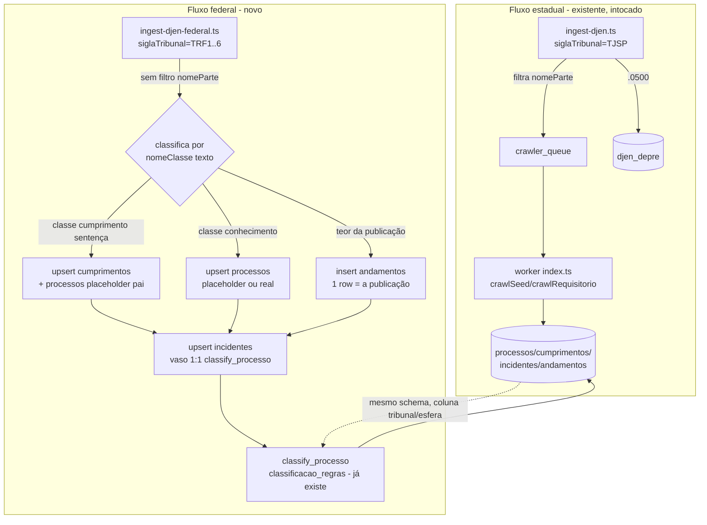

# Architecture: Captura de precatórios federais via DJEN (TRF1-6)

**Issue:** FOR-145 · **Branch:** `jjuniorfilho/for-145-captura-precatorios-federais-djen`

## Visão de alto nível

**Antes:** `worker-crawler/src/ingest-djen.ts` roda no cron da VPS, filtra o caderno DJEN por `nomeParte` (entes públicos SP), flagueia CNJs relevantes e enfileira pro crawler e-SAJ (`crawler_queue`), que visita o TJSP e constrói a árvore real `processos`→`cumprimentos`→`incidentes`+`andamentos`. `djen_depre` guarda flat os requisitórios `.0500` (não viram processo principal).

**Depois:** um script novo e paralelo, `ingest-djen-federal.ts`, roda num cron/processo separado por tribunal (TRF1-6). Sem crawler de origem — a publicação DJEN em si é a única fonte de dado. Classifica por `nomeClasse` (texto) + `classificacao_regras` (teor) e persiste na MESMA árvore `processos`/`cumprimentos`/`incidentes`/`andamentos`, usando o padrão de placeholder já existente no projeto (incidente `Indefinido`, `LEGADO-`) pra suprir a ausência de crawler.

## Componentes impactados

| Componente | Tipo | Mudança |
|---|---|---|
| `worker-crawler/src/ingest-djen-federal.ts` | **novo arquivo** | Script standalone (CLI, igual `ingest-djen.ts`): fetch paginado API Comunica por TRF, classifica, persiste. Não reutiliza `ingest-djen.ts` (decisão: zero risco de regressão no fluxo TJSP em produção). |
| `processos` / `cumprimentos` / `incidentes` | schema (ALTER) | + coluna `tribunal` (TEXT: `TJSP`,`TRF1`..`TRF6`), + coluna `sistema` (TEXT: `pje`,`eproc`,`outro`) em `processos`/`cumprimentos`. `ente_esfera` CHECK ganha valor `'Federal'`. |
| `djen_dias` | schema (ALTER) | Hoje PK é só `data` (1 linha/dia, implícito TJSP). Precisa virar PK composta `(data, tribunal)` pra suportar 6 tribunais em paralelo — `tribunal` novo, default `'TJSP'` nas linhas existentes (retrocompatível). |
| `coleta_config` | schema (ALTER) | CHECK de `rotina` hoje só aceita `('caderno_dje','crawler_esaj','backfill','refresh')` — precisa incluir as 6 rotinas novas (proposta: `caderno_djen_trf1`..`caderno_djen_trf6`, distinguindo do `caderno_dje` estadual). 6 INSERTs, `enabled=true` só pra TRF1/3/5 (Fase A) no seed inicial. |
| `classify_processo()` / `classificacao_regras` (FOR-72) | **reaproveitado, intocado** | Roda igual já roda hoje — o federal só precisa garantir que toda `cumprimentos` tenha uma `incidentes` "vaso" (1:1) apontando pra ela, com `numero_depre` sempre NULL. |
| `djen_depre` | **não usado pelo federal** | Correção em relação ao PRD original: esse table existe pro caso `.0500` do TJSP (requisitório com número próprio que nunca vira processo principal) — o federal **não tem esse conceito** (confirmado pelo usuário: só processo principal + cumprimento de sentença). Não reaproveitar. |
| `crawler_queue` / `enqueue_crawler_job` | **não tocado** | Sem crawler de origem no federal, não há o que enfileirar nesta entrega. |

## Convenções mantidas

- Centavos BIGINT, UUID `gen_random_uuid()`, TIMESTAMPTZ, snake_case plural, `idx_{tabela}_{coluna}`, `update_updated_at()` — mesmas do FOR-69.
- Padrão de placeholder pra dado incompleto: já usado 2x (incidente `tipo_previsto='Indefinido'` do FOR-71; linhas `LEGADO-` do FOR-143, reconciliadas via `merge_legado_processo`/`merge_legado_incidente`). O federal introduz um **terceiro uso** do mesmo padrão — placeholder em `processos` quando não se conhece o CNJ do processo de conhecimento.
- Idempotência via upsert com `onConflict` — mesmo padrão do `ingest-djen.ts` (`ignoreDuplicates` onde aplicável).
- `coleta_config`/`coleta_runs`/`djen_dias` como mecanismo de observabilidade/controle — reaproveitado, não reinventado.

## Interdependências externas

- API Comunica (`comunicaapi.pje.jus.br/api/v1/comunicacao`) — mesma API, parametrizada por `siglaTribunal`. Sem filtro server-side por classe (só `nomeParte`, que não usamos no federal); paginação client-side.

## Premissas

- Classes CNJ padronizadas nacionalmente (`nomeClasse`) — mesmos nomes já usados em `classes_relevantes` pro TJSP — aparecem de forma consistente nos 6 TRFs. **A confirmar com amostra real antes de fechar a lista definitiva** (pendência já registrada na FOR-145).
- O payload da API Comunica é estruturalmente igual entre PJe (TRF1/3/5) e eproc (TRF2/4/6) — confirmado nos testes ao vivo desta sessão (campos `nomeClasse`/`codigoClasse`/`link`/`destinatarios` presentes nos 6).
- Sem processo de conhecimento conhecido a priori, todo `cumprimentos` federal pendura num `processos` placeholder — aceitável porque não há telas/fluxos do produto hoje que dependam de `processos.valor_acao`/`distribuicao` reais para dados federais (essa entrega não afeta o produto público).

## Trade-offs e alternativas descartadas

- **Classificação por `codigoClasse` numérico** (proposta original do brainstorm) — descartada: schema já revelou que o TJSP classifica por texto (`nomeClasse` + `classes_relevantes`), padrão a reaproveitar em vez de caçar códigos numéricos incertos.
- **Refatorar `ingest-djen.ts` genérico** — descartado: risco de regressão no job estadual em produção não compensa a redução de duplicação.
- **Adaptar `classify_processo()` pra aceitar `cumprimentos` sem incidente real** — descartado: manteria mais fiel à realidade federal (sem registro fictício), mas mexeria em código que hoje só serve o estadual validado em produção. Preferiu-se o "vaso" 1:1.
- **Persistência flat estilo `djen_depre`** (sem árvore) — descartada: ficaria fora das telas admin existentes (`/admin/processos`, FOR-107), exigindo UI própria depois.

## Consequências adversas

- Placeholders em `processos` sem dado real (`valor_acao`, `distribuicao` etc. ficam NULL) — se alguém rodar relatórios que assumem esses campos preenchidos, pode gerar ruído. Mitigação: coluna `tribunal`/`sistema` permite filtrar/excluir federal desses relatórios até haver um crawler federal real.
- `djen_dias` muda de chave primária (`data` → `data, tribunal`) — precisa migrar dados existentes (default `tribunal='TJSP'`) sem quebrar o job estadual em produção. Cuidado na migration.
- Volume 3-6x maior de requisições à API Comunica (Fase A: 3 tribunais em paralelo) — risco de rate-limit já mapeado no PRD; mitigado por concorrência conservadora + cron separado.

## Principais arquivos a criar/modificar

1. `worker-crawler/src/ingest-djen-federal.ts` (novo) — script principal.
2. `sql/2026-09-0X_for145_schema_federal.sql` (novo) — ALTERs (tribunal/sistema/ente_esfera, djen_dias PK, coleta_config CHECK) + seeds.
3. `worker-crawler/src/config.ts` — possível novo bloco de config (concorrência/delay conservadores específicos do federal, se não reaproveitar os mesmos `CONCURRENCY`/`DELAY_MS` do estadual).
4. `worker-crawler/README.md` — documentar o novo script/uso (padrão já seguido pro `ingest-djen.ts`).

---

## ✅ Verificação de Consistência

**Data:** 2026-09-05
**Status:** ✅ APROVADO (com correções aplicadas durante a própria elaboração)

### Checklist
- [x] `context.md` e `architecture.md` consistentes (context.md será atualizado com as correções abaixo antes da aprovação final)
- [x] Conforme requisito de negócio (FOR-145) — 2 correções foram propagadas de volta pra issue durante esta sessão
- [x] Conforme padrões/convenções do projeto (placeholder pattern, upsert idempotente, `coleta_config`/`djen_dias` como observabilidade)
- [x] Valores/regras conferidos contra o schema real (não supostos)

### Correções aplicadas durante a elaboração
1. Classificação: `codigoClasse` numérico → `nomeClasse` texto (reaproveitando `classes_relevantes` já validado em produção). Já propagado para a FOR-145.
2. Persistência: descoberta de que a árvore requer processo placeholder (FK NOT NULL) — resolvido com o padrão já usado 2x no projeto (incidente Indefinido / LEGADO-).
3. `djen_depre` removido do escopo — não existe conceito de requisitório-com-número-próprio (.0500) no federal; só processo principal + cumprimento de sentença (confirmado pelo usuário).

### Notas
`context.md` atualizado (remoção da menção a `djen_depre`, adição do padrão de processo placeholder).
