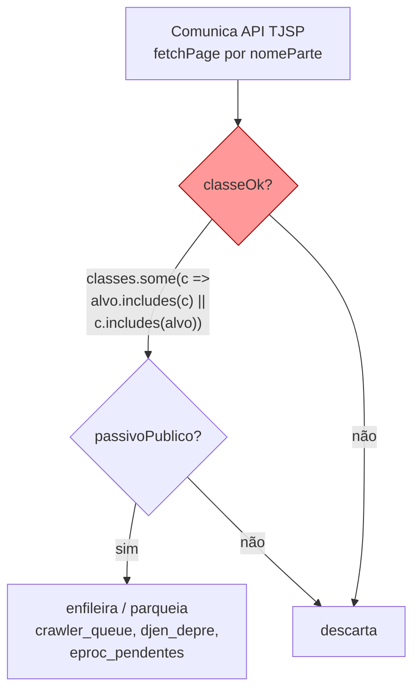
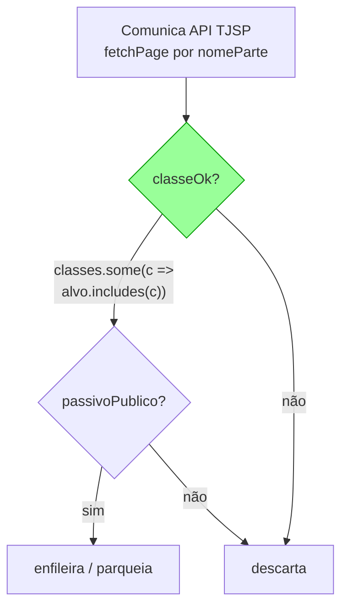

# Architecture: FOR-146 — Fix do match bidirecional de classes_relevantes

## Visão de alto nível

### Estado atual (bug)



O ramo `c.includes(alvo)` (configurado contém o observado) é a origem do bug: um
`nomeClasse` curto e genérico (ex.: "CUMPRIMENTO DE SENTENÇA") passa só por ser
substring de uma config mais longa ("Cumprimento de Sentença contra a Fazenda
Pública"), sem nenhuma verificação semântica adicional além do `passivoPublico`.

### Estado proposto (fix)



Único ramo mantido: o `nomeClasse` observado precisa **conter** a classe configurada.
Isso é monotônico e previsível — adicionar uma config mais específica nunca abre
brecha para prefixos curtos de outra config.

## Componentes impactados

| Componente | Tipo | Mudança |
|---|---|---|
| `worker-crawler/src/ingest-djen.ts` (`ingestDay`, linha do `classeOk`) | Código | Remove o ramo `c.includes(alvo)` |
| `worker-crawler/src/ingest-djen.test.ts` (não existe ainda — ver Limitações) | Teste novo | Casos: match exato, específico>config (passa), genérico prefixo de config (bug — não deve mais passar), sem relação (não passa) |
| `coleta_config.params.classes_relevantes` (dado em produção, Supabase) | Config, não-código | Nenhuma mudança de schema; decisão de produto em aberto: adicionar `"Cumprimento de Sentença"` / `"Cumprimento Provisório de Sentença"` (sem sufixo) como entradas próprias, se a operação quiser manter o volume atual |
| `worker-crawler/src/ingest-djen-federal.ts` | Referência | Já teria o fix equivalente em `classificaPorNomeClasse` (não lido nesta sessão — arquivo não commitado, fora do escopo de leitura permitido) |

Nenhuma outra função do arquivo é afetada — `passivoPublico`, `esfera`, `isDepre`,
`naoDistribuido`, `sistemaFromLink`, `persistAdvogadosDjen` ficam intactos. O
`classeOk` é uma expressão inline dentro do loop de `ingestDay`; extrair para uma
função nomeada (`classeOk(nomeClasse, classes)`) é recomendado para permitir teste
unitário isolado sem mockar toda a cadeia de I/O (`supabase`, `fetch`).

## Convenções e melhores práticas mantidas

- Normalização via `norm()` (remove acento, lowercase, trim) já é o padrão do arquivo
  para toda comparação textual — o fix não introduz um novo mecanismo de comparação,
  só corrige a direção de uma comparação existente.
- Fail-safe / idempotência do resto do pipeline (upserts com `onConflict`,
  `ignoreDuplicates`) não é afetado — o fix só decide **se** um item entra no pipeline,
  não como ele é persistido depois.
- Convenção do projeto de logar diagnóstico antes de decisões de roteamento
  (`djen_link_diag`) é um precedente: se a operação quiser visibilidade contínua do
  volume pós-fix, o padrão já existente seria logar `classeOk`/motivo de descarte de
  forma similar — fica como sugestão para a Fase 3, não bloqueia o fix.

## Interdependências externas

- API pública `comunicaapi.pje.jus.br` (já em uso, sem mudança de contrato).
- Nenhuma lib nova. Nenhuma migration nova.

## Achado de arquitetura crítico: base da worktree não contém o arquivo

`worker-crawler/` **não existe em `origin/main`**, que é a base desta worktree
(`jjuniorfilho/for-146-bug-match-bidirecional-de-classes_relevantes-em-ingest`).
Confirmado via:

```
git ls-tree -r origin/main --name-only | grep -i worker-crawler   # (vazio)
```

O código de produção real vive numa cadeia de branches de feature não mergeadas em
`main` (`jjuniorfilho/consolida-for68-backend` → ... → `jjuniorfilho/for-144-...` →
`jjuniorfilho/for-143-...` → `jjuniorfilho/for-145-captura-precatorios-federais-djen`,
que é onde o checkout principal está hoje). Ou seja: **este projeto não integra as
features no `main` a cada PR** — `main` ficou parado no estado de "só framework/docs"
enquanto todo o desenvolvimento real segue empilhado em branches sequenciais.

**Consequência prática para a Fase 3 (`/engineer:work`)**: o fix de uma linha em
`ingest-djen.ts` não pode ser implementado nesta worktree como está, porque o arquivo
simplesmente não existe nela. Antes de implementar, é preciso uma destas alternativas
(decisão para o gate humano, não tomada aqui):

1. **Rebasear/recriar o branch de FOR-146 em cima da ponta real da cadeia** (hoje,
   `jjuniorfilho/for-145-captura-precatorios-federais-djen`) em vez de `origin/main`.
   Risco: FOR-146 herdaria todo o trabalho não commitado/não revisado de FOR-145.
2. **Cherry-pick isolado**: trazer só o arquivo `ingest-djen.ts` (via
   `git checkout <branch>:worker-crawler/src/ingest-djen.ts` dentro da worktree) como
   ponto de partida, aplicar o fix, e depois o merge dessa branch para a linhagem real
   fica por conta de quem administra a integração. Mais seguro para isolamento de
   frota, mas fica "solto" até alguém religar as duas histórias.
3. **Fazer o fix diretamente na branch `for-145` (ou na próxima da cadeia) como parte
   do próximo commit dessa linhagem**, e usar esta issue/worktree só para o registro de
   investigação (o que já foi feito aqui).

Recomendo (2) para não bloquear o pipeline de frota, deixando explícito no PR que o
merge final depende de reconciliar com a cadeia FOR-68 → FOR-145. Mas essa é uma
decisão de processo, não de arquitetura de código — vai para o gate humano.

## Trade-offs e alternativas consideradas

| Alternativa | Prós | Contras | Decisão |
|---|---|---|---|
| Só `alvo.includes(c)` (proposta da issue) | Simples, monotônica, mesma direção já usada em `ingest-djen-federal.ts` | Reduz ~11% do volume atual (ver `context.md`), incluindo casos com `passivoPublico=true` reais | **Recomendada** |
| Manter bidirecional, mas com guarda extra (ex.: exigir diferença de tamanho mínima) | Preserva volume atual | Ad-hoc, difícil de justificar, ainda permite falso-positivo por acaso de substring | Rejeitada |
| `alvo.includes(c)` + adicionar `"Cumprimento de Sentença"` / `"Cumprimento Provisório de Sentença"` genéricos em `classes_relevantes` | Corrige o bug E preserva o volume que hoje chega (de forma explícita e auditável) | Decisão de produto (o que conta como "relevante" deixa de ser só técnico) — fora do escopo desta issue de bug | Sugerida como follow-up, não faz parte deste fix |
| Match exato (`===`) em vez de `includes` em qualquer direção | Elimina toda ambiguidade | TJSP usa variações reais de rótulo (ex. classes compostas); quebraria matches legítimos hoje capturados por `alvo.includes(c)` | Rejeitada — não investigada em profundidade, mas o dado mostra que 89% do volume já depende de `includes` funcionando numa única direção |

## Consequências adversas conhecidas

- Queda de ~10-11% no volume diário de CNJ enfileirados (medido: 1.524 de 14.123 numa
  amostra de 4 dias reais — ver `context.md` §5). Não é regressão de bug, é o fix
  removendo itens que hoje entram por acidente — mas o volume é real o suficiente para
  merecer aviso explícito antes do deploy, dado que a issue mesma pediu essa cautela.
- Nenhuma consequência de schema, performance ou segurança identificada.

## Arquivos principais a modificar/criar (Fase 3)

- `worker-crawler/src/ingest-djen.ts` — trocar a linha do `classeOk` (1 linha); idealmente
  extrair a função de match para ser testável isoladamente.
- `worker-crawler/src/ingest-djen.test.ts` — novo arquivo de teste unitário (ou adicionar
  ao arquivo de teste existente do federal, se o padrão do projeto for um arquivo de
  teste por módulo de ingestão — confirmar convenção ao entrar na Fase 3, olhando
  `worker-crawler/src/ingest-djen-federal.test.ts` como referência de estrutura, já que
  esse arquivo (teste) foi citado como existente na branch atual do checkout principal).
- Nenhuma migration nova.

---

## ✅ Verificação de Consistência

**Data**: 2026-09-06
**Status**: ✅ APROVADO

### Checklist
- [x] context.md e architecture.md consistentes (mesmo problema, mesma estratégia,
      mesmos números da amostra real: 1.524/14.123 ≈ 10,8%, 12.599/14.123 ≈ 89,2%)
- [x] Conforme especificação de negócio — não há spec de negócio formal para esta
      issue (é um bug técnico); a única regra de negócio tangente
      (`critical-rules.md` → busca tolerante a formato) foi checada e não conflita
      com o fix.
- [x] Conforme padrões/convenções do projeto — normalização via `norm()` mantida,
      nenhuma nova tabela/coluna, nenhum novo padrão introduzido.
- [x] Valores e regras de negócio conferidos entre os dois documentos.

### Correções Aplicadas
Nenhuma — primeira versão de ambos os documentos já saiu consistente.

### Notas
O achado mais importante desta fase não é sobre o fix (trivial, uma linha), é sobre
**onde** aplicá-lo: esta worktree, baseada em `origin/main`, não contém
`worker-crawler/` porque esse diretório só existe em branches de feature não
integradas ao `main`. Isso precisa ser resolvido explicitamente antes da Fase 2/3
(ver seção "Achado de arquitetura crítico" acima) — é o item a levar para o gate
humano com prioridade sobre a discussão do trade-off de volume.

## Decisão do Gate 1 (humano, 2026-09-06)

1. **Base da worktree**: opção 1 aplicada — branch rebaseada de `origin/main` para
   `jjuniorfilho/for-145-captura-precatorios-federais-djen` (ponta real da cadeia
   FOR-68→...→FOR-145). `worker-crawler/src/ingest-djen.ts` agora existe na worktree
   (commit deste doc reescrito para `a6faa92` após o rebase). Consequência aceita:
   esta branch agora carrega todo o histórico de FOR-68→FOR-145; o merge final
   (Fase 5) precisa reconciliar com essa cadeia, não com `main` isolado.
2. **Escopo do fix**: opção "Fix + 2 classes genéricas" — aplicar `alvo.includes(c)`
   unidirecional **e** adicionar `"Cumprimento de Sentença"` /
   `"Cumprimento Provisório de Sentença"` (sem sufixo "contra a Fazenda Pública") em
   `coleta_config.params.classes_relevantes`, para que o volume hoje capturado
   (os 1.524 CNJs com `passivoPublico=true` reais) continue entrando — sem mudança de
   comportamento observável em produção, só corrigindo a lógica de match para não
   depender de um acidente de substring. Isto vira escopo explícito da Fase 2
   (`/engineer:plan`): a mudança de dado em `coleta_config` (produção, via SQL/admin,
   não migration de schema) precisa constar como uma fase/tarefa própria do plano,
   com o passo de dado (UPDATE em produção) documentado e revisável separadamente do
   deploy de código.
