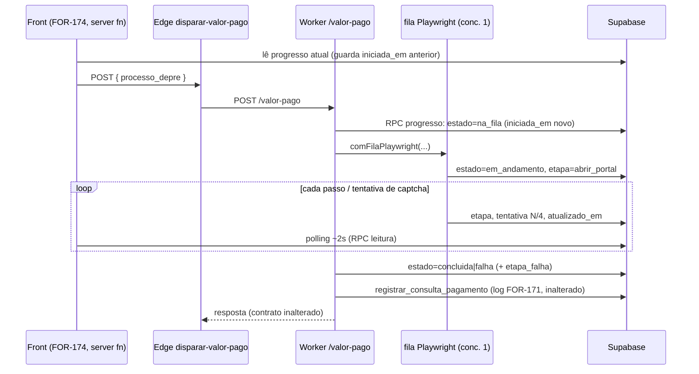

# Architecture: FOR-173 — Banco + worker do lead avulso

## 1. Visão de alto nível

**Antes**
- `leads`: todo lead vem do site. `leads_com_progresso` (FOR-170, `l.*`) e `leads_processos` (FOR-169, colunas explícitas) não conhecem origem.
- `POST /valor-pago` (worker) → `consultarEPersistirPagamentos` → `consultarPagamentos` (dentro de `comFilaPlaywright`) → só no fim `registrar_consulta_pagamento` grava o log com os `passos`. Nada é observável durante a execução.

**Depois**
- `leads.origem` (`site`|`avulso`), `leads.criado_por`, `relacao` opcional; views expõem `origem`/`criado_por`.
- Worker publica o progresso em `pagamentos_consultas_progresso` (1 linha por `processo_depre`) a cada passo; o front (FOR-174) lê por server function com `service_role`.



## 2. Componentes impactados

| Componente | Mudança |
|---|---|
| `leads` (tabela) | + `origem`, + `criado_por`, `relacao` nullable (defensivo) |
| `leads_com_progresso` (view) | DROP + CREATE; `l.*` já traz as colunas novas; regras de etapa/nível **inalteradas** |
| `leads_processos` (view) | DROP + CREATE; + `lp.origem`, `lp.criado_por` (lista explícita) |
| `pagamentos_consultas_progresso` (nova) | RLS ligado, sem GRANT de tabela |
| RPC `registrar_progresso_consulta_pagamento` (nova) | escrita; `authenticated, service_role` (mesmo motivo do FOR-171: o worker pode autenticar como `authenticated`) |
| RPC `obter_progresso_consulta_pagamento` (nova) | leitura; **só `service_role`** (o front lê por server function, não por anon) |
| `PassosCollector` | observador opcional + método `tentativa(n)` (não vira passo do log) |
| `pagamentos-progresso.ts` (novo) | reporter best-effort, serializado |
| `pagamentos-tjsp.ts` | liga o reporter (na_fila antes da fila; em_andamento dentro da fila; concluida/falha no fim) |
| `supabase.ts` | `registrarProgressoPagamento()` |
| master docs | exceções + novo modelo de `leads` |

## 3. Decisões de desenho

### 3.1 Tabela de progresso (não reusar o log)
`pagamentos_consultas_log` tem `resultado` com CHECK (`encontrado|nao_consta|falha`), `finalizada_em` e retenção de 20/processo. Uma linha "em andamento" quebraria o CHECK e o `listar_consultas_pagamento` (FOR-171). Tabela própria, efêmera:

```sql
CREATE TABLE IF NOT EXISTS public.pagamentos_consultas_progresso (
  processo_depre  text        PRIMARY KEY,
  estado          text        NOT NULL CHECK (estado IN ('na_fila','em_andamento','concluida','falha')),
  etapa           text,                    -- chave estável (mesmas do PassosCollector) ou 'na_fila'
  tentativa       integer     NOT NULL DEFAULT 0,
  max_tentativas  integer     NOT NULL DEFAULT 4,
  detalhe         text,                    -- <= 200 chars, texto já sanitizado (sem erro cru do banco)
  resultado       text        CHECK (resultado IN ('encontrado','nao_consta','falha')),
  etapa_falha     text,
  origem          text        CHECK (origem IN ('manual','busca_publica','crawler')),
  iniciada_em     timestamptz NOT NULL DEFAULT now(),
  atualizado_em   timestamptz NOT NULL DEFAULT now()
);
```

- **Uma linha por DEPRE** (PK): consulta nova sobrescreve (`iniciada_em` renovado). Consultas simultâneas do mesmo DEPRE (manual + pública) disputam a linha; aceitável (fila de concorrência 1 serializa a execução real).
- **Race do front:** o front lê o `iniciada_em` anterior antes de disparar e considera "nova" a linha cujo `iniciada_em` mudou (sem depender de relógio do cliente). Registrado aqui para o FOR-174.
- **Limpeza preguiçosa:** a RPC de escrita apaga linhas `concluida|falha` com `atualizado_em < now() - interval '7 days'` (tabela nunca cresce sem limite).
- **Linha órfã** (worker morto no meio): estado fica `em_andamento`; o front trata `atualizado_em` parado > 150s como timeout (regra do FOR-174; esta issue não precisa de job de limpeza).
- Origem incluída para o painel poder distinguir; entradas limitadas na RPC (textos truncados, etapa validada contra lista).

### 3.2 Onde nascem os estados
- `na_fila`: em `consultarEPersistirPagamentos`, **antes** de `deps.consultar` (que enfileira). Sem isso o front não distingue "esperando outra consulta" de "worker fora".
- `em_andamento`: 1º instante dentro do callback de `comFilaPlaywright` (quando a vez chega). Implementação: `consultarPagamentos` passa a chamar `passos.iniciar()` no início do callback.
- Passos: cada `passos.passo(...)` notifica o observador → upsert (`etapa`, `detalhe`, `tentativa`).
- Tentativa em curso: hoje `passos.tentativas = tentativa` é setado antes de `tentarBusca`, mas o passo só é registrado **depois** da tentativa. Novo `passos.tentativa(n)` atribui e notifica **sem** acrescentar passo (o log do FOR-171 fica idêntico).
- Fim: `concluida` (com `resultado`) ou `falha` (com `etapa_falha`), **antes** do `registrar` do log; uma falha aqui não impede o log.

### 3.3 Best-effort e ordenação
`pagamentos-progresso.ts` mantém uma cadeia de promises (`ultima = ultima.then(upsert).catch(log)`): upserts saem **em ordem**, nunca em paralelo, e nunca lançam para o chamador. Fim da consulta espera a cadeia esvaziar com teto curto (ex. 3s) para o estado final não ser sobrescrito por um passo atrasado. Sem timer/debounce: a cadência natural (~1 evento a cada vários segundos) é baixa.

### 3.4 Migration de `leads` (defensiva)
DDL real desconhecido → SQL `2026-09-28_for173_1_leads_origem.sql` usa `DO $$` que consulta `information_schema.columns` e só faz `DROP NOT NULL` se `is_nullable = 'NO'`; para o CHECK de `relacao`, descobre o nome em `pg_constraint` e o recria aceitando NULL (`relacao IS NULL OR relacao IN (...)`). `origem`/`criado_por` via `ADD COLUMN IF NOT EXISTS`. Um SQL de diagnóstico read-only (`..._0_diag_leads_ddl.sql`) lista colunas, NOT NULLs, CHECKs, triggers e dependências de views para o humano rodar antes.

`nome`/`email`/`telefone`: **decisão do Gate 1: relaxar para NULL** (`DROP NOT NULL` condicional). O operador pode digitar esses campos se quiser (opcionais no formulário do FOR-174); quando vazios, ficam NULL, sem valor neutro inventado. Cuidados que o diag precisa confirmar antes da migration: (a) CHECK/trigger que exija e-mail/telefone válido ou não vazio; (b) índice UNIQUE em `email`/`telefone`/`processo_depre` (NULL não colide, mas `''` colidiria — o FOR-174 grava NULL, nunca string vazia); (c) `reuse-lead`/`capturar-lead-publico`/`enviar-relatorio`/`processar-comunicacoes`, que hoje podem assumir e-mail preenchido em todo lead (avaliar no plano se precisam ignorar `origem='avulso'` — pelo menos o envio de relatório/comunicações não pode disparar para lead sem e-mail).

### 3.5 Views
`leads_com_progresso` usa `l.*`; `CREATE OR REPLACE` falha quando `leads` ganha coluna → `DROP VIEW` + `CREATE`. `leads_processos` depende dela → ordem: DROP `leads_processos`, DROP `leads_com_progresso`, CREATE `leads_com_progresso` (mesmo corpo do FOR-170), CREATE `leads_processos` (mesmo corpo do FOR-169 + `origem`, `criado_por`). GRANTs refeitos (`REVOKE ALL ... FROM PUBLIC, anon, authenticated; GRANT ALL ... TO service_role`, `security_invoker = true`). Numa única transação (`BEGIN/COMMIT`) para o grid nunca ficar sem view.

**Escopo do "fora do funil" (ajuste vs. texto do FOR-173):** as views **não filtram** avulsos (o grid precisa mostrá-los). As métricas do funil que contam leads estão em TypeScript (`getLeadsSummary` etc., `supabaseAdmin.from("leads")` em `admin-leads.functions.ts`), e `funnel_events` (usado pelo `admin-analytics`) não tem eventos de avulsos. Portanto a exclusão é filtro `origem='site'` nas queries do FOR-174, e para os campos `etapa*`/`nivel_funil` de um avulso o grid mostra "—". Esta issue só entrega a coluna.

### 3.6 Grants e segurança
- Tabela: `ENABLE RLS` + `REVOKE ALL FROM anon, authenticated` (padrão FOR-171).
- Escrita: `REVOKE ALL ... FROM PUBLIC, anon; GRANT EXECUTE ... TO authenticated, service_role`. Sem PII (só DEPRE, etapa, contadores).
- Leitura: `REVOKE ALL ... FROM PUBLIC, anon, authenticated; GRANT EXECUTE ... TO service_role`.
- Validação na escrita: `processo_depre ~ '\.8\.26\.0500$'`; `estado`/`origem` por CHECK; `etapa` contra lista fixa; textos com `left(...)`.

## 4. Convenções mantidas
- SQL `sql/AAAA-MM-DD_for173_N_*.sql`, re-executável, `NOTIFY pgrst, 'reload schema'`, comentário de cabeçalho explicando ordem e pré-requisito (mesmo projeto Supabase do worker).
- Worker: TypeScript ESM (`.js` nos imports), `node --test` via `tsx`, deps injetáveis para teste, mensagens cruas do banco só no `console.error`.
- Teste de migration por leitura do texto do SQL (padrão `*-migration.for170.test.ts` do frontend), aqui em `worker-crawler/src/` ou `sql/` conforme o runner existente.

## 5. Interdependências externas
Nenhuma biblioteca nova. Dependências operacionais: SQL Editor do Supabase (humano), pm2 na VPS (humano), mesmo projeto Supabase worker↔frontend.

## 6. Limitações e premissas
- Uma linha por DEPRE: não há histórico do progresso (o histórico continua sendo o log do FOR-171).
- Progresso é indicativo; não há garantia de entrega (best-effort).
- Premissa: `leads.processo_depre` existe e é NOT NULL para avulso (o avulso sempre tem DEPRE).
- Premissa: a fila `comFilaPlaywright` continua sendo o único ponto de execução do Playwright.

## 7. Trade-offs e alternativas
| Alternativa | Por que não |
|---|---|
| Inserir "em andamento" no log FOR-171 | CHECK de `resultado`, retenção de 20, quebraria `listar_consultas_pagamento` |
| GET de progresso no worker (memória) + edge function | Perde o estado se o worker reiniciar; exige nova edge function (deploy via Lovable AI, frágil) e expor o worker |
| Supabase Realtime em vez de polling | Exige habilitar publicação/realtime e RLS de leitura; polling de 2s é suficiente e sem nova superfície |
| Filtrar avulsos dentro das views | O grid precisa listá-los; a contagem de funil é em TS |
| Relaxar `nome/email/telefone` para NULL | Mexe no contrato do fluxo do site e em `capturar-lead-publico`; valores neutros são mais seguros |

## 8. Consequências adversas
- `DROP VIEW` deixa o grid do admin sem view por milissegundos (mitigado com transação; aplicar fora do horário de uso).
- +1 escrita no banco por passo da consulta (~10 por consulta): desprezível.
- Duas consultas simultâneas do mesmo DEPRE embaralham a linha de progresso (raro; execução real é serializada).
- Front antigo (sem FOR-174) ignora a tabela: worker novo é 100% compatível.

## 9. Arquivos

**Criar**
- `sql/2026-09-28_for173_0_diag_leads_ddl.sql` (read-only)
- `sql/2026-09-28_for173_1_leads_origem.sql`
- `sql/2026-09-28_for173_2_views_origem.sql`
- `sql/2026-09-28_for173_3_tabela_progresso.sql`
- `sql/2026-09-28_for173_4_rpcs_progresso.sql`
- `worker-crawler/src/pagamentos-progresso.ts` + `pagamentos-progresso.test.ts`
- `.claude/sessions/for-173-banco-worker-lead-avulso/{context,architecture,plan}.md`

**Modificar**
- `worker-crawler/src/pagamentos-passos.ts` (observador, `iniciar()`, `tentativa(n)`)
- `worker-crawler/src/pagamentos-tjsp.ts` (liga o reporter; `DepsPersistencia.progresso`)
- `worker-crawler/src/pagamentos-tjsp.test.ts` (contrato inalterado + progresso)
- `worker-crawler/src/supabase.ts` (`registrarProgressoPagamento`)
- `worker-crawler/README.md` (progresso, deploy)
- `docs/technical-context/briefing/critical-rules.md`, `backend-conventions.md` (exceções + modelo de `leads`)

**Espelho (repo frontend, PR separado — ver Gate 1):** `supabase/migrations/2026092810*_for173_*.sql`.

## 10. Ordem de aplicação (humano)
1. Rodar `..._0_diag_leads_ddl.sql` e conferir. 2. `..._1_leads_origem.sql`. 3. `..._2_views_origem.sql` (fora do horário de uso). 4. `..._3_tabela_progresso.sql`. 5. `..._4_rpcs_progresso.sql`. 6. Deploy do worker (pm2 restart). 7. FOR-174.

## 11. Decisões do Gate 1 (respondidas pelo humano em 2026-09-28)
1. **Escopo do "fora do funil":** SIM — views só expõem `origem`/`criado_por`; a exclusão das métricas é filtro TS `origem='site'` no FOR-174 (seção 3.5). Texto do FOR-173 corrigido no Linear.
2. **Espelho da migration:** SIM — PR pequeno e separado no repo `frontend` (`supabase/migrations/`) com o mesmo SQL, além de `cortex-v1/sql/`.
3. **`nome/email/telefone` do avulso:** relaxar para **NULL**, campos opcionais que o operador pode digitar (muda o FOR-172/174: o formulário deixa de ter "campo único"). Ver seção 3.4.
4. **Grants:** leitura só `service_role` (front via server function).
5. **Diag antes da migration:** o humano roda `sql/2026-09-28_for173_0_diag_leads_ddl.sql` no SQL Editor e cola o resultado **antes de a migration ser escrita** (Fase 3). A migration `..._1_leads_origem.sql` e a recriação das views `..._2_views_origem.sql` (que precisam da definição viva das views, `definicao_view` do diag) só saem depois disso.

---

## ✅ Verificação de Consistência

**Data**: 2026-09-28
**Status**: ⚠️ CORRIGIDO

### Checklist
- [x] context.md e architecture.md consistentes (meta, arquivos, estratégia, base `origin/main`)
- [x] Conforme especificação de negócio (FOR-172/FOR-173): origem, criado_por, relacao opcional, tabela de progresso com estados na_fila|em_andamento|concluida|falha, RPC escrita/leitura, hook `onPasso`, linha criada antes da fila, contrato de resposta inalterado
- [x] Conforme padrões do projeto (SQL re-executável, SECURITY DEFINER + search_path, RLS sem GRANT de tabela, deps injetáveis, best-effort)
- [x] Valores conferidos: 4 tentativas, timeout de linha órfã 150s (regra do front), retenção de 7 dias da tabela de progresso (nova, decisão desta issue)

### Correções Aplicadas
- **Texto do FOR-173 "views excluem avulsos das métricas do funil"** contradiz o código real (métricas de leads são TS; `funnel_events` não tem avulsos): as views apenas expõem `origem`/`criado_por`; a exclusão vira filtro `origem='site'` no FOR-174. Aguarda confirmação no item 1 das Clarificações.
- Nome do hook: a issue diz `onPasso`; o desenho usa observador + `iniciar()` + `tentativa(n)` (o `onPasso` sozinho não cobre `na_fila`/`em_andamento`/tentativa em curso).

### Notas
- Sem consulta ao portal TJSP em nenhum teste (site de terceiro).
- DDL real de `leads` não verificado (sem acesso ao banco): por isso a migration é defensiva e há SQL de diagnóstico.
