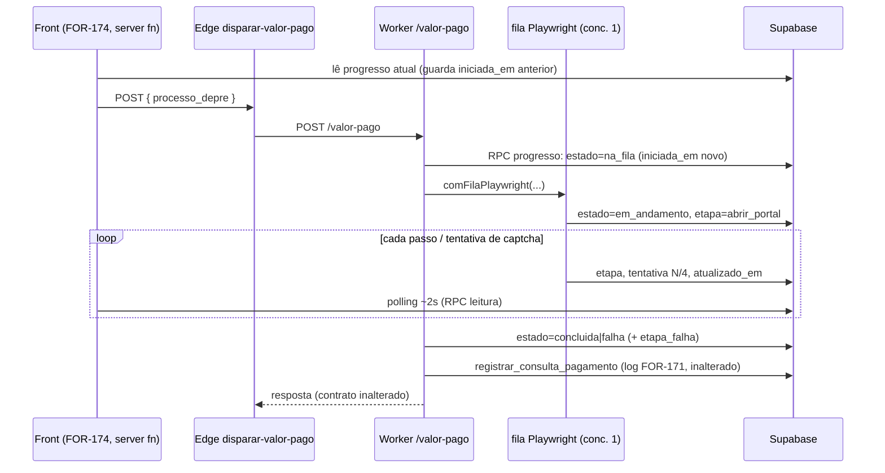

# Architecture: FOR-173 — Banco + worker do lead avulso

## 0. Achados do diagnóstico do DDL real de `leads` (rodado pelo humano em 2026-09-28)

O diag mudou o desenho do banco. O que o banco vivo diz:

1. **`origem` já existe** (`text`, nullable, sem CHECK, com índice `idx_leads_origem`) e guarda a origem do fluxo público (`capturar-lead-publico`: `busca_em_formacao` | `monitorar` | `antecipacao`). → **Não criar coluna nem CHECK.** `origem = 'avulso'` é só um novo valor. "Lead do site" = `origem IS DISTINCT FROM 'avulso'` (atenção: `.neq()` do PostgREST descarta NULL; no TS usar `.or('origem.is.null,origem.neq.avulso')`).
2. **Só `email` e `relacao` são NOT NULL** (`nome`, `telefone`, `processo_depre`, `cnj` já são nullable). O CHECK de `relacao` aceita NULL nativamente (CHECK com NULL passa) → apenas `DROP NOT NULL`, sem recriar constraint.
3. **Sem UNIQUE** em email/telefone/processo_depre. Triggers em `leads`: só `leads_updated_at` e `trg_leads_enfileira_crawler`. Nada exige e-mail preenchido.
4. **`leads_com_progresso` já expõe `origem` e `cnj`** (foi recriada depois de as colunas existirem). **`leads_processos` (lista explícita) não expõe `origem`** → `CREATE OR REPLACE VIEW leads_processos` acrescentando `lp.origem` **no fim** (Postgres aceita colunas novas no final). **Sem DROP VIEW**, sem tocar em `leads_com_progresso`, sem janela de indisponibilidade do grid.
5. **`criado_por` não entra nas views**: como `leads_com_progresso` é `l.*`, uma coluna nova ficaria no meio e exigiria DROP. O modal do FOR-174 lê `criado_por` direto de `leads`.
6. **RLS:** `anon_insert_leads` (check `lgpd_consent = true`) e `leads_admin_only` (`authenticated` com `app_metadata.role='admin'`). O avulso é inserido por server function com `service_role` (ignora RLS). `lgpd_consent` é NOT NULL default `false` → **lead avulso fica com `lgpd_consent=false`** (sem consentimento do titular): registrar na exceção dos master docs e nunca disparar comunicação automática para avulso.
7. **FOR-171 está aplicado** no banco (tabela + `registrar_consulta_pagamento` + `listar_consultas_pagamento`); e o log de consultas que o humano consultou confirma que worker e frontend usam o mesmo banco.
8. **FKs para `leads`:** `comunicacoes_agendadas` (CASCADE), `funnel_events` (SET NULL), `lead_precatorios`, `lead_status_history`, `tokens` (CASCADE). Risco de e-mail NULL é baixo: `enviar-relatorio` exige os dois tokens validados antes de usar o e-mail; `comunicacoes_agendadas` só é escrita por `capturar-lead-publico`; `reuse-lead` só lê lead verificado (avulso nunca é).
9. **Achado lateral (não é escopo):** `capturar-lead-publico` insere sem `relacao`, mas `relacao` era NOT NULL sem default — aparentemente esse insert falharia. Relaxar `relacao` também resolve isso. Confirmar com o humano se essa function está em uso.

## 1. Visão de alto nível

**Antes**
- Todo lead vem do site. `leads_processos` não expõe `origem`.
- `POST /valor-pago` (worker) → `consultarEPersistirPagamentos` → `consultarPagamentos` (dentro de `comFilaPlaywright`) → só no fim `registrar_consulta_pagamento` grava o log com os `passos`. Nada é observável durante a execução.

**Depois**
- `leads`: `email` e `relacao` opcionais, `criado_por` novo, índice único parcial para avulso; `leads_processos` expõe `origem`.
- Worker publica o progresso em `pagamentos_consultas_progresso` (1 linha por `processo_depre`) a cada passo; o front (FOR-174) lê por server function com `service_role`.



## 2. Componentes impactados

| Componente | Mudança |
|---|---|
| `leads` (tabela) | + `criado_por uuid`; `DROP NOT NULL` em `email` e `relacao`; índice único parcial `(processo_depre) WHERE origem='avulso'` |
| `leads.origem` | sem mudança de DDL; novo valor `'avulso'` (COMMENT documenta os valores) |
| `leads.documento` (nova) | `text`, só dígitos (CPF 11 / CNPJ 14) do que o operador pesquisou; PII, RLS `leads_admin_only` já protege; **fora das views** |
| `leads_com_progresso` (view) | **não muda** |
| `leads_processos` (view) | `CREATE OR REPLACE` + `lp.origem` no fim; mesmas opções e GRANTs |
| `pagamentos_consultas_progresso` (nova) | RLS ligado, sem GRANT de tabela |
| RPC `registrar_progresso_consulta_pagamento` (nova) | escrita; `authenticated, service_role` (o worker pode autenticar como `authenticated`, como no FOR-171) |
| RPC `obter_progresso_consulta_pagamento` (nova) | leitura; **só `service_role`** |
| `PassosCollector` | observador opcional + `iniciar()` + `tentativa(n)` (não vira passo do log) |
| `pagamentos-progresso.ts` (novo) | reporter best-effort, serializado |
| `pagamentos-tjsp.ts` | liga o reporter (na_fila antes da fila; em_andamento dentro da fila; concluida/falha no fim) |
| `supabase.ts` | `registrarProgressoPagamento()` |
| master docs | exceções + novo modelo de `leads` (valores de `origem`, `lgpd_consent=false` no avulso) |

## 3. Decisões de desenho

### 3.1 Tabela de progresso (não reusar o log)
`pagamentos_consultas_log` tem `resultado` com CHECK (`encontrado|nao_consta|falha`), `finalizada_em` e retenção de 20/processo. Uma linha "em andamento" quebraria o CHECK e o `listar_consultas_pagamento`. Tabela própria, efêmera:

```sql
CREATE TABLE IF NOT EXISTS public.pagamentos_consultas_progresso (
  processo_depre  text        PRIMARY KEY,
  estado          text        NOT NULL CHECK (estado IN ('na_fila','em_andamento','concluida','falha')),
  etapa           text,                    -- chave estável (mesmas do PassosCollector) ou 'na_fila'
  tentativa       integer     NOT NULL DEFAULT 0,
  max_tentativas  integer     NOT NULL DEFAULT 4,
  detalhe         text,                    -- <= 200 chars, texto já sanitizado (sem erro cru do banco)
  resultado       text        CHECK (resultado IN ('encontrado','nao_consta','falha')),
  etapa_falha     text,
  origem          text        CHECK (origem IN ('manual','busca_publica','crawler')),
  iniciada_em     timestamptz NOT NULL DEFAULT now(),
  atualizado_em   timestamptz NOT NULL DEFAULT now()
);
```

- **Uma linha por DEPRE** (PK): consulta nova sobrescreve (`iniciada_em` renovado). Consultas simultâneas do mesmo DEPRE disputam a linha; aceitável (a execução real é serializada pela fila).
- **Race do front:** o front lê o `iniciada_em` anterior antes de disparar e considera "nova" a linha cujo `iniciada_em` mudou (sem depender de relógio do cliente). Registrado para o FOR-174.
- **Limpeza preguiçosa:** a RPC de escrita apaga linhas `concluida|falha` com `atualizado_em < now() - interval '7 days'`.
- **Linha órfã** (worker morto no meio): fica `em_andamento`; o front trata `atualizado_em` parado > 150s como timeout (regra do FOR-174).
- Entradas limitadas na RPC (textos truncados, etapa validada contra lista fixa).
- **Peso da barra (dado real, log de 27/09):** cada tentativa de captcha leva ~26s; consulta que passa na 2ª tentativa dura ~38s; falha nas 4 dura ~1m48s. As etapas antes/depois da busca somam ~2s. O trecho "busca" domina o tempo; a barra do FOR-174 deve pesar por tentativa, não por etapa.

### 3.2 Onde nascem os estados
- `na_fila`: em `consultarEPersistirPagamentos`, **antes** de `deps.consultar` (que enfileira).
- `em_andamento`: 1º instante dentro do callback de `comFilaPlaywright`. Implementação: `consultarPagamentos` chama `passos.iniciar()` no início do callback.
- Passos: cada `passos.passo(...)` notifica o observador → upsert (`etapa`, `detalhe`, `tentativa`).
- Tentativa em curso: hoje `passos.tentativas = tentativa` é setado antes de `tentarBusca`, mas o passo só é registrado **depois** da tentativa. Novo `passos.tentativa(n)` atribui e notifica **sem** acrescentar passo (o log do FOR-171 fica idêntico).
- Fim: `concluida` (com `resultado`) ou `falha` (com `etapa_falha`), **antes** do `registrar` do log; falha aqui não impede o log.

### 3.3 Best-effort e ordenação
`pagamentos-progresso.ts` mantém uma cadeia de promises (`ultima = ultima.then(upsert).catch(log)`): upserts saem **em ordem**, nunca em paralelo, e nunca lançam para o chamador. O fim da consulta espera a cadeia esvaziar com teto curto (ex. 3s) para o estado final não ser sobrescrito por um passo atrasado. Sem timer/debounce: a cadência natural é baixa.

### 3.4 Migration de `leads` — `sql/2026-09-28_for173_1_leads_avulso.sql`
Re-executável, sem DO $$ defensivo (o DDL agora é conhecido):

```sql
ALTER TABLE public.leads ADD COLUMN IF NOT EXISTS criado_por uuid;
ALTER TABLE public.leads ADD COLUMN IF NOT EXISTS documento text;   -- CPF/CNPJ pesquisado (só dígitos)
ALTER TABLE public.leads ALTER COLUMN email    DROP NOT NULL;
ALTER TABLE public.leads ALTER COLUMN relacao  DROP NOT NULL;
COMMENT ON COLUMN public.leads.origem IS
  'Origem do lead: busca_em_formacao | monitorar | antecipacao (fluxo público) | avulso (cadastrado pelo operador no admin, sem 2 canais validados).';
COMMENT ON COLUMN public.leads.criado_por IS 'auth.users.id do admin que cadastrou o lead avulso (null nos leads do site).';
COMMENT ON COLUMN public.leads.documento IS 'CPF (11) ou CNPJ (14) pesquisado pelo operador ao cadastrar o lead avulso, só dígitos. PII: nunca em log, nunca exposto a anon; null nos leads do site.';
CREATE UNIQUE INDEX IF NOT EXISTS uq_leads_avulso_processo_depre
  ON public.leads (processo_depre) WHERE origem = 'avulso';
```
- `criado_por` sem FK (evita acoplar a `auth.users`; é só auditoria).
- `documento`: só dígitos (a server function normaliza; CHECK opcional `documento IS NULL OR documento ~ '^\d{11}(\d{3})?$'`). Sem índice (nenhuma consulta filtra por ele nesta versão) e fora das views (uma coluna nova no meio de `l.*` exigiria DROP).
- Índice único parcial impede dois avulsos para o mesmo DEPRE em corrida; o `criarLeadAvulso` (FOR-174) trata o conflito como "já existe" e reconsulta.
- `nome`/`telefone` já são nullable; o FOR-174 grava **NULL**, nunca string vazia.
- `saldo_consultado` (NOT NULL default 0) e `devedora` (nullable): o FOR-174 preenche de `precatorios` quando existir.

### 3.5 View — `sql/2026-09-28_for173_2_view_leads_processos_origem.sql`
`CREATE OR REPLACE VIEW public.leads_processos WITH (security_invoker = true)` com **exatamente** a definição viva (colada do diag: `lp.id … inc.cessao_credito`) + `lp.origem` como **última** coluna. Reafirma `REVOKE ALL … FROM PUBLIC, anon, authenticated` e `GRANT ALL … TO service_role`. `NOTIFY pgrst, 'reload schema'`. Não é preciso transação nem janela de manutenção.

**Escopo do "fora do funil":** as views **não filtram** avulsos (o grid precisa listá-los). As métricas do funil que contam leads estão em TypeScript (`getLeadsSummary` etc. em `admin-leads.functions.ts`) e `funnel_events` não terá eventos de avulsos. A exclusão é filtro `origem IS DISTINCT FROM 'avulso'` nas queries do FOR-174; para `etapa*`/`nivel_funil` de um avulso o grid mostra "—". Esta issue só entrega a coluna na view.

### 3.6 Grants e segurança
- Tabela de progresso: `ENABLE RLS` + `REVOKE ALL FROM anon, authenticated` (padrão FOR-171).
- Escrita: `REVOKE ALL … FROM PUBLIC, anon; GRANT EXECUTE … TO authenticated, service_role`. Sem PII (só DEPRE, etapa, contadores).
- Leitura: `REVOKE ALL … FROM PUBLIC, anon, authenticated; GRANT EXECUTE … TO service_role`.
- Validação na escrita: `processo_depre ~ '\.8\.26\.0500$'`; `estado`/`origem` por CHECK; `etapa` contra lista fixa; textos com `left(...)`.

## 4. Convenções mantidas
- SQL `sql/AAAA-MM-DD_for173_N_*.sql`, re-executável, `NOTIFY pgrst, 'reload schema'`, cabeçalho com ordem e pré-requisito.
- Worker: TypeScript ESM (`.js` nos imports), `node --test` via `tsx`, deps injetáveis, mensagens cruas do banco só no `console.error`.
- Teste de migration por leitura do texto do SQL (padrão `*-migration.for170.test.ts` do frontend).

## 5. Interdependências externas
Nenhuma biblioteca nova. Dependências operacionais: SQL Editor do Supabase (humano), pm2 na VPS (humano).

## 6. Limitações e premissas
- Uma linha por DEPRE: sem histórico do progresso (o histórico continua sendo o log do FOR-171).
- Progresso é indicativo; best-effort, sem garantia de entrega.
- `leads.processo_depre` é nullable no banco; o avulso sempre grava o DEPRE (a validação é da server function).
- A fila `comFilaPlaywright` continua sendo o único ponto de execução do Playwright.
- Avulso tem `lgpd_consent=false`: nenhuma comunicação automática pode partir dele.

## 7. Trade-offs e alternativas
| Alternativa | Por que não |
|---|---|
| Criar coluna `origem` nova (`site\|avulso`) | Já existe e tem outro uso; reusar com valor `'avulso'` evita duplicar semântica e migrar dados |
| CHECK em `origem` | Valores do fluxo público são livres; um CHECK exigiria enumerar/aprovar todos |
| `DROP VIEW` + `CREATE` das duas views | Desnecessário: coluna nova no fim de `leads_processos` cabe em `CREATE OR REPLACE` |
| `criado_por` nas views | Colocaria a coluna no meio de `l.*` e exigiria DROP; o modal lê de `leads` |
| Inserir "em andamento" no log FOR-171 | CHECK de `resultado`, retenção de 20, quebraria `listar_consultas_pagamento` |
| GET de progresso no worker (memória) + edge function | Perde estado se o worker reiniciar; nova edge function (deploy via Lovable AI, frágil) |
| Supabase Realtime em vez de polling | Exige publicação/RLS de leitura; polling de 2s basta |
| Valores neutros em `email`/`nome` | Decisão do humano: NULL, com campos opcionais no formulário |

## 8. Consequências adversas
- +1 escrita no banco por passo da consulta (~10 por consulta): desprezível.
- Duas consultas simultâneas do mesmo DEPRE embaralham a linha de progresso (raro; execução real é serializada).
- `email` e `relacao` opcionais valem para todos os leads: código futuro que assuma e-mail preenchido precisa checar (hoje nada assume; ver achado 8).
- Front antigo (sem FOR-174) ignora a tabela: worker novo é 100% compatível.

## 9. Arquivos

**Criar**
- `sql/2026-09-28_for173_0_diag_leads_ddl.sql` (feito, read-only)
- `sql/2026-09-28_for173_1_leads_avulso.sql`
- `sql/2026-09-28_for173_2_view_leads_processos_origem.sql`
- `sql/2026-09-28_for173_3_tabela_progresso.sql`
- `sql/2026-09-28_for173_4_rpcs_progresso.sql`
- `worker-crawler/src/pagamentos-progresso.ts` + `pagamentos-progresso.test.ts`
- `.claude/sessions/for-173-banco-worker-lead-avulso/{context,architecture,plan}.md`

**Modificar**
- `worker-crawler/src/pagamentos-passos.ts` (observador, `iniciar()`, `tentativa(n)`)
- `worker-crawler/src/pagamentos-tjsp.ts` (liga o reporter; `DepsPersistencia.progresso`)
- `worker-crawler/src/pagamentos-tjsp.test.ts` (contrato inalterado + progresso)
- `worker-crawler/src/supabase.ts` (`registrarProgressoPagamento`)
- `worker-crawler/README.md` (progresso, deploy)
- `docs/technical-context/briefing/critical-rules.md`, `backend-conventions.md` (exceções, valores de `origem`, `lgpd_consent=false`, `email`/`relacao` opcionais)

**Espelho (repo frontend, PR separado — decidido no Gate 1):** `supabase/migrations/2026092810*_for173_*.sql` (mesmos SQLs `_1` a `_4`).

## 10. Ordem de aplicação (humano)
1. `..._1_leads_avulso.sql`. 2. `..._2_view_leads_processos_origem.sql`. 3. `..._3_tabela_progresso.sql`. 4. `..._4_rpcs_progresso.sql`. 5. Deploy do worker (pm2 restart). 6. FOR-174.

## 11. Decisões do Gate 1 (respondidas pelo humano em 2026-09-28)
1. **Escopo do "fora do funil":** SIM — views só expõem a coluna; exclusão é filtro TS no FOR-174 (3.5).
2. **Espelho da migration:** SIM — PR pequeno e separado no repo `frontend`.
3. **`nome/email/telefone` do avulso:** NULL, campos opcionais no formulário (o DDL real: `nome`/`telefone` já eram nullable; só `email` e `relacao` foram relaxados).
4. **Grants:** leitura só `service_role`.
5. **Diag antes da migration:** feito; resultado incorporado na seção 0.

## 12. Pontos para o humano confirmar (novos, vindos do diag)
1. **`lgpd_consent=false` no avulso** e regra de que nenhuma comunicação automática parte dele (aceitável?).
2. **Achado 9:** `capturar-lead-publico` parece inserir sem `relacao` (NOT NULL até agora). Essa function está em uso/deployada? Se sim, o relaxamento corrige um bug que talvez já esteja em produção.

## 13. Escopo ampliado em 2026-09-28: busca por processo, CPF/CNPJ e DEPRE (impacto)

O humano voltou a pedir os três tipos de entrada do site. Decisões: **seleção múltipla, 1 lead por DEPRE**; **guardar o CPF/CNPJ em `leads.documento`**; **fallback ao vivo no e-SAJ como o site**.

- **FOR-173 (esta issue):** só ganha a coluna `documento` (seção 3.4). Worker, progresso, views e RPCs não mudam.
- **FOR-174 (frontend) carrega o resto** (detalhado na issue): busca em 2 etapas — (1) resolução admin-only, **só base local**, por DEPRE/CNJ/CPF/CNPJ → lista de DEPREs candidatos, sem tocar no portal; (2) o operador marca N DEPREs, o front cria N leads e dispara as consultas **em sequência**.
- **Não reusar a edge `buscar-precatorio`:** para cada item com `.0500` ela chama o worker (90s cada, sem progresso), grava `busca_realizada` em `funnel_events` (poluiria as métricas do funil) e persiste o documento em `djen_depre`/`precatorios`. A resolução do operador é uma server function própria (padrão `consulta-oab.functions.ts`: `supabaseAdmin` + `enqueue_crawler_job`).
- **Fallback ao vivo (miss de CPF/CNPJ):** o "DOCPARTE" do site só **descobre CNJs no e-SAJ e enfileira o crawler** (`enqueue_crawler_job`, origem `manual`); não devolve DEPRE na hora. O operador vê "N processos enfileirados; busque de novo em alguns minutos". Para busca por processo/DEPRE não há fallback (igual ao site).
- **Limite do worker:** a fila é serial e a edge `disparar-valor-pago` tem timeout de 120s **incluindo a espera na fila**. Disparar N consultas em paralelo daria falso "falha" nas últimas. O front despacha **uma por vez** e limita a seleção (proposta: máx. 10 DEPREs por lote, ~7 min no pior caso). Uma busca pública na frente da fila também pode empurrar uma consulta do operador além dos 120s (risco já existente).
- Itens sem `.0500` (direito creditório ainda sem ofício) aparecem na lista mas não são selecionáveis para valor pago.

---

## ✅ Verificação de Consistência

**Data**: 2026-09-28
**Status**: ⚠️ CORRIGIDO

### Checklist
- [x] context.md e architecture.md consistentes (meta, arquivos, estratégia, base `origin/main`)
- [x] Conforme especificação de negócio (FOR-172/FOR-173): avulso identificável, relação opcional, tabela de progresso com estados na_fila|em_andamento|concluida|falha, RPC escrita/leitura, linha criada antes da fila, contrato de resposta inalterado
- [x] Conforme padrões do projeto (SQL re-executável, SECURITY DEFINER + search_path, RLS sem GRANT de tabela, deps injetáveis, best-effort)
- [x] Valores conferidos: 4 tentativas, timeout de linha órfã 150s (regra do front), retenção de 7 dias (nova, decisão desta issue), ~26s por tentativa (log real)

### Correções Aplicadas (vs. rascunho anterior e vs. texto do FOR-173)
- **`origem`:** o FOR-173 mandava criar `leads.origem` com CHECK `('site','avulso')`; a coluna já existe, é livre e tem outro uso. Passa a ser só o valor `'avulso'`, sem CHECK.
- **Views:** o FOR-173 mandava `DROP VIEW` + `CREATE` nas duas; basta `CREATE OR REPLACE` em `leads_processos` (coluna no fim) e `leads_com_progresso` não muda. `criado_por` sai das views.
- **`nome`/`telefone`:** já eram nullable; só `email` e `relacao` são relaxados; o CHECK de `relacao` não precisa ser recriado.
- **Migration defensiva (`DO $$`):** descartada, o DDL agora é conhecido.
- **Nome do hook:** observador + `iniciar()` + `tentativa(n)` em vez de só `onPasso`.
- **Exclusão do funil:** filtro TS `origem IS DISTINCT FROM 'avulso'` (não `= 'site'`).
- **Escopo ampliado (seção 13):** `leads.documento` entra no `_1_leads_avulso.sql`; nada mais muda no FOR-173.

### Notas
- Sem consulta ao portal TJSP em nenhum teste (site de terceiro).
