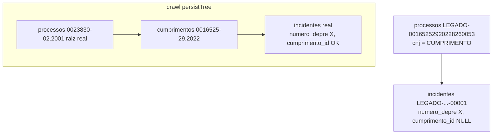
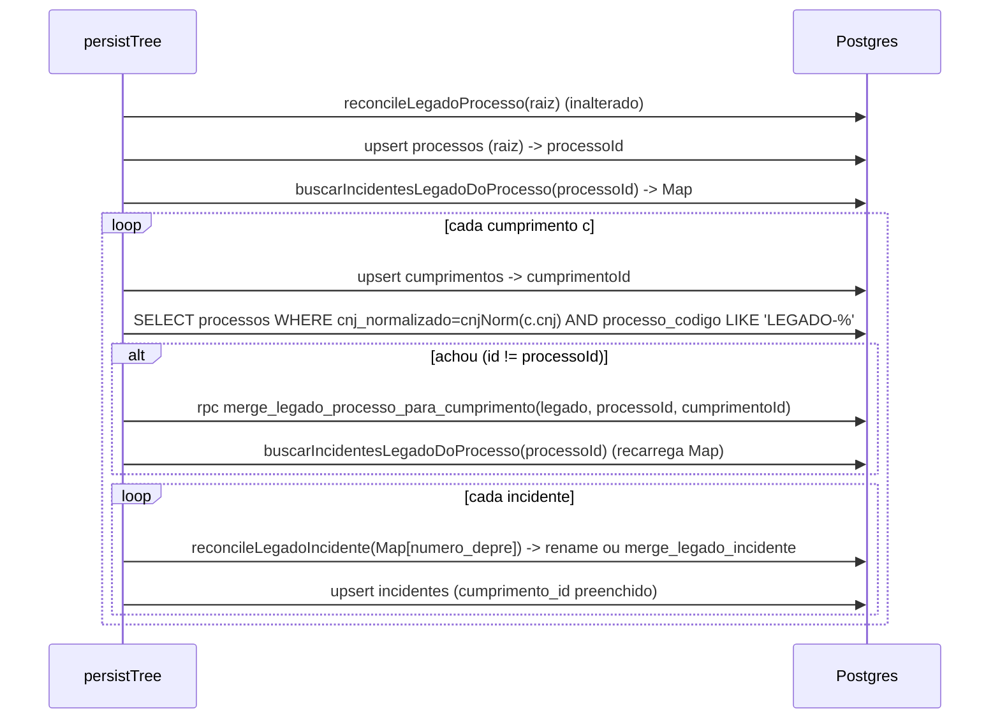

# Architecture: FOR-178 — reconciliação LEGADO no nível do cumprimento

## Antes

`reconcileLegadoProcesso(cnjNorm(tree.cnj))` procura LEGADO- pelo CNJ da raiz → não acha →
duas linhas `incidentes` com numero_depre X; a legado fica órfã.

## Depois

## Componentes

| Arquivo | Mudança |
|---|---|
| `sql/2026-09-29_for178_merge_legado_processo_para_cumprimento.sql` | NOVO — RPC plpgsql `security definer`, `search_path = public` |
| `worker-crawler/src/supabase.ts` | NOVO `reconcileLegadoCumprimento()`; `persistTree` chama após upsert de cada cumprimento e recarrega o Map se houve merge |
| `worker-crawler/src/supabase-persist-tree-legado.test.ts` | NOVO — fake in-memory de `supabase.from`/`supabase.rpc` |
| `sql/sandbox/for178_validate_local.sh` | NOVO — valida a RPC real num Postgres 15 descartável |

## RPC `merge_legado_processo_para_cumprimento(p_legado_processo_id, p_real_processo_id, p_real_cumprimento_id)`

1. `if p_legado_processo_id = p_real_processo_id then return` (padrão dos RPCs FOR-143).
2. Guardas defensivas (baratas, não mudam o contrato acordado): a linha legado precisa ter
   `processo_codigo LIKE 'LEGADO-%'` (senão no-op — nunca apaga processo real), e o cumprimento
   precisa pertencer a `p_real_processo_id` (senão `raise exception`).
3. `update incidentes set processo_id = real, cumprimento_id = real_cumprimento where processo_id = legado`
4. `update partes set processo_id = real where processo_id = legado`
5. `update cumprimentos set processo_id = real where processo_id = legado` (defensivo: FK
   `ON DELETE CASCADE` apagaria um cumprimento pendurado na linha legado; o import legado não cria
   cumprimentos, então na prática é no-op).
6. `delete from processos where id = legado`.
7. `revoke all ... from public, anon; grant execute ... to service_role, authenticated`.

## Por que funciona com o loop de incidentes existente

Depois do passo 3 o incidente legado tem `processo_id = processoId`; recarregando o Map,
`reconcileLegadoIncidente` o encontra pelo numero_depre e:
- renomeia `processo_codigo` LEGADO- → código real (1º crawl), e o upsert seguinte completa a
  linha (preserva `id`) com `cumprimento_id`; ou
- se o real já existe (crawls anteriores já criaram a hierarquia paralela — dados atuais em
  produção), `merge_legado_incidente` apaga o legado. Isso também limpa duplicatas já existentes.

## Convenções mantidas

- Mesmo padrão `reconcileLegado*`: gate `config.legadoReconcile`, erro com nome da RPC na mensagem.
- Mesmo padrão SQL do FOR-143 (plpgsql + security definer + set search_path).

## Trade-offs / alternativas

- Alternativa descartada (pelo usuário): passe de limpeza SQL pós-backfill.
- Custo: +1 SELECT por cumprimento crawleado enquanto `LEGADO_RECONCILE` estiver ligado (índice
  `idx_processos_cnj_normalizado` cobre). Recarga do Map só quando houve merge.
- Incidentes legado da linha que não aparecem na árvore crawleada (numero_depre diferente) também
  ganham `cumprimento_id` do cumprimento real — correto, já que estavam pendurados naquele CNJ.

## Consequências / riscos

- Ordem de deploy: a RPC precisa ser aplicada ANTES do deploy do worker; caso contrário crawls que
  encontrarem linha legado de cumprimento falham (`function ... does not exist`) e vão pra retry.
- Grants antigos do FOR-143 (`merge_legado_processo`/`merge_legado_incidente`) não revogam PUBLIC —
  achado registrado no relatório, fora do escopo desta tarefa.

## Revisão pós code review (pre-pr) — substitui o diagrama "Depois" acima

- `persistTree` em **dois passes**: (1) upsert de TODOS os cumprimentos + `reconcileLegadoCumprimento`
  em cada; (2) Map de incidentes legado montado uma vez, depois o loop de incidentes. Motivo: o
  incidente real que casa com um legado pendurado no cumprimento B pode estar sob o cumprimento A.
- Entrada do Map consumida (`delete`) após uso — um legado nunca é renomeado duas vezes.
- `reconcileLegadoRows` (FOR-143): com 2+ legados e nenhum real, renomeia só o 1º e funde os demais
  nele (antes: unique violation). Afeta também o caminho de processos (legado duplicado).
- RPC: `cumprimento_id = coalesce(cumprimento_id, p_real_cumprimento_id)` — preserva vínculo de
  incidente cujo cumprimento estava pendurado na linha legado.

---

## ✅ Verificação de Consistência

**Data**: 2026-09-29
**Status**: ✅ APROVADO

- [x] context.md e architecture.md consistentes (mesmos arquivos, mesma estratégia)
- [x] Conforme escopo aprovado pelo usuário (via lead) no card FOR-178
- [x] Conforme padrões do projeto (FOR-143 RPC pattern, grants restritos, sandbox local)
- [x] Nenhum valor de negócio envolvido
