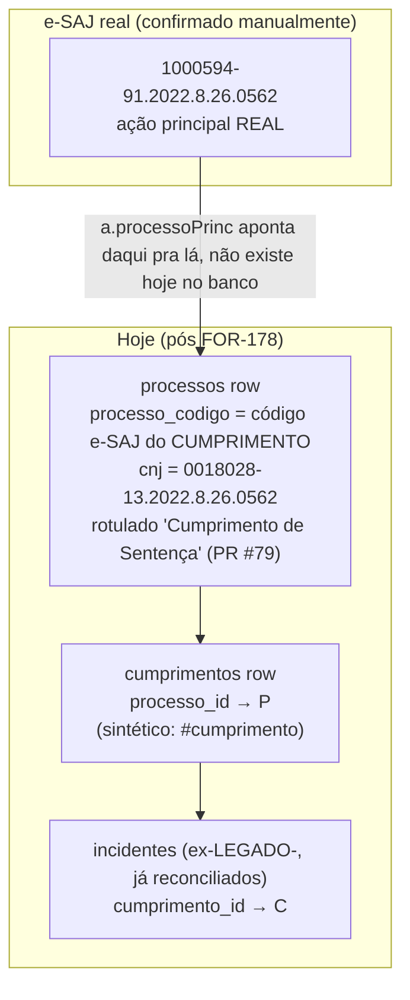

# Architecture: FOR-195 — subir 1 nível (cumprimento → ação principal real) nos ~24.292 legado

## Estado atual (confirmado no código)

`persistTree` (worker-crawler/src/supabase.ts:208-245) sempre grava `processos.processo_codigo`
= o código da RAIZ que `normalizeToRoot` (crawl.ts:31-59) resolveu **para o seed daquele job
específico**. Pros ~24.292 casos legado, o seed que originou a reconciliação foi o próprio CNJ
do cumprimento (é o único CNJ que o import FOR-143 tinha) — e a subida via `a.processoPrinc`
nunca foi tentada A PARTIR da própria página do cumprimento nesse fluxo, porque
`reconcileLegadoCumprimento` apenas casa por `cnj_normalizado` contra uma linha `processos`
LEGADO- já existente; ela não dispara um novo crawl. Resultado: o cumprimento ficou "preso" como
se fosse raiz, e ninguém jamais perguntou ao e-SAJ "este cumprimento tem processo principal
acima dele?".

## Mecanismo a reaproveitar (padrão FOR-178, já no código)

- `merge_legado_processo_para_cumprimento(p_legado_processo_id, p_real_processo_id,
  p_real_cumprimento_id)` — `sql/2026-09-29_for178_merge_legado_processo_para_cumprimento.sql`.
  Guarda dupla: só age se a linha "legado" tem `processo_codigo LIKE 'LEGADO-%'` (nunca apaga um
  processo real) e exige que o cumprimento pertença ao processo real (evita pendurar incidente
  na árvore errada). `revoke all ... from public, anon` + `grant ... to service_role,
  authenticated` logo após o `create or replace` (lição do FOR-179, hotfix de segurança sobre o
  FOR-143 original).
- `reconcileLegadoCumprimento` (supabase.ts:157-174): busca `processos` LEGADO- por
  `cnj_normalizado`, chama a RPC acima pra cada match.
- `processoPrincLink($)` (parse.ts:91-95): lê `a.processoPrinc` da página carregada — é usado
  dentro de `normalizeToRoot` (crawl.ts:50-57) num loop de até 20 iterações de climb.
- `showByCodigo` / `searchByCnj` (esaj.ts:81-109): primitivas HTTP puras (fetch + sessão), sem
  nenhuma lógica de árvore — são o que `normalizeToRoot` chama por dentro.

## 3 decisões de arquitetura pendentes (freio de mão — NÃO resolvidas nesta sessão)

### Decisão 1 — RPC nova ou estender a existente?

**Pergunta**: ao achar a ação principal real do cumprimento, como mover `incidentes` + `partes`
+ o próprio `cumprimentos` row (e opcionalmente a antiga `processos` row, que vira um
cumprimento de verdade) pra debaixo do novo `processos` root?

| Opção | Descrição | Prós | Contras |
|---|---|---|---|
| **A. RPC nova** `merge_legado_cumprimento_para_principal(p_processo_atual_id, p_processo_principal_id)` | Espelha o padrão FOR-178: recebe o id do `processos` row que hoje faz de raiz (na verdade é o cumprimento) e o id do `processos` root real recém-criado/achado. Internamente: INSERT em `cumprimentos` apontando o antigo "processo" pro novo root (virando o cumprimento de verdade), reaponta `incidentes`/`partes` órfãs se houver. | Mesma assinatura semântica do padrão já revisado em code-review (FOR-178/179); guardas já testadas (`LIKE 'LEGADO-%'` não se aplica aqui — precisa de guarda equivalente, ver Decisão 3); fácil de dar `REVOKE`/`GRANT` explícito igual às outras. | Mais uma função `security definer` pra manter; schema tem agora 3 gerações de merge RPC (`merge_legado_processo`, `merge_legado_processo_para_cumprimento`, + esta) — risco de confusão de nomes/uso errado se não documentado igual ao comentário de cabeçalho das outras duas. |
| **B. Estender** `merge_legado_processo_para_cumprimento` pra aceitar um 4º nível (ou rodar 2x em cadeia) | Reaproveita a função já revisada. | Economiza 1 função. | A função atual assume que o alvo "legado" é sempre uma linha `processo_codigo LIKE 'LEGADO-%'` sendo fundida — aqui o objeto que está "errado" é uma linha **real** (código e-SAJ válido do cumprimento), só que no nível hierárquico errado (processos em vez de cumprimentos). Forçar essa semântica na função existente quebra a guarda de segurança mais importante dela (`LIKE 'LEGADO-%'`) ou exige um parâmetro de modo, deixando a função ambígua — maior risco de regressão silenciosa numa RPC `security definer` que já teve 1 CVE interno (FOR-179). |

**Recomendação**: opção A (RPC nova), com nome e guardas análogas, documentando explicitamente
no cabeçalho (igual ao padrão já estabelecido) por que ela é diferente da FOR-178 (aqui o objeto
movido é uma linha REAL de `processos`, não uma LEGADO-, e ela "desce" um nível em vez de ser
apagada). Mas é uma decisão de shape de schema/RPC — fica para quem aprovar o Gate 1 confirmar.

### Decisão 2 — novo "modo de crawl" (1 página) ou reaproveitar função existente?

**Pergunta**: como buscar só a página do cumprimento (pra ler `a.processoPrinc`) sem rodar
`crawlSeed`/`persistTree` inteiro (que reconstrói e grava a árvore completa, caro e
desnecessário aqui)?

| Opção | Descrição | Prós | Contras |
|---|---|---|---|
| **A. Nova função fina** `fetchProcessoPrincipal(codigo, foro, session)` em `crawl.ts`, que chama `showByCodigo`/`searchByCnj` (já existentes em `esaj.ts`) + `processoPrincLink` e retorna só `{codigo, foro} \| null` — sem persistir nada. | Mínimo código novo (reaproveita 100% das primitivas HTTP já testadas); sem efeito colateral em `persistTree`; fácil de testar isoladamente. | É, tecnicamente, "um novo modo de crawl" — novo ponto de entrada no worker, precisa de decisão sobre que `origem`/fila o alimenta (ver Decisão 3) e precisa respeitar o mesmo `sleep(config.delayMs)`/rate-limit das outras chamadas (fácil esquecer, já que não está dentro do loop padrão de `crawlSeed`). | Nenhum real — é a opção de menor superfície. |
| **B. Chamar `crawlSeed(cumprimento_cnj)` inteiro e aproveitar que `normalizeToRoot` já climba** | Zero código novo em `crawl.ts`. | — | `crawlSeed` dispara `persistTree` com uma árvore que re-grava TUDO (processos, cumprimentos, incidentes, partes) a partir do NOVO root — reconstrução cara e redundante pros ~24.292 casos (a maior parte dos dados já está correta, só falta o nível acima); e ainda deixaria a `processos` row antiga (cumprimento) pendurada sem relação automática com a nova árvore, exigindo a mesma reconciliação manual da Decisão 1 de qualquer forma — ou seja, não elimina a RPC nova, só adiciona trabalho e custo de e-SAJ (climb redundante, já que o climb de `normalizeToRoot` a partir do cumprimento é exatamente o comportamento que falta hoje — mas correr a árvore INTEIRA de novo é desperdício quando só o nó acima é novo). |

**Recomendação**: opção A (função fina dedicada). Risco maior aqui não é "qual opção", mas
**onde ela se encaixa na fila** (ver Decisão 3) — é a parte que mais se parece com "novo
boundary" de verdade.

### Decisão 3 — enfileiramento dos ~24k jobs e UPSERT seguro por `cnj_normalizado`

**Pergunta A (fila)**: os ~24.292 jobs de "buscar só a página do cumprimento" competem pela
MESMA fila (`crawler_queue`) que os crawls normais (`crawlSeed` full-tree), ou precisam de uma
fila/origem própria?

- `crawler_queue_origem_check` hoje aceita `manual | refresh | backfill | caderno_dje`
  (confirmado em comentário de `index.ts:131`). Usar `manual` (mesmo padrão do backfill FOR-178)
  evita migration de schema, mas o worker (`index.ts:107-158`) decide o comportamento do job só
  por `isDepre(job.processo_codigo)` — não há hoje um terceiro ramo "job de 1 página". **Precisa
  de uma forma de o worker diferenciar** um job "legado sobe 1 nível" de um job normal: campo
  novo (`crawler_queue.modo` ou similar) vs. uma tabela de fila separada só pra este backfill
  pontual (mais parecido com o padrão dos scripts `sql/2026-09-13_*recrawl*` que já existem no
  repo pra outros backfills pontuais). Isso É uma decisão de schema/boundary, não só de código.

**Pergunta B (UPSERT sem duplicar `processos`)**: `processos.cnj_normalizado` **não tem unique
constraint hoje** (confirmado em `supabase/migrations/20260627192837_for69_schema_base_propria.sql:35`
— só índice não-único `idx_processos_cnj_normalizado`; o único UNIQUE real é
`processo_codigo`). Se dois incidentes legado diferentes resolverem pra uma MESMA ação principal
(cenário plausível e citado no card), um `upsert(..., {onConflict: "cnj_normalizado"})` direto
**falharia silenciosamente ou duplicaria**, porque não há constraint para o Postgres aplicar.

| Opção | Descrição | Prós | Contras |
|---|---|---|---|
| **A. Adicionar unique constraint em `cnj_normalizado`** (`WHERE cnj_normalizado IS NOT NULL`, parcial) + usar `upsertReturningId("processos", row, "cnj_normalizado")` igual ao padrão de `persistRequisitorio` (supabase.ts:373, já faz `onConflict: "cnj_normalizado"` em OUTRA tabela, `djen_depre`). | Resolve a causa raiz pra sempre, não só pro backfill da FOR-195; idêntico ao padrão já usado em produção pra `djen_depre`. | **Migration de schema em tabela de ~630k linhas** — precisa checar ANTES se já existem duplicatas de `cnj_normalizado` (não-NULL) na base hoje; se existirem, a migration falha até essas duplicatas serem resolvidas manualmente (fora do escopo de recrawl desta issue). Ação que toca produção — não é "ação irreversível" per se (é só um índice), mas é mudança de schema compartilhado, validar em sandbox local antes (ver `patterns/postgres-sandbox-local.md`). |
| **B. SELECT-then-INSERT/UPDATE explícito dentro da RPC nova** (mesmo padrão de `reconcileLegadoRows`: busca por `cnj_normalizado`, se achar usa o id existente, senão cria) | Não exige constraint nova; a lógica de "achar ou criar" já é exatamente o padrão que `reconcileLegadoRows` (supabase.ts:113-136) implementa pra esse tipo de problema (2+ linhas concorrentes pro mesmo alvo: a 1ª vira o "real", as demais são fundidas nela via RPC de merge). | Zero migration; reaproveita padrão já revisado e testado (`supabase-persist-tree-legado.test.ts`). | Tem que ser cuidadoso com corrida: dois jobs do pool rodando em paralelo (`runPool`, concurrency > 1) podem fazer o SELECT ao mesmo tempo, não achar nada, e os dois tentarem INSERT — sem constraint, isso cria duplicata de verdade. Mitigação possível: processar os ~24k jobs com `concurrency=1` só para esta fase de backfill (aceitável dado o volume e que é um backfill pontual, não rotina contínua), OU aceitar o risco baixo e rodar uma query de detecção de duplicata `cnj_normalizado` DEPOIS do backfill como rede de segurança. |

**Recomendação**: opção B para o UPSERT (reaproveita padrão testado, sem migration de schema em
tabela de 630k linhas) combinada com concorrência=1 (ou um `SELECT ... FOR UPDATE`/advisory lock
dentro da RPC) só para este backfill pontual — mas isso é uma troca de robustez-vs-simplicidade
que vale confirmar com quem aprova o Gate 1, especialmente porque a Pergunta A (fila) também
está em aberto e a resposta de uma influencia a outra (ex.: se o backfill roda como um script
batch separado, serial, fora do worker normal, a corrida da Pergunta B desaparece por
construção).

## Por que isto conta como "nova decisão arquitetural" (não decidir sozinho)

- Decisão 1 e 3A tocam **shape de RPC/schema** (nova função `security definer` + possível
  unique constraint em tabela de 630k linhas) — exatamente o tipo de erro caro-de-reverter que
  o Gate 1 existe para pegar (ver `reference/pipeline.md`: "Gate 1: maior alavancagem... barato
  revisar, caríssimo deixar passar").
- Decisão 2/3A introduzem um **novo boundary** no worker (um modo de job que hoje não existe) —
  segunda classe de freio de mão listada em `reference/autonomous-mode.md`.
- Nenhuma dessas 3 tem um gate mecânico existente (lint/schema-validator) que a module
  autonomamente sem julgamento humano — ao contrário do que a seção "Discovery-first" do modo
  autônomo permite pular.

## Arquivos relevantes já lidos (evidência desta sessão)

- `worker-crawler/src/crawl.ts` (normalizeToRoot, crawlSeed)
- `worker-crawler/src/parse.ts` (processoPrincLink, incidenteLinks)
- `worker-crawler/src/esaj.ts` (showByCodigo, searchByCnj — primitivas HTTP)
- `worker-crawler/src/supabase.ts` (persistTree, reconcileLegadoProcesso,
  reconcileLegadoCumprimento, reconcileLegadoRows, upsertReturningId, persistRequisitorio)
- `worker-crawler/src/index.ts` (processBatch, runPool, origem `manual`/`backfill`/`refresh`/
  `caderno_dje`)
- `sql/2026-09-29_for178_merge_legado_processo_para_cumprimento.sql`
- `sql/2026-09-30_for179_hotfix_revoke_public_merge_legado.sql`
- `sql/2026-08-19_for143_merge_legado_rpcs.sql`
- `supabase/migrations/20260627192837_for69_schema_base_propria.sql` (confirma ausência de
  unique constraint em `processos.cnj_normalizado`)
- `.claude/sessions/for-178-reconcilia-legado-cumprimento/{context,architecture,plan}.md`

---

## ✅ Verificação de Consistência

**Data**: 2026-10-02
**Status**: ✅ APROVADO

### Checklist
- [x] context.md e architecture.md consistentes (mesmo escopo: ~24.292 legado, mesmas 3
      decisões, mesmo exemplo de teste)
- [x] Conforme especificação de negócio — card FOR-195 já traz a "Abordagem técnica" e as 3
      perguntas de arquitetura verbatim; este documento só aprofunda com evidência de código,
      não diverge delas
- [x] Conforme padrões/convenções do projeto (RPC `security definer` + REVOKE/GRANT explícito;
      nomenclatura `merge_legado_*`; `cnj_normalizado` como chave de matching)
- [x] Nenhum valor numérico novo introduzido que precise bater com outro documento

### Correções Aplicadas
Nenhuma — `context.md` escrito depois de já ter lido o código, sem divergência a corrigir.

### Notas — FREIO DE MÃO ACIONADO

Esta sessão **PARA aqui**, na Fase 1 (discovery + arquitetura), por decisão do próprio lead que
invocou esta execução (já registrada no card FOR-195 antes desta sessão começar). As 3 decisões
acima são "nova decisão arquitetural" (classe 2 do freio de mão do modo autônomo,
`reference/autonomous-mode.md`) — não há gate mecânico que as valide sem julgamento humano, e um
erro nelas (nome/shape de RPC, schema de fila, constraint em tabela de 630k linhas) propagaria
por toda a implementação do backfill de ~24.292 jobs.

**Próximo passo esperado (fora desta sessão)**: humano decide as 3 perguntas (ou aprova as
recomendações acima) → só então `/engineer:plan` roda com a decisão já tomada.
