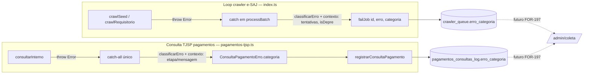

# Architecture: FOR-198 — Categorizar erros de consulta

## Visão de alto nível



Estado anterior: `erro` é só texto livre em ambas as tabelas; nenhuma categoria estruturada.
Estado posterior: cada escrita de erro passa por `classificarErro()` (módulo novo, puro,
testável) ANTES de chegar ao banco — o valor persistido já vem rotulado.

## Componente novo: `src/erro-categoria.ts`

Mesmo padrão de `Etapa` (`pagamentos-passos.ts`): union TypeScript simples + array readonly,
sem dependências. Dois conjuntos de dados de entrada:

1. **Flags de contexto explícitas**, setadas pelo CHAMADOR (que sabe coisas que a mensagem de
   erro sozinha não garante): `conteudoInesperado` (a página respondeu 200 mas sem o conteúdo
   esperado — a heurística de bloqueio/manutenção da issue) e `naoEncontrado` (sinal forte o
   bastante pra afirmar "não encontrado", não só "incerto").
2. **Fallback por regex na mensagem do `Error`**, só para os casos em que o chamador não tem
   informação extra pra oferecer (rate limit via "HTTP 429/5xx" — já embutido pela própria
   `esaj.ts`/`fetchHtml`; captcha; timeout; indisponibilidade de rede/browser).

```ts
export type ErroCategoria =
  | "captcha" | "timeout" | "rate_limit" | "site_indisponivel"
  | "bloqueio_suspeito" | "cnj_nao_encontrado" | "outro";

export interface ClassificarErroOpts {
  conteudoInesperado?: boolean; // 200 OK sem conteúdo esperado (heurística, decisão #2)
  naoEncontrado?: boolean;      // sinal forte o bastante pra não ser "incerto"
}

export function classificarErro(erro: unknown, opts?: ClassificarErroOpts): ErroCategoria;
```

Prioridade: `naoEncontrado` > `conteudoInesperado` > regex (rate_limit > captcha > timeout >
site_indisponivel) > `"outro"`. Flags explícitas sempre vencem regex — é informação de quem
lançou o erro, mais confiável que inferir de novo a partir do texto.

## Por que não dá pra fazer "cnj_nao_encontrado" com confiança no fluxo cpopg (e por que não finjo)

`crawl.ts` já documenta: quando a busca nunca sai do seed, é "indistinguível entre página de
manutenção do TJSP, bloqueio, e CNJ que nunca foi e-SAJ" — NA PRIMEIRA tentativa. O único sinal
adicional real que o pipeline já usa é **esgotar as tentativas da fila** (`MAX_TENTATIVAS_FILA`,
hoje 3) com o MESMO erro ambíguo — é exatamente a condição que já dispara `parkAsEproc()`
(reclassifica pra `eproc_pendentes`). Reuso dessa condição para `naoEncontrado=true` SÓ na
última tentativa; em qualquer tentativa anterior, `conteudoInesperado=true` (→
`bloqueio_suspeito`, com aviso de incerteza, decisão #2). Nenhum sinal novo inventado.

Requisitórios (.0500) nunca passam por `parkAsEproc` (o pipeline já restringe isso a
`!isDepre`) — então para eles o mesmo erro ambíguo classifica sempre como `bloqueio_suspeito`,
nunca `cnj_nao_encontrado`.

## Pontos de injeção (onde a classificação entra, concretamente)

### 1. `pagamentos-tjsp.ts::consultarInterno` — catch-all único

Hoje qualquer erro não-`ConsultaPagamentoErro` cai num catch-all no fim de `consultarInterno`
que já sabe a `etapa`. É o ponto único de classificação pros erros de captcha/busca/leitura:

```ts
} catch (e) {
  if (e instanceof ConsultaPagamentoErro) throw e;
  const msg = e instanceof Error ? e.message : String(e);
  if (!passos.passos.some((p) => p.etapa === etapa && p.status === "erro")) {
    passos.passo(etapa, "erro", msg);
  }
  const conteudoInesperado = /não encontrado no menu|portal não reconhecida/i.test(msg);
  throw new ConsultaPagamentoErro(msg, etapa, passos, classificarErro(e, { conteudoInesperado }));
}
```

`ConsultaPagamentoErro` ganha `categoria: ErroCategoria` como 4º parâmetro do construtor
(mesmo padrão de `etapa`, 2º parâmetro já existente). O outro ponto de construção direta
(falha de persistência, linha ~142) recebe `"outro"` explícito — é bug interno de
gravação no banco, não uma das 6 categorias externas.

`consultarEPersistirPagamentos` já lê `erro instanceof ConsultaPagamentoErro ? erro.etapa : ...`
pro `etapaFalha` — acrescenta o espelho pra `categoria` e passa pro `deps.registrar` (novo campo
`categoria` em `RegistroConsultaPagamento`).

### 2. `index.ts::processBatch` — catch do loop principal

```ts
} catch (err) {
  if (pareceSessaoMorta(err)) { /* ...existente... */ }
  const ultimaTentativa = job.tentativas + 1 >= MAX_TENTATIVAS_FILA;
  const semFichaNoESaj = isDepre(job.processo_codigo)
    ? requisitorioNaoRetornouDetalhe(err)
    : buscaNuncaSaiuDoSeed(err);
  const categoria = classificarErro(err, {
    conteudoInesperado: semFichaNoESaj,
    naoEncontrado: !isDepre(job.processo_codigo) && ultimaTentativa && semFichaNoESaj,
  });
  await failJob(job.id, String(err), categoria).catch(() => {});
  ...
  if (!isDepre(...) && ultimaTentativa && buscaNuncaSaiuDoSeed(err)) { /* parkAsEproc existente, reusa ultimaTentativa */ }
}
```

`requisitorioNaoRetornouDetalhe` é um novo helper espelhando `buscaNuncaSaiuDoSeed`, para a
mensagem equivalente de `crawlRequisitorio` em `crawl.ts`.

## Persistência — migrations (NÃO aplicadas por este agente; ver seção de validação)

### `crawler_queue` (decisão #3, literal)

- `ALTER TABLE crawler_queue ADD COLUMN erro_categoria text` + `CHECK` com as 7 categorias
  (mesmo padrão de `status`/`origem` já existentes nessa tabela — não é "enum nativo do
  Postgres", é TEXT+CHECK, igual ao resto do schema; decisão #3 só veta enum nativo).
- `fail_crawler_job(p_id, p_erro, p_categoria text DEFAULT NULL)` — `DROP FUNCTION` da
  assinatura de 2 parâmetros + `CREATE` da de 3 (Postgres não deixa `CREATE OR REPLACE`
  acrescentar parâmetro à assinatura existente; padrão já usado no repo em
  `sql/2026-10-03_for195c_...sql`).

### `pagamentos_consultas_log` (extensão mecânica da mesma decisão, não nova arquitetura — ver context.md)

- `ALTER TABLE pagamentos_consultas_log ADD COLUMN erro_categoria text` + mesmo `CHECK`.
- `registrar_consulta_pagamento(..., p_categoria text DEFAULT NULL)` — mesmo padrão de
  `DROP FUNCTION` + `CREATE` (assinatura muda de 12 para 13 parâmetros).

`coleta_runs`: nenhuma migration. `detalhe` já é jsonb; não usado nesta issue.

## Trade-offs e alternativas consideradas

- **Enum nativo do Postgres pra `erro_categoria`**: rejeitado na decisão #3 (`ALTER TYPE` é
  mais caro/rígido que `text`+`CHECK`; union TS já dá o mesmo nível de validação do lado que
  escreve).
- **RPC de classificação em SQL (Opção B da issue)**: rejeitada na decisão #1 — mensagem já
  truncada em 2000 chars quando chega no banco, e quebraria silenciosamente a cada mudança de
  texto. A classificação no worker tem acesso ao `Error` completo + contexto (tentativas,
  `isDepre`) que o SQL não tem.
- **Expor `erro_categoria` com `NOT NULL DEFAULT 'outro'`**: rejeitado — teria que classificar
  retroativamente as linhas existentes (dado histórico real) como `'outro'` mesmo sem ter
  sido de fato classificado; `NULL` é honesto ("não classificado"/"sem erro"), `'outro'` fica
  reservado pra erro CLASSIFICADO mas sem categoria específica.

## Consequências

- Nenhuma mudança de comportamento de retry/backoff/circuit-breaker/sessão — só rotulagem.
- 2 migrations pequenas, aditivas (coluna nullable + parâmetro com default), aplicadas
  manualmente no SQL Editor (convenção do repo) — preparadas e validadas em sandbox local,
  não aplicadas em produção por este agente (freio de mão: ação em produção exige aprovação).
- `fail_crawler_job`/`registrar_consulta_pagamento` mudam de assinatura (DROP+CREATE) — todo
  chamador precisa ser atualizado junto (só `supabase.ts`, confirmado por grep).

## Principais arquivos a modificar/criar

- **novo** `worker-crawler/src/erro-categoria.ts` (+ `.test.ts`)
- `worker-crawler/src/pagamentos-passos.ts` (ConsultaPagamentoErro ganha `categoria`)
- `worker-crawler/src/pagamentos-tjsp.ts` (classifica no catch-all + "outro" explícito na
  falha de persistência; propaga pro `registrar`)
- `worker-crawler/src/index.ts` (classifica no catch do loop; novo helper
  `requisitorioNaoRetornouDetalhe`)
- `worker-crawler/src/supabase.ts` (`failJob`, `registrarConsultaPagamento`,
  `RegistroConsultaPagamento` — novo parâmetro/campo `categoria`)
- **novo** `sql/2026-10-04_for198_1_erro_categoria_crawler_queue.sql`
- **novo** `sql/2026-10-04_for198_2_erro_categoria_pagamentos_consultas_log.sql`
- **novo** `sql/sandbox/for198_validate_local.sh`
- Testes existentes a ajustar: `worker-crawler/src/pagamentos-tjsp.test.ts` (construtor de
  `ConsultaPagamentoErro` ganha parâmetro — ajustar as 2 chamadas existentes).

---

## ✅ Verificação de Consistência

**Data**: 2026-10-04
**Status**: ✅ APROVADO

### Checklist
- [x] context.md e architecture.md consistentes (mesmos arquivos, mesma lista de categorias,
      mesma regra de `cnj_nao_encontrado`)
- [x] Conforme as 3 decisões já tomadas (#1 worker-time, #2 bloqueio exposto com aviso, #3
      persiste via coluna+RPC, union TS)
- [x] Extensão de escopo (`pagamentos_consultas_log`) documentada explicitamente em context.md
      e repetida aqui — não é decisão nova, é o mesmo padrão aplicado à 2ª tabela citada pela
      issue; reportado ao humano no handback
- [x] Nenhum enum nativo introduzido; nenhuma mudança de comportamento de retry/circuit-breaker

### Notas
Nenhuma decisão de arquitetura NOVA encontrada durante a investigação — o único ponto de
julgamento (persistir também em `pagamentos_consultas_log`) é extensão mecânica de uma decisão
já tomada, não um boundary/trade-off novo, então não aciona o freio de mão de "nova decisão
arquitetural" do modo autônomo. Reportado por transparência.
