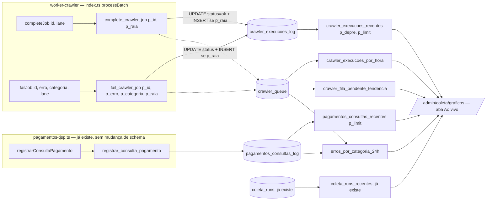

# Architecture: FOR-200 — /admin/coleta/graficos

## Visão de alto nível



Só UMA tabela nova (`crawler_execucoes_log`). Tudo o mais é RPC de leitura nova sobre tabelas
já existentes (ver context.md para o porquê de cada uma não precisar de tabela própria).

## Tabela nova: `crawler_execucoes_log`

```sql
CREATE TABLE public.crawler_execucoes_log (
  id              uuid        PRIMARY KEY DEFAULT gen_random_uuid(),
  job_id          uuid        NOT NULL,
  processo_codigo text        NOT NULL,
  raia            smallint    NOT NULL,
  resultado       text        NOT NULL CHECK (resultado IN ('ok', 'erro')),
  erro_categoria  text        CHECK (erro_categoria IN (
                    'captcha','timeout','rate_limit','site_indisponivel',
                    'bloqueio_suspeito','cnj_nao_encontrado','outro'
                  )),
  terminal        boolean     NOT NULL,
  criado_em       timestamptz NOT NULL DEFAULT now()
);
CREATE INDEX idx_crawler_execucoes_log_criado_em ON crawler_execucoes_log (criado_em DESC);
```

- **Append-only de verdade**: só é escrita via INSERT dentro de `complete_crawler_job`/
  `fail_crawler_job` (abaixo) — nenhum UPDATE/DELETE de linha individual.
- **Denormalizado** (`processo_codigo` duplicado de `crawler_queue`): o log sobrevive a
  qualquer mudança futura na linha de origem; não depende de JOIN pra exibir o feed.
- **`terminal`**: distingue uma falha FINAL (job sai da fila, `status='erro'`, não ganha mais
  tentativas) de uma falha intermediária (`tentativas < 3`, volta pra `pendente` com backoff).
  Só existe por causa da fórmula da "Fila pendente" (ver RPC 4 abaixo) — sem essa flag, uma
  retentativa pareceria "saída da fila" indevidamente. `resultado='ok'` é sempre `terminal=true`.
- **`raia`**: 1-based (lane 0-based do worker + 1) — só pra bater com a leitura humana do
  protótipo (`#1`.."#6"), sem significado especial além de identificar a raia.
- **Retenção por tempo** (não por processo, ver context.md): a cada INSERT, também
  `DELETE FROM crawler_execucoes_log WHERE criado_em < now() - interval '3 days'` — mesmo
  espírito do padrão "retenção na própria RPC de escrita" de `pagamentos_consultas_log`
  (FOR-171), adaptado de "por processo" pra "por tempo" (não há um "processo" único pra podar
  aqui — é log agregado de todos os jobs).
- **RLS**: `ENABLE ROW LEVEL SECURITY` + nenhuma policy + `REVOKE ALL FROM anon, authenticated`
  (padrão "admin anon → RPC" da memória do projeto) — só leitura via RPC `SECURITY DEFINER`.

## RPCs de escrita — `complete_crawler_job`/`fail_crawler_job` ganham `p_raia`

Ambas precisam de **DROP FUNCTION + CREATE** (Postgres não deixa `CREATE OR REPLACE` acrescentar
parâmetro — mesmo padrão já usado no repo, citado no FOR-198). `p_raia integer DEFAULT NULL`
(não `NOT NULL`): se vier `NULL` (worker ainda não atualizado, ou chamada de teste/manual), a
função só pula o INSERT no log — nunca falha a chamada por causa de telemetria. Mesmo princípio
defensivo do `.catch(() => {})` já usado em `index.ts` ao redor de `failJob`.

```sql
CREATE FUNCTION public.complete_crawler_job(p_id uuid, p_raia integer DEFAULT NULL)
RETURNS void LANGUAGE plpgsql SECURITY DEFINER SET search_path = public AS $$
DECLARE v_processo text;
BEGIN
  UPDATE crawler_queue SET status = 'ok', updated_at = NOW()
   WHERE id = p_id
   RETURNING processo_codigo INTO v_processo;

  IF v_processo IS NOT NULL AND p_raia IS NOT NULL THEN
    INSERT INTO crawler_execucoes_log (job_id, processo_codigo, raia, resultado, terminal)
    VALUES (p_id, v_processo, p_raia, 'ok', true);
    DELETE FROM crawler_execucoes_log WHERE criado_em < now() - interval '3 days';
  END IF;
END; $$;

CREATE FUNCTION public.fail_crawler_job(
  p_id uuid, p_erro text, p_categoria text DEFAULT NULL, p_raia integer DEFAULT NULL
) RETURNS void LANGUAGE plpgsql SECURITY DEFINER SET search_path = public AS $$
DECLARE v_processo text; v_tentativas int;
BEGIN
  UPDATE crawler_queue
     SET tentativas     = tentativas + 1,
         erro           = p_erro,
         erro_categoria = p_categoria,
         updated_at     = NOW(),
         status         = CASE WHEN tentativas + 1 >= 3 THEN 'erro' ELSE 'pendente' END,
         scheduled_at   = CASE WHEN tentativas + 1 >= 3 THEN scheduled_at
                               ELSE NOW() + (ARRAY['15 minutes','1 hour'])[tentativas + 1]::interval END
   WHERE id = p_id
   RETURNING processo_codigo, tentativas INTO v_processo, v_tentativas;
   -- RETURNING devolve o valor JÁ incrementado (tentativas = tentativas + 1 no SET acima)

  IF v_processo IS NOT NULL AND p_raia IS NOT NULL THEN
    INSERT INTO crawler_execucoes_log (job_id, processo_codigo, raia, resultado, erro_categoria, terminal)
    VALUES (p_id, v_processo, p_raia, 'erro', p_categoria, v_tentativas >= 3);
    DELETE FROM crawler_execucoes_log WHERE criado_em < now() - interval '3 days';
  END IF;
END; $$;
```

**GRANT explícito** (endurecendo os 2, mesmo achado de code review do FOR-198: assinatura antiga
de `complete_crawler_job` NUNCA teve `REVOKE ALL FROM PUBLIC` — vazava EXECUTE pra `anon` via
privilégio padrão do schema; corrigido aqui também, não só em `fail_crawler_job`):

```sql
REVOKE ALL ON FUNCTION public.complete_crawler_job(uuid, integer) FROM PUBLIC, anon;
GRANT EXECUTE ON FUNCTION public.complete_crawler_job(uuid, integer) TO authenticated, service_role;
REVOKE ALL ON FUNCTION public.fail_crawler_job(uuid, text, text, integer) FROM PUBLIC, anon;
GRANT EXECUTE ON FUNCTION public.fail_crawler_job(uuid, text, text, integer) TO authenticated, service_role;
```

### Pontos de injeção no worker (`index.ts`/`supabase.ts`)

- `supabase.ts::completeJob(id, raia?)` → `supabase.rpc("complete_crawler_job", { p_id: id, p_raia: raia ?? null })`.
- `supabase.ts::failJob(id, erro, categoria?, raia?)` → acrescenta `p_raia: raia ?? null`.
- `index.ts::processBatch` já recebe `lane` do `runPool` — só passa `lane + 1` (1-based) nas
  duas chamadas existentes (`completeJob(job.id, lane + 1)`, `failJob(job.id, String(err),
  categoria, lane + 1).catch(() => {})`). Nenhuma mudança de lógica de retry/circuit-breaker.

## RPCs de leitura novas

### 1. `crawler_execucoes_recentes(p_depre boolean, p_limit integer DEFAULT 14)`

Feed dos cards "Crawler e-SAJ" (`p_depre=false`) e "Consulta DEPRE/.0500" (`p_depre=true`).
Distingue pelo MESMO regex que `isDepre()` usa no worker (`esaj.ts:72`), aplicado em SQL —
nenhuma coluna nova pra marcar isso (seria redundante com o formato do `processo_codigo`).

```sql
CREATE FUNCTION public.crawler_execucoes_recentes(p_depre boolean, p_limit integer DEFAULT 14)
RETURNS TABLE(criado_em timestamptz, processo_codigo text, raia integer, resultado text, erro_categoria text)
LANGUAGE sql STABLE SECURITY DEFINER SET search_path = public AS $$
  SELECT criado_em, processo_codigo, raia, resultado, erro_categoria
    FROM crawler_execucoes_log
   WHERE (processo_codigo ~ '\.8\.26\.0500$') = p_depre
   ORDER BY criado_em DESC
   LIMIT LEAST(GREATEST(COALESCE(p_limit, 14), 1), 50);
$$;
```

### 2. `pagamentos_consultas_recentes(p_limit integer DEFAULT 14)`

Feed do card "Consulta de pagamento TJSP" — versão "global, mais recentes" de
`listar_consultas_pagamento` (que é por-processo). Nenhuma mudança na tabela/RPC existente.

```sql
CREATE FUNCTION public.pagamentos_consultas_recentes(p_limit integer DEFAULT 14)
RETURNS TABLE(criado_em timestamptz, processo_depre text, resultado text, erro_categoria text)
LANGUAGE sql STABLE SECURITY DEFINER SET search_path = public AS $$
  SELECT criado_em, processo_depre, resultado, erro_categoria
    FROM pagamentos_consultas_log
   ORDER BY criado_em DESC
   LIMIT LEAST(GREATEST(COALESCE(p_limit, 14), 1), 50);
$$;
```

Frontend mapeia `resultado`: `'encontrado'`/`'nao_consta'` → badge "ok" (a CONSULTA funcionou,
mesmo quando a resposta de negócio é "não consta"); só `'falha'` → badge de erro com a
`erro_categoria`. Essa é uma leitura de SAÚDE DO ROBÔ, não do resultado de negócio.

### 3. `crawler_execucoes_por_hora()` — "Execuções por hora" (24 barras, sucesso/erro)

`status IN ('ok','erro')` em `crawler_queue` é estado TERMINAL — uma vez alcançado,
`updated_at` não muda mais (nenhuma RPC faz UPDATE em linha já 'ok'/'erro', exceto
`requeue_failed`, ação manual admin que tira a linha de 'erro' — aceitável: um job
reprocessado manualmente "sai" do histórico de erro antigo, é o comportamento correto).

```sql
CREATE FUNCTION public.crawler_execucoes_por_hora()
RETURNS TABLE(hora timestamptz, n_ok bigint, n_erro bigint)
LANGUAGE sql STABLE SECURITY DEFINER SET search_path = public AS $$
  SELECT date_trunc('hour', updated_at) AS hora,
         count(*) FILTER (WHERE status = 'ok')   AS n_ok,
         count(*) FILTER (WHERE status = 'erro') AS n_erro
    FROM crawler_queue
   WHERE status IN ('ok', 'erro') AND updated_at >= now() - interval '24 hours'
   GROUP BY 1
   ORDER BY 1;
$$;
```

RPC nova (não altera `crawler_ritmo_processamento`, que o `/admin/coleta` atual já consome —
evita qualquer regressão na aba "Visão geral").

### 4. `crawler_fila_pendente_tendencia()` — "Fila pendente" (linha/área, 24 pontos)

Sem snapshot periódico (ver context.md). Reconstrução: um job está "na fila" (pendente ou
processando) no instante `t` se `created_at <= t` E ele ainda não tinha alcançado um estado
terminal em `t` — o que é verdade se (a) ele AINDA não é terminal agora (`status IN
('pendente','processando')`, logo também não era terminal em nenhum `t` anterior a agora), OU
(b) ele JÁ é terminal agora mas só ficou terminal DEPOIS de `t` (`updated_at > t`).

```sql
CREATE FUNCTION public.crawler_fila_pendente_tendencia()
RETURNS TABLE(hora timestamptz, pendentes bigint)
LANGUAGE sql STABLE SECURITY DEFINER SET search_path = public AS $$
  SELECT h.hora,
         (SELECT count(*) FROM crawler_queue q
           WHERE q.created_at <= h.hora
             AND (q.status IN ('pendente', 'processando') OR q.updated_at > h.hora)
         ) AS pendentes
    FROM generate_series(
           date_trunc('hour', now() - interval '23 hours'),
           date_trunc('hour', now()),
           interval '1 hour'
         ) AS h(hora)
   ORDER BY h.hora;
$$;
```

**Limitação documentada (honesta, não escondida)**: um job que teve retentativas
(`tentativas < 3`, volta pra `pendente`) conta como "na fila" o tempo TODO entre `created_at` e
sua resolução final — o que é exatamente correto (ele de fato nunca saiu da fila; só teve
`scheduled_at` adiado). A série não depende de `crawler_execucoes_log` (poderia estar vazia logo
após a migration que ainda assim os primeiros pontos do gráfico já serem corretos desde o
deploy, porque usa só colunas que `crawler_queue` já populava antes desta issue).

### 5. `erros_por_categoria_24h()` — painel "Erros por categoria"

Combina as duas fontes que já têm `erro_categoria` (FOR-198): `crawler_queue` (erro terminal) +
`pagamentos_consultas_log` (consulta que falhou de verdade).

```sql
CREATE FUNCTION public.erros_por_categoria_24h()
RETURNS TABLE(categoria text, n bigint)
LANGUAGE sql STABLE SECURITY DEFINER SET search_path = public AS $$
  WITH tudo AS (
    SELECT erro_categoria FROM crawler_queue
     WHERE status = 'erro' AND erro_categoria IS NOT NULL AND updated_at >= now() - interval '24 hours'
    UNION ALL
    SELECT erro_categoria FROM pagamentos_consultas_log
     WHERE resultado = 'falha' AND erro_categoria IS NOT NULL AND criado_em >= now() - interval '24 hours'
  )
  SELECT erro_categoria, count(*) FROM tudo GROUP BY 1 ORDER BY count(*) DESC;
$$;
```

### 6. 4 robôs periódicos — reusa `coleta_runs_recentes` (já existe, FOR-108)

Nenhuma RPC nova. Chamadas com os `p_rotina` certos (ver context.md pros valores reais):
- Ingestão DJE → `coleta_runs_recentes('caderno_dje', 1)`.
- Refresh de ativos → `coleta_runs_recentes('refresh_ativos', 1)` (já usada hoje).
- Ingestão DJE Federal / Ingestão por OAB → `rotina` varia por tribunal/script
  (`caderno_djen_trf1..6`, `ingest_oab`/`ingest_oab_cpopg`) — `coleta_runs_recentes` não filtra
  por prefixo. Em vez de uma RPC nova só pra isso, o frontend busca sem filtro de rotina
  (`coleta_runs_recentes(null, 50)`) e filtra client-side pelas rotinas que começam com o
  prefixo certo, pegando a mais recente — mesmo princípio de "não inventar infra nova pra um
  problema que dá pra resolver com o dado que já volta".

GRANTs de leitura: todas as RPCs novas seguem o padrão já usado em `for108`/`for171_3`:
`GRANT EXECUTE ... TO anon, authenticated` (ou `anon, authenticated, service_role` onde o
padrão existente usa — `/admin` roda anônimo, ver memória "Admin anon → RPC").

## Frontend — `/admin/coleta/graficos`

- Nova rota `src/routes/admin.coleta.graficos.tsx` (convenção flat-file do TanStack Router já
  usada no repo: `admin.coleta.tsx` → sub-rota `admin.coleta.graficos.tsx`, confirmado olhando
  o diretório `src/routes/`).
- Nova aba "Ao vivo" ao lado de "Visão geral" em AMBAS as páginas (link cruzado, como no
  protótipo: `<a href="Main.dc.html">Visão geral</a>` / `Ao vivo` ativa).
- Novo `src/lib/api/coleta-graficos.ts` com os `fetch*` das 6 RPCs novas + os client-side
  helpers de rotina periódica (não mistura com `coleta.ts` existente, que é só da "Visão geral").
- **Honestidade de "ao vivo" preservada na UI**: só os 3 cards com dado de
  `crawler_execucoes_recentes`/`pagamentos_consultas_recentes` ganham o `live-dot` pulsante +
  poll curto (`refetchInterval` do react-query, ~5s — rápido o bastante pra "sentir" ao vivo sem
  gerar carga desproporcional ao volume real). Os 4 periódicos usam `staleTime` normal (sem
  poll agressivo) e mostram só "última execução: `<data/hora>`", sem qualquer indicador
  pulsante — isso é o cerne da decisão de honestidade já validada e não deve regredir.
- Gráficos renderizados em SVG/CSS puro (mesmo estilo do protótipo: barras com `div`s, linha de
  área com `<svg><polyline>`) — sem biblioteca de charting nova (não há precedente de lib de
  gráficos no repo; manter a dependência zero do protótipo).

## Trade-offs e alternativas consideradas

- **Snapshot periódico (pg_cron) da profundidade da fila**: rejeitado — infra nova (seria uma
  2ª tabela + um cron) pra um dado que já é reconstruível dos timestamps que `crawler_queue`
  já mantém. Reportado explicitamente no handback pra confirmação fácil (é mecanismo, não
  produto; reversível trocando só a RPC 4 se a aproximação se mostrar errada em produção).
- **1 tabela de log por robô (3 tabelas)**: rejeitado — "Consulta de pagamento" já tem a sua
  (`pagamentos_consultas_log`, preexistente); criar uma 2ª só duplicaria o que já funciona.
- **RPC única "pega tudo" pros 3 feeds**: rejeitado — `crawler_execucoes_log` e
  `pagamentos_consultas_log` têm colunas diferentes (raia só na primeira); 2 RPCs read-only
  pequenas e tipadas são mais simples que uma genérica com colunas nulas condicionais.
- **Enum nativo do Postgres pra `resultado`/`erro_categoria`**: rejeitado, mesmo racional do
  FOR-198 (TEXT+CHECK já é o padrão do repo).

## Consequências

- `complete_crawler_job`/`fail_crawler_job` mudam de assinatura (DROP+CREATE) — único chamador
  é `worker-crawler/src/supabase.ts` (confirmado por grep); atualizado junto nesta sessão.
- Migration tem que ser aplicada ANTES do deploy do worker novo (mesma ordem de risco já
  documentada no FOR-198: RPC sem o parâmetro novo → PostgREST não resolve a função →
  `completeJob`/`failJob` falham). Não aplicada em produção por este agente (freio de mão).
- Nenhuma mudança de comportamento de retry/backoff/circuit-breaker — só passa a logar raia +
  popular uma tabela nova em paralelo.
- `/admin/coleta` (aba "Visão geral") INTOCADA — só ganha o link pra aba nova.

## Principais arquivos a modificar/criar

**cortex-v1:**
- novo `sql/2026-10-04_for200_1_tabela_crawler_execucoes_log.sql`
- novo `sql/2026-10-04_for200_2_completa_falha_job_com_raia.sql`
- novo `sql/2026-10-04_for200_3_rpcs_leitura_graficos.sql`
- novo `sql/sandbox/for200_validate_local.sh`
- `worker-crawler/src/supabase.ts` (`completeJob`, `failJob` — parâmetro `raia`)
- `worker-crawler/src/index.ts` (`processBatch` — passa `lane + 1` nas 2 chamadas)
- `worker-crawler/src/index.test.ts` ou teste novo cobrindo a passagem de raia, se existir
  suite de `processBatch`/mocka `supabase.ts` (confirmar na Fase 3)

**frontend:**
- novo `src/routes/admin.coleta.graficos.tsx`
- novo `src/lib/api/coleta-graficos.ts`
- `src/routes/admin.coleta.tsx` (acrescenta a aba "Ao vivo" ao lado de "Visão geral")

---

## ✅ Verificação de Consistência

**Data**: 2026-10-04
**Status**: ✅ APROVADO

### Checklist
- [x] context.md e architecture.md consistentes (mesma tabela nova, mesmas 5 RPCs de leitura,
      mesma lista de arquivos)
- [x] Conforme a decisão já tomada (tabela de log append-only, não Realtime) — nenhum Realtime
      introduzido, nenhuma tabela mutável reaproveitada como se fosse log
- [x] Escopo reduzido a 1 tabela nova (não 3) documentado e justificado — extensão de leitura
      sobre dado já existente não é decisão de arquitetura nova, é desenho dentro da decisão já
      tomada (mandato explícito da tarefa: "o desenho exato da tabela/RPC é seu")
- [x] Decisão de honestidade (indicador "ao vivo" só nos 3 robôs contínuos) preservada no
      desenho do frontend
- [x] Única extensão de escopo não-trivial (reconstrução matemática da fila pendente em vez de
      snapshot periódico) documentada e reportada para confirmação no handback — mecanismo, não
      produto, reversível isoladamente

### Notas
Nenhuma decisão de PRODUTO nova. A única decisão técnica desta sessão que vai além de "aplicar
o padrão já decidido" é a escolha de reconstruir a tendência de fila pendente via fórmula em vez
de snapshot periódico — é uma escolha de MECANISMO (evita infra nova), não de arquitetura de
dados (seria substituível por uma RPC diferente sem tocar a tabela de log), então não aciona o
freio de mão de "nova decisão arquitetural" — mas é reportada por transparência, como o FOR-198
reportou sua extensão de escopo.

---

## Addendum — ajustes pós-code-review (2026-10-04, 2 revisões independentes)

Achados MEDIUM aplicados antes do PR (nenhuma decisão de arquitetura nova — todos dentro do
desenho já aprovado acima):

- **M1**: `complete_crawler_job`/`fail_crawler_job` rodavam o INSERT+DELETE de log na MESMA
  transação implícita da UPDATE em `crawler_queue` — uma falha na telemetria (deadlock no
  DELETE concorrente entre raias, overflow de `raia` no smallint) desfazia a UPDATE inteira e
  fazia `index.ts` tratar um job bem-sucedido como falho. Fix: `BEGIN...EXCEPTION WHEN OTHERS`
  isola o log numa subtransação.
- **M2**: `crawler_fila_pendente_tendencia` fazia 24 subqueries correlacionadas não-sargáveis
  (OR entre `status` e `updated_at`) sobre `crawler_queue` inteira — mesma classe de risco de
  57014 já documentada no projeto (FOR-189/194). Fix: reescrita em 1 CTE + 2 índices parciais
  novos cobrindo os dois ramos do OR.
- **M3**: `crawler_execucoes_por_hora`/`erros_por_categoria_24h` contavam só falha TERMINAL em
  `crawler_queue` do lado crawler, divergindo do feed (por tentativa) e do lado pagamentos (por
  tentativa). Fix: as duas agora leem `crawler_execucoes_log` do lado crawler — por tentativa,
  consistente com o resto da tela; `crawler_fila_pendente_tendencia` continua em `crawler_queue`
  (profundidade de fila é sobre o estado atual, não dá pra derivar do log de tentativas).
- **L3**: teste do sandbox pro CHECK de `erro_categoria` exercitava o CHECK errado (o de
  `crawler_queue`, não o da tabela nova). Fix: INSERT direto em `crawler_execucoes_log`.
- Frontend M2/M6: nova RPC `coleta_runs_ultima_por_padrao` (substitui filtro client-side por
  prefixo numa janela capada que podia nunca incluir uma rotina rara como `ingest_oab`); filtro
  `origem='crawler'` em `pagamentos_consultas_recentes` (consultas manuais/busca pública não são
  execução do robô). Frontend L10: feeds retornam `id` (chave estável pro React).

Todos revalidados em `sql/sandbox/for200_validate_local.sh` (inclui cenários novos pro guard de
exceção do M1 e pros valores corrigidos do M2/M3) — suite completa OK.
