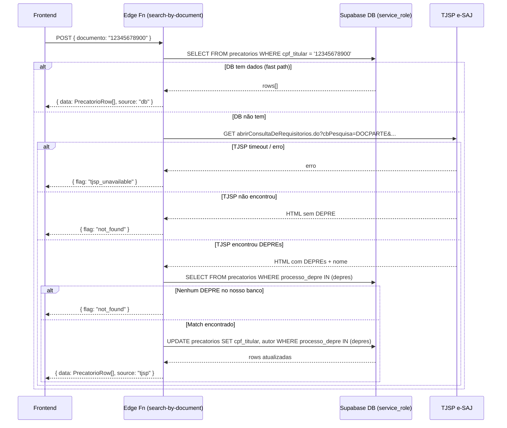

# Architecture: FOR-25 — Busca de Precatório por CPF/CNPJ via TJSP

## Estado Atual vs. Estado Futuro

### Antes
```
/resultado/cpf/$cpf   → ResultadoCpf  → findByCpf(cpf, mockPrecatorios)  ← MOCK
/resultado/cnpj/$cnpj → ResultadoCnpj → findByCnpj(cnpj, mockPrecatorios) ← MOCK
```

### Depois
```
/resultado/cpf/$cpf   → ResultadoCpf  → fetchPrecatoriosByDoc(cpf)  → edge fn → DB + TJSP
/resultado/cnpj/$cnpj → ResultadoCnpj → fetchPrecatoriosByDoc(cnpj) → edge fn → DB + TJSP
```

---

## Componentes e Relações

```
frontend/src/
  routes/
    resultado.cpf.$cpf.tsx       [MODIFICAR] async + loading state
    resultado.cnpj.$cnpj.tsx     [MODIFICAR] async + loading state
  lib/
    api/
      precatorios.ts             [MODIFICAR] adicionar fetchPrecatoriosByDoc()
  components/
    grouped-results.tsx          [NÃO MUDAR] já renderiza bem lista de precatórios

cortex-v1/supabase/functions/
  search-by-document/
    index.ts                     [CRIAR] nova edge function
```

---

## Diagrama de Fluxo



---

## Edge Function: `search-by-document`

**Arquivo:** `supabase/functions/search-by-document/index.ts`

**Padrão:** idêntico a `verify-token/index.ts` — Deno.serve, CORS, service_role client

### Contrato da API

```
POST /functions/v1/search-by-document
Headers: Authorization: Bearer <anon_key>   (chave pública — a auth real é pelo SUPABASE_ANON_KEY)
Body: { "documento": "12345678900" }        // CPF 11 dígitos ou CNPJ 14 dígitos, sem máscara

Responses:
  200 { data: PrecatorioRow[], source: "db" | "tjsp" }
  200 { flag: "not_found" }
  200 { flag: "tjsp_unavailable" }
  400 { error: "documento inválido" }
```

### Lógica interna

```typescript
// 1. Validação
const digits = documento.replace(/\D/g, "")
if (digits.length !== 11 && digits.length !== 14) → 400

// 2. DB-first (service_role)
const col = digits.length === 11 ? "cpf_titular" : "cnpj_titular"
const { data } = await supabase.from("precatorios").select("*").eq(col, digits)
if (data.length > 0) → retorna via precatorios_publico view (sem CPF/CNPJ)

// 3. TJSP fallback
const html = await fetch(TJSP_URL, { signal: AbortSignal.timeout(15_000) })
const depres = extractDepres(html)        // regex \d{7}-\d{2}\.\d{4}\.\d\.\d{2}\.0500
const nome = extractNome(html)            // parse do nome do beneficiário

// 4. Cross-reference
const { data: matches } = await supabase
  .from("precatorios").select("*").in("processo_depre", depres)

// 5. Enrich
await supabase.from("precatorios")
  .update({ [col]: digits, autor: nome })
  .in("processo_depre", depres)

// 6. Return (via public view para não vazar CPF/CNPJ)
const { data: publicRows } = await supabase
  .from("precatorios_publico").select("*").in("processo_depre", depres)
```

### TJSP Request

```
URL: https://esaj.tjsp.jus.br/cpopg/abrirConsultaDeRequisitorios.do
Params:
  cbPesquisa=DOCPARTE
  dadosConsulta.valorConsulta=<CPF_OU_CNPJ>    // dígitos apenas
  consultaDeRequisitorios=true
Headers:
  User-Agent: Mozilla/5.0 (Windows NT 10.0; Win64; x64) AppleWebKit/537.36...
  Referer: https://esaj.tjsp.jus.br/cpopg/abrirConsultaDeRequisitorios.do
```

> ⚠️ **Nota de implementação**: o parâmetro exato para o valor do documento pode variar (`dadosConsulta.valorConsulta` ou `dadosConsulta.valorConsultaNuUnificado`). Verificar com request real no início da implementação — comparar com `busca_cessao.py` linha 65–75.

### Parse HTML (Deno — sem BeautifulSoup)

```typescript
// Extrai DEPREs
const REGEX_DEPRE = /\d{7}-\d{2}\.\d{4}\.\d\.\d{2}\.0500/g
const depres = [...html.matchAll(REGEX_DEPRE)].map(m => m[0])

// Extrai nome do beneficiário (heurística — verificar HTML real do TJSP)
// Provável padrão: tag com class "nomePartes" ou texto após "Parte:"
const nomeMatch = html.match(/(?:Exequente|Requerente|Parte):\s*<[^>]*>([^<]+)</)
```

---

## Frontend Changes

### `resultado.cpf.$cpf.tsx` e `resultado.cnpj.$cnpj.tsx`

**Padrão atual (mock):**
```typescript
function ResultadoCpf() {
  const { cpf } = Route.useParams()
  const results = findByCpf(cpf, mockPrecatorios)  // síncrono, mock
  return <GroupedResults kind="CPF" maskedId={...} results={results} />
}
```

**Novo padrão (async, igual a `resultado.$processo.tsx`):**
```typescript
function ResultadoCpf() {
  const { cpf } = Route.useParams()
  const [loading, setLoading] = useState(true)
  const [results, setResults] = useState<PrecatorioRow[]>([])
  const [flag, setFlag] = useState<"not_found" | "tjsp_unavailable" | null>(null)

  useEffect(() => {
    fetchPrecatoriosByDoc(cpf).then(({ data, flag }) => {
      setResults(data ?? [])
      setFlag(flag ?? null)
      setLoading(false)
    })
  }, [cpf])

  if (loading) return <LoadingCard label="Consultando TJSP..." />
  if (flag === "tjsp_unavailable") return <TjspUnavailableCard />
  return <GroupedResults kind="CPF" maskedId={maskCpfPartial(...)} results={results} />
}
```

### `src/lib/api/precatorios.ts`

Adicionar `fetchPrecatoriosByDoc()`:

```typescript
export async function fetchPrecatoriosByDoc(documento: string): Promise<{
  data: PrecatorioRow[],
  flag?: "not_found" | "tjsp_unavailable",
  source?: "db" | "tjsp"
}> {
  const digits = documento.replace(/\D/g, "")
  const res = await supabase.functions.invoke("search-by-document", {
    body: { documento: digits }
  })
  return res.data
}
```

---

## Arquivos a Modificar/Criar

| Arquivo | Ação | Descrição |
|---------|------|-----------|
| `supabase/functions/search-by-document/index.ts` | CRIAR | Nova edge function |
| `frontend/src/routes/resultado.cpf.$cpf.tsx` | MODIFICAR | Async + real API |
| `frontend/src/routes/resultado.cnpj.$cnpj.tsx` | MODIFICAR | Async + real API |
| `frontend/src/lib/api/precatorios.ts` | MODIFICAR | Adicionar `fetchPrecatoriosByDoc` |

---

## Trade-offs e Alternativas

| Decisão | Escolhida | Alternativa descartada | Motivo |
|---------|-----------|----------------------|--------|
| DB-first | Sim | Sempre TJSP | Mais rápido quando já enriquecido, menor load no TJSP |
| Edge Function | Sim | Client direto | `cpf_titular`/`cnpj_titular` precisam de service_role |
| Regex HTML | Sim | `node-html-parser` via esm.sh | Menos deps, DEPRE tem formato fixo previsível |
| `funnel_events` | Registra tipo (cpf/cnpj) sem o número | Registrar documento | LGPD |

---

## Consequências Adversas

- TJSP pode retornar CAPTCHA em volume alto → considerar rate limiting (fora do escopo deste ticket)
- Edge function timeout: Supabase default é 60s — TJSP request com AbortSignal de 15s previne hanging
- Se TJSP mudar estrutura do HTML → regex quebra silenciosamente → adicionar log de warning

---

## ✅ Verificação de Consistência

**Data**: 2026-06-05
**Status**: ✅ APROVADO

### Checklist
- [x] context.md e architecture.md consistentes
- [x] Conforme especificação de negócio (FOR-25 refinado)
- [x] Conforme padrões/convenções do projeto (service_role, RLS, snake_case, funnel_events)
- [x] Valores e regras de negócio conferidos (CPF mascarado, centavos, LGPD)

### Notas
- `grouped-results.tsx` não precisa de mudança — já renderiza `Precatorio[]` genérico
- A flag `tjsp_unavailable` precisa de um novo variant no componente CPF/CNPJ (inline, não no GroupedResults)
- Mock `mockPrecatorios` pode ser removido das importações dos dois arquivos de rota após a mudança
