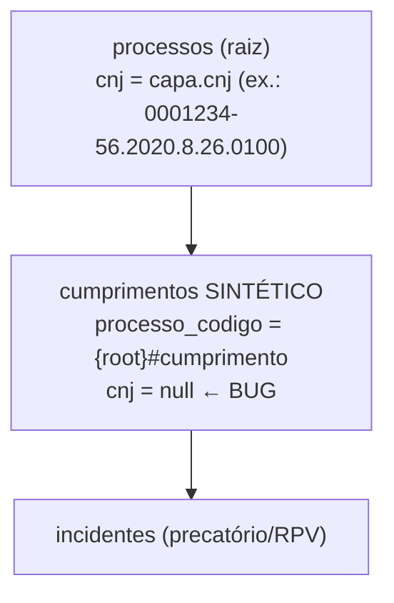
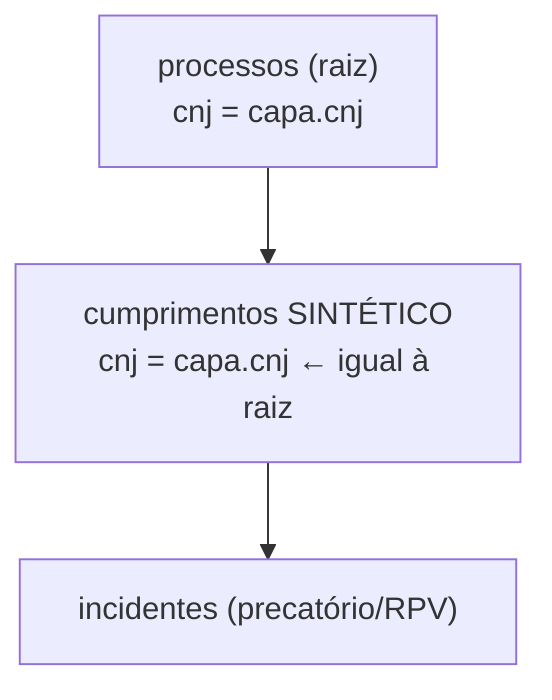

# Architecture: FOR-196 — cumprimento sintético gravando cnj=null

## Antes

347.482 `incidentes` com "Cumprimento de Sentença" em branco (herdam o `cnj` null do
cumprimento sintético ao qual pertencem).

## Depois

## Componentes

| Arquivo | Mudança |
|---|---|
| `worker-crawler/src/crawl.ts` | linha 141 e 148-149: `cnj: null` → `cnj: capa.cnj` (2 ramificações de `crawlSeed` que criam cumprimento sintético) |
| `worker-crawler/src/crawl-cumprimento-sintetico.test.ts` | NOVO — cobre as 2 ramificações, via `mock.module` da camada de rede (esaj/comunica/supabase) |
| `worker-crawler/package.json` | NOVO script `test:module-mocks` (opt-in, não entra no `npm test` default) |
| `sql/2026-10-02_for196_backfill_cnj_cumprimento_sintetico.sql` | NOVO — UPDATE idempotente, backfill dos 126.388 cumprimentos já gravados com `cnj is null` |
| `sql/sandbox/for196_validate_local.sh` | NOVO — valida o UPDATE num Postgres 15 local descartável (3 cenários: sintético c/ incidentes, "de verdade" já preenchido, sintético sem incidente; 2 rodadas p/ provar idempotência) |

## Por que `capa.cnj` é a fonte certa

`capa` vem de `extractCapa(root.$)` (linha 89 de `crawlSeed`), executado **antes** das
ramificações de cumprimento sintético — já está em escopo, sem custo extra de fetch. É o mesmo
CNJ que o `ProcessoTree` resultante usa em `tree.cnj` (linha ~187) — ou seja, o cumprimento
sintético agora é literalmente "o mesmo número do processo principal", exatamente o
comportamento esperado descrito no card.

## Convenções mantidas

- Comentários em português explicando o "porquê" (padrão do arquivo: ver comentários FOR-143/
  FOR-156 já existentes em `parse.ts`/`crawl.ts`).
- Migration no padrão `sql/YYYY-MM-DD_forNNN_descrição.sql` com cabeçalho explicando achado +
  números + confirmação de segurança (mesmo estilo de `sql/2026-10-01_for194_...sql`).
- Script de validação local no padrão `sql/sandbox/forNNN_validate_local.sh` (mesmo esqueleto
  de `for173_validate_local.sh`: Postgres descartável via Homebrew, TCP-only, cleanup via trap).

## Trade-offs / alternativas

- **Teste de `crawlSeed` via mock.module vs. não testar a camada de orquestração**: o resto do
  worker-crawler só testa funções puras (`parse.ts`, `pagamentos-classificar.ts`) ou mocka um
  client singleton por `t.mock.method` (`supabase.rpc`); nenhum teste existente mocka módulos
  ESM inteiros, porque `esaj.ts` exporta funções soltas (não um objeto/client), que não são
  mutáveis via `t.mock.method` num namespace ESM. `mock.module` (node:test nativo, sem lib nova)
  resolve isso, mas exige `--experimental-test-module-mocks`, só em Node ≥22.3. Decisão: não
  elevar o piso de Node do `npm test` default (`engines`/README dizem "≥20") — o teste novo vive
  num script opt-in (`test:module-mocks`) e se auto-pula sob o `npm test` padrão. Documentado
  explicitamente para o humano poder revisar essa escolha (não é uma mudança de arquitetura de
  produção, só de tooling de teste).
- Alternativa descartada: extrair a lógica de `crawlSeed` para uma função pura testável sem rede
  — mudaria a estrutura do módulo além do escopo acordado (só as 2 linhas + migration).

## Consequências / riscos

- Nenhum (fix aditivo: amplia o que já era `capa.cnj` disponível, não muda nenhum outro campo).
- Migration e fix de código são independentes entre si (ordem de deploy não importa).

---

## ✅ Verificação de Consistência

**Data**: 2026-10-02
**Status**: ✅ APROVADO

- [x] context.md e architecture.md consistentes (mesmos 5 arquivos, mesma estratégia)
- [x] Conforme escopo definido no card FOR-196 (2 linhas + migration; sem recrawl)
- [x] Conforme padrões do projeto (comentários PT-BR, convenção `sql/YYYY-MM-DD_forNNN_*.sql`,
  `sql/sandbox/*.sh` para validação local)
- [x] Nenhuma decisão de produto ou decisão arquitetural nova de produção — a única escolha de
  engenharia feita sem pedir aprovação prévia foi de TOOLING de teste (script opt-in em vez de
  elevar o piso de Node do `npm test`), documentada acima e no relatório final.
