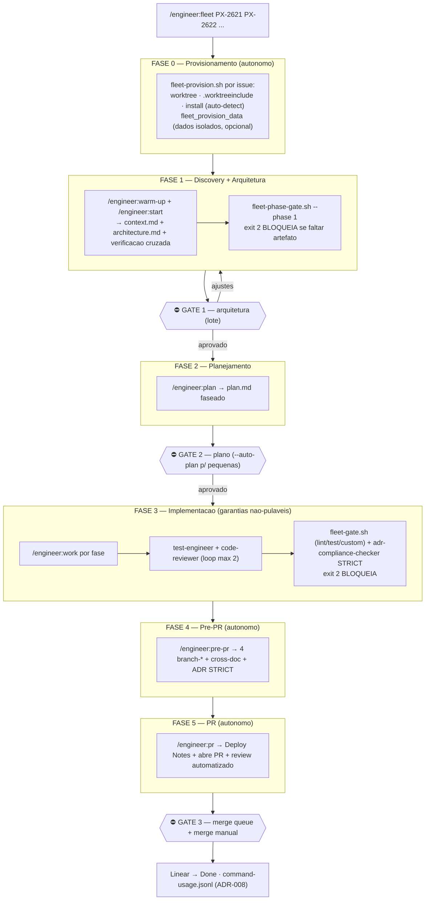

# Fleet — design do pipeline gate-based

## Principio

O workflow do Cortex e human-gated por design (`/start`, `/plan`, `/pr` exigem aval).
O Fleet preserva isso: **3 gates humanos** (arquitetura, plano, merge). Tudo entre os
gates e garantido por agentes + checagens mecanicas nao-pulaveis.

## Por que esses 3 gates

- **Gate 1 (arquitetura):** maior alavancagem. Erro arquitetural propaga por toda a
  implementacao — barato revisar, carissimo deixar passar. Nao-negociavel.
- **Gate 2 (plano):** pode ser leve. `--auto-plan` libera issues pequenas/bem
  definidas; grandes ou que tocam schema/seguranca sempre esperam aval.
- **Gate 3 (merge):** humano por politica do `/pr` + serializado pela merge queue.

## Infra — isolamento sem colisao

A estrategia de isolamento e **definida pelo projeto** na config layer
([`configuration.md`](configuration.md)). Padroes comuns:

- Infra compartilhada (ex.: banco de dados) sobe **uma vez**; worktrees nao sobem stack
  propria. O isolamento de dados por worktree (ex.: database/schema dedicado) vai no hook
  `fleet_provision_data`.
- Testes efemeros (ex.: Testcontainers) reduzem colisao de porta — offset de porta
  (`API_PORT = base + i`) so quando a worktree boota um servico.
- Caches content-addressable (ex.: pnpm store) evitam multiplicar disco por worktree.

## Mapa das 5 garantias → enforcement

| # | Garantia | Enforcement | Onde |
|---|---|---|---|
| 1 | Funcionalidade | `test-engineer` + `branch-test-planner` + gate `test` | `/work`, `/pre-pr`, hook (v2) |
| 2 | Aderencia a ADRs | `adr-compliance-checker` STRICT + `branch-master-docs-checker` + gate custom | `/work`, `/pre-pr`, hook (v2) |
| 3 | Seguranca | `code-reviewer` + `branch-code-reviewer` (CRITICAL bloqueia) | `/work`, `/pre-pr` |
| 4 | Padroes | `adr-compliance-checker` + `code-reviewer` + gate `lint` | `/work`, hook (v2) |
| 5 | Testes | `branch-test-planner` (+30-40% edge cases) + cobertura | `/pre-pr`, hook (v2) |

> O `code-reviewer` roda em 2 passes (em `/work` = bugs/logica; em `/pre-pr` =
> seguranca/polish). Nao e redundancia — categorias complementares.

## Roadmap

- **v1 (atual):** garantias como passos explicitos do lead.
- **v2:** hooks `TaskCompleted`/`TeammateIdle` (`exit 2`) via `fleet-gate.sh` →
  garantias nao-pulaveis ([`hooks-settings.md`](hooks-settings.md)).
- **v3 (futuro):** dashboard de review queue (artifact HTML vivo) + modo headless
  `claude -p` para batch overnight.
