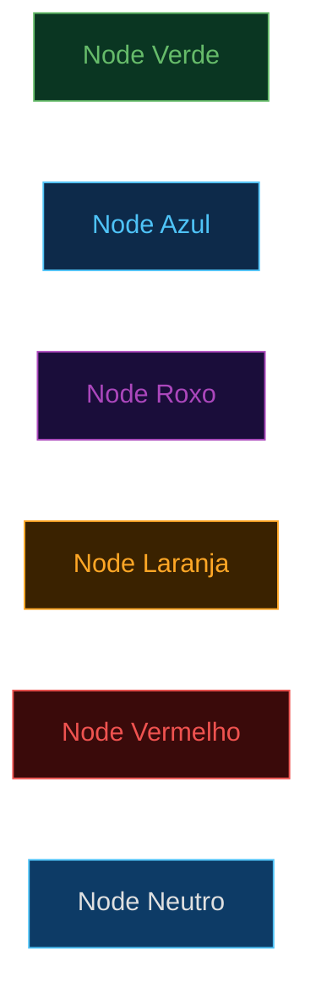

# HTML Presentations — AI Frontiers Theme

## REGRA OBRIGATÓRIA: Português Brasil com Acentuação

**ATENÇÃO CRÍTICA**: Todo conteúdo gerado por esta skill DEVE seguir estas regras sem exceção:

- ✅ **SEMPRE usar Português Brasil com acentuação correta**
- ✅ **Caracteres obrigatórios**: á, é, í, ó, ú, ã, õ, ç, â, ê, ô, à
- ✅ **Exemplos corretos**: "diagnóstico", "automação", "próximos", "implementação", "análise", "integração", "operação"
- ❌ **NUNCA omitir acentos**: "diagnostico", "automacao", "proximos" são INCORRETOS
- ✅ **Em HTML (títulos, parágrafos, tabelas, cards)**: SEMPRE com acentuação completa
- ⚠️ **Em labels de diagramas Mermaid**: usar texto SEM acentos APENAS quando causar erro de renderização
- ✅ **Encoding do arquivo HTML**: SEMPRE incluir `<meta charset="UTF-8">` no `<head>`
- ✅ **Verificação final**: Revisar TODO o texto antes de entregar o arquivo

**Esta regra é INEGOCIÁVEL. Apresentações sem acentuação correta não são aceitáveis.**

## Visão Geral

Esta skill cria apresentações HTML interativas em formato single-file (tudo em um único arquivo .html):

- **Tema visual**: AI Frontiers — dark navy (#0b1929) + cyan (#4fc3f7)
- **Tipografia**: Inter (Google Fonts)
- **Navegação completa**:
  - Teclado (setas, espaço, PgUp/PgDn)
  - Touch (swipe para mobile)
  - Fullscreen (tecla F)
  - Hash URLs (#N para slide específico)
- **Diagramas**: Mermaid.js v11 com tema dark customizado
- **Impressão**: CSS @media print com page-break-after automático
- **Responsividade**: Media queries para tablet e mobile

**Formato de saída**: Um único arquivo .html self-contained, sem dependências externas (exceto CDN para Mermaid e Google Fonts).

## Design System Completo

### CSS Variables

Todas as cores e valores do design system são definidos via CSS custom properties:

```css
:root {
    /* Backgrounds */
    --bg-primary: #0b1929;      /* Navy escuro principal */
    --bg-secondary: #0d2137;    /* Navy médio para cards */
    --bg-tertiary: #132d4a;     /* Navy claro para elementos */

    /* Cyan palette */
    --cyan: #4fc3f7;            /* Cyan principal */
    --cyan-bright: #00e5ff;     /* Cyan brilhante (destaques) */
    --cyan-light: #b3e5fc;      /* Cyan claro (texto secundário) */
    --cyan-dim: rgba(79, 195, 247, 0.15); /* Cyan transparente (backgrounds) */

    /* Text colors */
    --text-primary: #ffffff;    /* Texto principal */
    --text-secondary: #b0bec5;  /* Texto secundário */
    --text-muted: #78909c;      /* Texto esmaecido */

    /* Accent colors */
    --accent-green: #66bb6a;    /* Verde (sucesso, baixo risco) */
    --accent-orange: #ffa726;   /* Laranja (atenção, médio risco) */
    --accent-red: #ef5350;      /* Vermelho (crítico, alto risco) */
    --accent-purple: #ab47bc;   /* Roxo (especial) */
}
```

### Tipografia

Sistema tipográfico baseado na fonte Inter com escala definida:

- **h1 (título principal)**:
  - Tamanho: 3rem a 3.5rem
  - Weight: 800
  - Efeito: Gradient cyan (`linear-gradient(135deg, var(--cyan-bright), var(--cyan), var(--cyan-light))`)
  - Uso: Título de capa e títulos principais

- **h2 (título de seção)**:
  - Tamanho: 2rem a 2.5rem
  - Weight: 700
  - Cor: `var(--cyan)`
  - Uso: Títulos de slides de conteúdo

- **h3 (subtítulo)**:
  - Tamanho: 1.3rem
  - Weight: 600
  - Cor: `var(--cyan-light)`
  - Uso: Subtítulos dentro de slides

- **p (parágrafo)**:
  - Tamanho: 1.05rem
  - Line-height: 1.6
  - Cor: `var(--text-secondary)`
  - Uso: Texto de corpo

- **subtitle**:
  - Tamanho: 1.3rem
  - Weight: 300
  - Cor: `var(--text-secondary)`
  - Uso: Subtítulo de capa

- **slide-label**:
  - Tamanho: 0.75rem
  - Weight: 600
  - Transform: uppercase
  - Letter-spacing: 3px
  - Cor: `var(--cyan)`
  - Uso: Labels pequenos acima de títulos

### Classes CSS Disponíveis

#### Estrutura Base de Slides

1. **`.slide`** — Container base de cada slide
   - `position: absolute`
   - `width: 100vw; height: 100vh`
   - `top: 0; left: 0`
   - `opacity: 0` (por padrão)
   - `transition: opacity 0.3s ease`
   - Contém todo o conteúdo visual do slide

2. **`.slide.active`** — Slide atualmente visível
   - `opacity: 1`
   - `z-index: 10`
   - Aplicado automaticamente pelo JavaScript de navegação

3. **`.slide-content`** — Container interno do slide
   - `max-width: 1400px`
   - `margin: 0 auto`
   - `padding: 60px 80px`
   - `display: flex; flex-direction: column`
   - `justify-content: center`
   - `min-height: 100vh`

4. **`.slide-label`** — Label pequeno acima do título
   - `font-size: 0.75rem`
   - `font-weight: 600`
   - `text-transform: uppercase`
   - `letter-spacing: 3px`
   - `color: var(--cyan)`
   - `margin-bottom: 10px`

#### Tipos de Slides Especiais

5. **`.title-slide`** — Slide de capa
   - `text-align: center`
   - Centraliza h1, subtitle, divider
   - Usa gradient em h1

6. **`.section-header`** — Slide separador de seção
   - `text-align: center`
   - Número grande translúcido no background
   - h2 centralizado com border-bottom cyan

#### Tabelas

7. **`.data-table`** — Tabela padrão de dados
   - `width: 100%`
   - `border-collapse: collapse`
   - `thead`: background `var(--bg-tertiary)`, border-bottom 2px cyan
   - `tbody tr`: hover effect `var(--bg-secondary)`
   - `td, th`: padding 14px, text-align left

8. **`.compact-table`** — Tabela compacta
   - Mesmas propriedades de `.data-table`
   - `font-size: 0.92rem`
   - `td, th`: padding 10px
   - Para tabelas com muitos dados

#### Cards de Métricas

9. **`.stats-grid`** — Grid para cards de métricas
   - `display: grid`
   - `grid-template-columns: repeat(3, 1fr)`
   - `gap: 30px`
   - `margin: 30px 0`

10. **`.stat-card`** — Card individual de métrica
    - `background: var(--bg-secondary)`
    - `border: 1px solid var(--cyan-dim)`
    - `border-radius: 12px`
    - `padding: 30px`
    - `text-align: center`
    - Transição de hover com border cyan

11. **`.stat-card .stat-value`** — Número grande da métrica
    - `font-size: 2.2rem`
    - `font-weight: 800`
    - `color: var(--cyan-bright)`
    - `display: block`
    - `margin-bottom: 8px`

12. **`.stat-card .stat-label`** — Label da métrica
    - `font-size: 0.75rem`
    - `text-transform: uppercase`
    - `letter-spacing: 2px`
    - `color: var(--text-muted)`

#### Cards SCR (Situação/Complicação/Resolução)

13. **`.scr-cards`** — Grid para cards SCR
    - `display: grid`
    - `grid-template-columns: repeat(3, 1fr)`
    - `gap: 25px`
    - `margin: 30px 0`

14. **`.scr-card`** — Card base SCR
    - `background: var(--bg-secondary)`
    - `border-radius: 8px`
    - `padding: 25px`
    - `border-left: 4px solid` (cor varia por tipo)

15. **`.scr-card.situacao`** — Card de Situação
    - `border-left-color: var(--accent-green)`

16. **`.scr-card.complicacao`** — Card de Complicação
    - `border-left-color: var(--accent-orange)`

17. **`.scr-card.resolucao`** — Card de Resolução
    - `border-left-color: var(--cyan-bright)`

#### Cards de Tier/Projeto

18. **`.tier-cards`** — Grid auto-fit para cards
    - `display: grid`
    - `grid-template-columns: repeat(auto-fit, minmax(280px, 1fr))`
    - `gap: 25px`
    - `margin: 30px 0`

19. **`.tier-card`** — Card de tier/projeto
    - `background: var(--bg-secondary)`
    - `border: 1px solid rgba(79, 195, 247, 0.2)`
    - `border-radius: 10px`
    - `padding: 25px`
    - Hover effect com border cyan

#### Elementos de Conteúdo

20. **`.quote-box`** — Caixa de citação
    - `border-left: 4px solid var(--cyan)`
    - `background: var(--bg-secondary)`
    - `padding: 20px 25px`
    - `font-style: italic`
    - `color: var(--text-secondary)`
    - `margin: 25px 0`

21. **`.agenda-grid`** — Grid para itens de agenda
    - `display: grid`
    - `grid-template-columns: repeat(3, 1fr)`
    - `gap: 20px`
    - `margin: 30px 0`

22. **`.agenda-item`** — Item de agenda/navegação
    - `background: var(--bg-secondary)`
    - `border-radius: 8px`
    - `padding: 20px`
    - `text-align: center`
    - `cursor: pointer`
    - Hover effect com border cyan e transform

#### Layouts

23. **`.two-col`** — Layout de 2 colunas
    - `display: grid`
    - `grid-template-columns: 1fr 1fr`
    - `gap: 40px`
    - `align-items: start`

24. **`.diagram-container`** — Container para Mermaid
    - `display: flex`
    - `justify-content: center`
    - `align-items: center`
    - `max-height: 72vh`
    - `overflow: auto`
    - `margin: 20px 0`

#### Cards de Módulo

25. **`.module-cards`** — Grid de 4 colunas para módulos
    - `display: grid`
    - `grid-template-columns: repeat(4, 1fr)`
    - `gap: 20px`
    - `margin: 30px 0`

26. **`.module-card`** — Card de módulo
    - `background: var(--bg-secondary)`
    - `border-top: 3px solid var(--cyan)`
    - `border-radius: 6px`
    - `padding: 20px`

#### Badges e Indicadores

27. **`.phase-badge`** — Badge de fase/status
    - `display: inline-block`
    - `padding: 4px 12px`
    - `border-radius: 10px`
    - `font-size: 0.7rem`
    - `font-weight: 700`
    - `text-transform: uppercase`
    - `letter-spacing: 1px`

28. **`.phase-badge.green`** — Badge verde
    - `background: rgba(102, 187, 106, 0.2)`
    - `color: var(--accent-green)`

29. **`.phase-badge.blue`** — Badge azul
    - `background: var(--cyan-dim)`
    - `color: var(--cyan)`

30. **`.phase-badge.purple`** — Badge roxo
    - `background: rgba(171, 71, 188, 0.2)`
    - `color: var(--accent-purple)`

31. **`.phase-badge.orange`** — Badge laranja
    - `background: rgba(255, 167, 38, 0.2)`
    - `color: var(--accent-orange)`

32. **`.phase-badge.red`** — Badge vermelho
    - `background: rgba(239, 83, 80, 0.2)`
    - `color: var(--accent-red)`

#### Classes de Risco

33. **`.risk-high`** — Texto de alto risco
    - `color: var(--accent-red)`
    - `font-weight: 600`

34. **`.risk-med`** — Texto de médio risco
    - `color: var(--accent-orange)`
    - `font-weight: 600`

35. **`.risk-low`** — Texto de baixo risco
    - `color: var(--accent-green)`
    - `font-weight: 600`

#### Controles de Navegação

36. **`.nav-controls`** — Barra de navegação fixa
    - `position: fixed`
    - `bottom: 30px; right: 30px`
    - `display: flex; gap: 12px`
    - `align-items: center`
    - `z-index: 1000`

37. **`.nav-btn`** — Botão de navegação circular
    - `width: 44px; height: 44px`
    - `border-radius: 50%`
    - `border: 1px solid var(--cyan)`
    - `background: var(--bg-secondary)`
    - `cursor: pointer`
    - Hover effect com background cyan

38. **`.slide-counter`** — Contador "X / Y" slides
    - `font-size: 0.85rem`
    - `color: var(--text-muted)`
    - `padding: 0 10px`

#### UI Global

39. **`.progress-bar`** — Barra de progresso no topo
    - `position: fixed`
    - `top: 0; left: 0`
    - `height: 3px`
    - `background: linear-gradient(90deg, var(--cyan-bright), var(--cyan))`
    - `z-index: 1001`
    - Width calculado dinamicamente via JavaScript

40. **`.brand-footer`** — Rodapé fixo bottom-left
    - `position: fixed`
    - `bottom: 30px; left: 30px`
    - `font-size: 0.7rem`
    - `color: var(--text-muted)`
    - `z-index: 999`

#### Utilitários de Texto

41. **`.highlight`** — Texto destacado em cyan
    - `color: var(--cyan)`
    - `font-weight: 600`

## Mermaid.js — Configuração Dark Theme

Todo diagrama Mermaid deve usar esta configuração padrão para manter consistência visual com o tema AI Frontiers:

```javascript
mermaid.initialize({
    startOnLoad: true,
    theme: 'dark',
    flowchart: {
        useMaxWidth: true,
        htmlLabels: true,
        curve: 'basis',
        padding: 15
    },
    sequence: {
        useMaxWidth: true,
        wrap: true,
        width: 180,
        height: 50,
        boxMargin: 10,
        mirrorActors: false
    },
    themeVariables: {
        background: 'transparent',
        primaryColor: '#0d3b66',
        primaryTextColor: '#e0e0e0',
        primaryBorderColor: '#4fc3f7',
        lineColor: '#4fc3f7',
        secondaryColor: '#132d4a',
        tertiaryColor: '#1a3a5c',
        mainBkg: '#0d3b66',
        nodeBorder: '#4fc3f7',
        clusterBkg: 'rgba(79,195,247,0.08)',
        clusterBorder: '#4fc3f7',
        titleColor: '#4fc3f7',
        edgeLabelBackground: 'transparent',
        nodeTextColor: '#e0e0e0',
        actorBkg: '#0d3b66',
        actorBorder: '#4fc3f7',
        actorTextColor: '#e0e0e0',
        actorLineColor: '#4fc3f7',
        noteBkgColor: '#132d4a',
        noteTextColor: '#e0e0e0',
        noteBorderColor: '#4fc3f7',
        activationBkgColor: '#1a3a5c',
        activationBorderColor: '#4fc3f7',
        signalColor: '#b0bec5',
        signalTextColor: '#e0e0e0',
        labelBoxBkgColor: '#0d3b66',
        labelBoxBorderColor: '#4fc3f7',
        labelTextColor: '#e0e0e0',
        loopTextColor: '#4fc3f7',
        altSectionBkgColor: 'rgba(79,195,247,0.05)'
    },
    securityLevel: 'loose'
});
```

### Paleta Mermaid para Nós Coloridos

Use esta sintaxe para colorir nós individuais em diagramas Mermaid (flowchart, graph):



**Palette de cores para nós**:

| Cor | Fill (fundo) | Stroke (borda) | Color (texto) | Uso |
|-----|-------------|---------------|---------------|-----|
| **Verde** | `#0a3622` | `#66bb6a` | `#66bb6a` | Sucesso, aprovado, baixo risco |
| **Azul** | `#0d2a4a` | `#4fc3f7` | `#4fc3f7` | Neutro, informação, padrão |
| **Roxo** | `#1a0d3a` | `#ab47bc` | `#ab47bc` | Especial, destaque, inovação |
| **Laranja** | `#3a2200` | `#ffa726` | `#ffa726` | Atenção, médio risco, pendente |
| **Vermelho** | `#3a0a0a` | `#ef5350` | `#ef5350` | Crítico, alto risco, bloqueado |
| **Neutro** | `#0d3b66` | `#4fc3f7` | `#e0e0e0` | Padrão dark theme |

**Para subgrafos/clusters**:

```
fill:rgba(79,195,247,0.08),stroke:#4fc3f7
```

Efeito translúcido cyan que mantém legibilidade.

## Tipos de Slide

Cada apresentação é composta por diferentes tipos de slide. Aqui está uma visão geral de cada tipo:

### 1. Title Slide — Capa da Apresentação

Slide de abertura com:
- h1 com efeito gradient cyan
- Subtitle descritivo
- Divider horizontal cyan
- Informações de autores/data/projeto

**Uso**: Primeiro slide de toda apresentação.

### 2. Section Header — Separador de Seção

Slide divisor entre seções principais com:
- Número grande translúcido no background
- h2 centralizado com border-bottom cyan
- Opcional: subtítulo descritivo

**Uso**: Marcar início de nova seção temática (ex: "Diagnóstico", "Estratégia", "Roadmap").

### 3. Content + Table — Conteúdo com Tabela

Slide padrão de conteúdo com:
- Slide-label + h2 + parágrafo introdutório
- Tabela `.data-table` ou `.compact-table`
- Opcional: notas de rodapé

**Uso**: Apresentar dados tabulares, listas comparativas, cronogramas.

### 4. Content + Stats Grid — Cards de Métricas

Slide com cards de métricas usando:
- `.stats-grid` (3 colunas)
- Múltiplos `.stat-card` com valor + label

**Uso**: Mostrar KPIs, números-chave, resultados quantitativos.

### 5. Content + Diagram — Diagrama Mermaid

Slide com diagrama visual:
- `.diagram-container`
- Código Mermaid inline (`<pre class="mermaid">`)
- Tipos: flowchart, sequence, gantt, timeline

**Uso**: Fluxos de processo, arquiteturas, cronogramas visuais, jornadas.

### 6. Content + Quote — Citação

Slide com destaque para citação ou insight-chave:
- `.quote-box` com texto em itálico
- Autor/fonte abaixo

**Uso**: Destacar feedback de stakeholders, insights importantes, princípios-chave.

### 7. Content + Cards — Cards em Grid

Slide com múltiplos cards:
- `.tier-cards` para projetos/iniciativas
- `.module-cards` para módulos/componentes
- `.scr-cards` para estrutura Situação/Complicação/Resolução

**Uso**: Apresentar portfólio de projetos, módulos de plataforma, análise estruturada.

### 8. Content + Two Columns — Layout 2 Colunas

Slide com layout lado a lado:
- `.two-col` para dividir conteúdo
- Útil para antes/depois, comparações, texto + visual

**Uso**: Comparações, conteúdo complementar, texto + diagrama pequeno.

### 9. Closing Slide — Encerramento

Slide final com:
- Agradecimento
- Contato (e-mail, site)
- Opcional: QR code, próximos passos

**Uso**: Último slide de toda apresentação.

**Para templates completos de cada tipo, consultar**: `references/slide-types.md`

## Workflow de Criação

Ao criar uma apresentação HTML, siga este fluxo de trabalho:

### Passo 1: Analisar Conteúdo-Fonte

- Ler documentos fornecidos (relatórios, planos estratégicos, dados)
- Identificar seções principais e sub-tópicos
- Listar métricas, tabelas, diagramas necessários
- Definir mensagem principal e narrativa

### Passo 2: Definir Estrutura de Slides

- Quantos slides totais (recomendado: 15-30 para apresentações executivas)
- Quais tipos de slide usar em cada posição
- Onde inserir Section Headers para dividir seções
- Onde usar diagramas vs tabelas vs cards

**Exemplo de estrutura**:
```
1. Title Slide
2. Agenda (cards de navegação)
3. Section Header "Diagnóstico"
4-7. Slides de conteúdo (tabelas, stats, diagramas)
8. Section Header "Estratégia"
9-12. Slides de conteúdo (cards, quote, diagrama)
13. Section Header "Roadmap"
14-16. Slides de roadmap (timeline, cards de projeto)
17. Closing Slide
```

### Passo 3: Usar o Template Base

- Copiar `assets/base-template.html` como ponto de partida
- Já inclui todas as classes CSS, JavaScript de navegação, configuração Mermaid
- Substituir placeholders `[PROJETO]`, `[EMPRESA]`, etc.

### Passo 4: Preencher Slides com Conteúdo

Para cada slide:
- Usar a estrutura HTML do tipo correto (ver `references/slide-types.md`)
- Aplicar classes CSS apropriadas
- **CRÍTICO**: Escrever TODO o texto em Português Brasil com acentuação correta
- Adicionar `slide-label` descritivo
- Numerar slides sequencialmente com `id="slide-N"`

### Passo 5: Adicionar Diagramas Mermaid

Onde apropriado:
- Usar `<pre class="mermaid">` dentro de `.diagram-container`
- Verificar sintaxe Mermaid (flowchart, sequence, gantt, timeline)
- **Importante**: Labels sem acentos se causar erro de renderização
- Aplicar classes de cor (verde, azul, roxo, etc.) conforme a paleta

### Passo 6: Verificação de Acentuação

**PASSO OBRIGATÓRIO**:
- Revisar TODO o texto do HTML
- Procurar por palavras sem acento que deveriam ter
- Verificar `<meta charset="UTF-8">` no head
- Testar renderização no navegador

### Passo 7: Salvar como Single-File HTML

- Todo CSS inline no `<style>` do head
- Todo JavaScript inline no `<script>` antes do `</body>`
- CDN apenas para Mermaid e Google Fonts
- Imagens como data URI ou via CDN
- Nome do arquivo descritivo: `apresentacao-diagnostico-ia-2026.html`

### Passo 8: Gerar PDF (se solicitado)

Se o usuário pedir PDF:
1. Copiar `assets/html-to-pdf.js` para o diretório da apresentação
2. Editar `HTML_PATH` e `OUTPUT_PATH` no script
3. Instalar Puppeteer: `npm install puppeteer`
4. Executar: `node html-to-pdf.js`
5. Verificar slides densos (equipe, tabelas, grids) para garantir que não há corte
6. Ajustar `SCALE` se necessário (padrão: 0.78)

## Navegação (incluída automaticamente no template)

O template base já inclui JavaScript completo para navegação. O usuário pode usar:

| Tecla / Ação | Comportamento |
|--------------|---------------|
| **→ ↓ Space PgDn** | Avançar para próximo slide |
| **← ↑ PgUp** | Voltar para slide anterior |
| **Home** | Ir para primeiro slide |
| **End** | Ir para último slide |
| **F** | Ativar/desativar fullscreen |
| **Touch swipe →** | Próximo slide (mobile) |
| **Touch swipe ←** | Slide anterior (mobile) |
| **Hash URL (#N)** | Ir diretamente para slide N (ex: `#3` vai para slide 3) |
| **Botões na tela** | Clicar em `.nav-btn` para navegar |

**Features automáticas**:
- Contador de slides atualizado dinamicamente
- Barra de progresso no topo
- Transições suaves (opacity fade)
- Suporte a teclado, mouse e touch

## Geração de PDF (Puppeteer — Método Recomendado)

> **IMPORTANTE**: O método Ctrl+P do navegador **NÃO funciona bem** para estas apresentações.
> Problemas conhecidos: adiciona headers/footers indesejados (data, URL, número de página),
> mostra apenas 1 slide, perde backgrounds e estilos dark theme. **Sempre usar Puppeteer.**

### Por que Puppeteer?

| Método | Resultado | Problemas |
|--------|-----------|-----------|
| Ctrl+P (Chrome) | Ruim | Headers/footers, 1 slide, sem background |
| Chrome `--print-to-pdf` | Ruim | Mesmos problemas do Ctrl+P |
| pptxgenjs (HTML→PPTX) | Ruim | Perda de fidelidade visual, limitações da lib |
| **Puppeteer** | **Excelente** | Nenhum — reproduz fielmente o design original |

### Dependência

```bash
npm install puppeteer
```

### Script de Geração

Usar o template em `assets/html-to-pdf.js`. Os pontos-chave do script:

1. **`emulateMediaType('screen')`** — Preserva estilos visuais do tema dark (sem isso, Puppeteer usa media type `print` que perde backgrounds)
2. **CSS injection** — Sobrescreve o posicionamento dos slides de `position: absolute` (interativo) para `position: relative` com `page-break-after: always` (paginação PDF)
3. **`@page` com dimensões 16:9** — `size: 254mm 142.875mm` garante proporção landscape correta
4. **`preferCSSPageSize: true`** — Usa as dimensões definidas no `@page` ao invés do tamanho de papel padrão
5. **`printBackground: true`** — Renderiza backgrounds (essencial para tema dark)
6. **`scale: 0.78`** — Reduz zoom em ~22% para evitar corte de conteúdo em slides densos (ex: grids de 5+ cards, tabelas com muitas linhas)
7. **Esperar carregamento de ícones** — Aguardar 2s após `networkidle0` para que libs como Lucide/FontAwesome renderizem os ícones SVG
8. **Esconder elementos de navegação** — `.nav-controls`, `.progress-bar`, `.brand-footer` são ocultados via CSS injection

### CSS Injetado pelo Puppeteer

```css
@page {
  size: 254mm 142.875mm;  /* 16:9 landscape */
  margin: 0;
}

html, body {
  overflow: visible !important;
  height: auto !important;
  width: auto !important;
}

.presentation {
  position: relative !important;
  height: auto !important;
}

.slide {
  position: relative !important;
  opacity: 1 !important;
  visibility: visible !important;
  width: 100vw !important;
  height: 100vh !important;
  page-break-after: always !important;
  break-after: page !important;
  display: flex !important;
}

.slide:last-child {
  page-break-after: avoid !important;
  break-after: avoid !important;
}

/* Hide navigation elements */
.nav-controls,
.progress-bar,
.brand-footer {
  display: none !important;
}

/* Ensure backgrounds are printed */
* {
  -webkit-print-color-adjust: exact !important;
  print-color-adjust: exact !important;
  color-adjust: exact !important;
}
```

### Opções do `page.pdf()`

```javascript
await page.pdf({
  path: OUTPUT_PATH,
  printBackground: true,       // ESSENCIAL para tema dark
  preferCSSPageSize: true,     // Usa @page size (254mm x 142.875mm)
  landscape: true,             // Orientação paisagem
  scale: 0.78,                 // Reduz zoom para evitar overflow
  margin: { top: "0", right: "0", bottom: "0", left: "0" },
  timeout: 60000,
});
```

### Ajuste de Scale

O parâmetro `scale` controla o zoom do conteúdo no PDF:

| Scale | Resultado | Quando usar |
|-------|-----------|-------------|
| 1.0 | 100% (padrão) | Slides simples com pouco conteúdo |
| **0.78** | **78% (recomendado)** | **Slides com grids, tabelas, equipe, muitos cards** |
| 0.65 | 65% | Slides muito densos com overflow severo |

**Regra**: Comece com `scale: 0.78`. Se algum slide ainda cortar conteúdo, reduza para 0.70-0.65. Se houver excesso de espaço vazio, aumente para 0.85-0.90.

### Workflow Completo de PDF

```bash
# 1. Criar apresentação HTML
# (seguir workflow normal da skill)

# 2. Criar script de geração (copiar template)
cp .claude/skills/html-presentations/assets/html-to-pdf.js ./presentation/

# 3. Editar paths no script (HTML_PATH e OUTPUT_PATH)

# 4. Instalar Puppeteer
cd presentation && npm install puppeteer

# 5. Gerar PDF
node html-to-pdf.js

# 6. Verificar resultado
# Abrir o PDF e conferir todos os slides (especialmente os densos)
```

### Lições Aprendidas

1. **NUNCA usar Ctrl+P** — O Chrome print dialog não renderiza corretamente slides com position: absolute e tema dark
2. **NUNCA usar pptxgenjs para converter HTML** — A conversão perde fidelidade visual. pptxgenjs é bom para criar slides do zero, não para converter HTML existente
3. **SEMPRE usar `emulateMediaType('screen')`** — Sem isso, o Puppeteer usa media type `print` que ignora backgrounds e estilos visuais
4. **SEMPRE aguardar ícones SVG** — Bibliotecas como Lucide renderizam ícones via JavaScript após page load. O `waitUntil: 'networkidle0'` não é suficiente, adicionar `setTimeout` de 2s
5. **Scale 0.78 é o sweet spot** — Evita overflow em slides densos sem perder legibilidade
6. **Testar slides densos primeiro** — Slide de equipe (grid 3+2), tabelas com 5+ linhas e grids de 4+ cards são os mais propensos a overflow

## Responsividade

O template inclui media queries para adaptar o layout em tablets e mobile:

### Breakpoint: max-width 1024px (Tablet)

```css
@media (max-width: 1024px) {
    /* Grids de 3-4 colunas → 2 colunas */
    .stats-grid { grid-template-columns: repeat(2, 1fr); }
    .module-cards { grid-template-columns: repeat(2, 1fr); }
    .scr-cards { grid-template-columns: repeat(2, 1fr); }

    /* Padding reduzido */
    .slide-content { padding: 40px 40px; }

    /* Fontes reduzidas */
    h1 { font-size: 2.5rem; }
    h2 { font-size: 1.8rem; }

    /* Two-col → 1 coluna */
    .two-col { grid-template-columns: 1fr; }
}
```

### Breakpoint: max-width 640px (Mobile)

```css
@media (max-width: 640px) {
    /* Todos os grids → 1 coluna */
    .stats-grid,
    .module-cards,
    .scr-cards,
    .tier-cards,
    .agenda-grid { grid-template-columns: 1fr; }

    /* Padding mínimo */
    .slide-content { padding: 30px 20px; }

    /* Fontes ainda menores */
    h1 { font-size: 2rem; }
    h2 { font-size: 1.5rem; }

    /* Controles de navegação menores */
    .nav-controls { bottom: 15px; right: 15px; }
    .nav-btn { width: 36px; height: 36px; }
}
```

## Observações Importantes

### CDN e Dependências

- **Mermaid.js**: `https://cdn.jsdelivr.net/npm/mermaid@11/dist/mermaid.min.js`
- **Google Fonts**: `https://fonts.googleapis.com/css2?family=Inter:wght@300;400;500;600;700;800&display=swap`
- Tudo mais (CSS, JavaScript) é inline no HTML

### Charset e Encoding

- **Sempre incluir** no `<head>`:
  ```html
  <meta charset="UTF-8">
  <meta name="viewport" content="width=device-width, initial-scale=1.0">
  ```
- Salvar o arquivo como UTF-8 (não ANSI ou Latin-1)

### Imagens

- **Inline**: Usar data URI para imagens pequenas (logos, ícones)
  ```html
  
  ```
- **CDN**: Usar URLs de CDN para imagens hospedadas externamente
- **Evitar**: Referências a arquivos locais (quebra o single-file)

### Self-Contained

O objetivo é um único arquivo .html que funcione em qualquer navegador moderno sem dependências locais:
- ✅ Abrir diretamente no navegador (file://)
- ✅ Enviar por e-mail como anexo
- ✅ Hospedar em servidor web
- ✅ Funciona offline (exceto CDN de Mermaid e Fonts)

### Referências Completas

- **Templates de todos os tipos de slide**: `references/slide-types.md`
- **Guia completo Mermaid dark theme**: `references/mermaid-dark-theme.md`
- **Template base HTML**: `assets/base-template.html`
- **Script gerador de PDF (Puppeteer)**: `assets/html-to-pdf.js`

### Boas Práticas

1. **Número de slides**: 15-30 para apresentações executivas, 30-50 para workshops
2. **Texto por slide**: Máximo 5-7 bullet points, preferir visual (cards, diagramas)
3. **Diagramas**: Não mais de 8-10 nós por flowchart (legibilidade)
4. **Cores**: Usar a paleta definida (verde/azul/roxo/laranja/vermelho) de forma consistente
5. **Hierarquia**: Sempre usar slide-label → h2 → parágrafo → conteúdo
6. **Acessibilidade**: Alt text em imagens, cores com contraste adequado
7. **Performance**: Evitar muitos diagramas Mermaid complexos em uma única apresentação (pode travar o render)

---

**Esta skill está pronta para criar apresentações HTML de alta qualidade, visualmente consistentes com o tema AI Frontiers, totalmente em Português Brasil com acentuação correta.**
