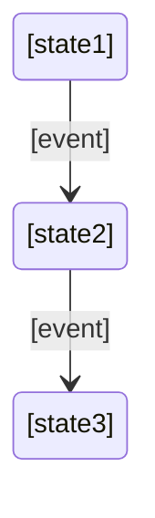

# 🔄 **Cortex for Legacy Projects**
**Adopting Context-Driven Development for Existing Codebases**

---

## 📋 Table of Contents

- [Overview](#-overview)
- [Why Adopt Cortex for Legacy Projects?](#-why-adopt-cortex-for-legacy-projects)
- [Adoption Strategy](#-adoption-strategy)
- [Phase 1: Foundation & Documentation](#-phase-1-foundation--documentation)
- [Phase 2: Context Architecture](#-phase-2-context-architecture)
- [Phase 3: Process Integration](#-phase-3-process-integration)
- [Phase 4: Full Adoption](#-phase-4-full-adoption)
- [Common Challenges & Solutions](#-common-challenges--solutions)
- [Best Practices](#-best-practices)
- [Success Metrics](#-success-metrics)

---

## 🎯 Overview

This guide helps teams adopt Cortex for **existing projects that were not built with AI assistance**. The approach focuses on incremental adoption, allowing teams to gradually integrate Cortex's context-driven methodology without disrupting ongoing development.

**Key Principle**: Start with documentation, then gradually integrate processes and automation.

---

## 💡 Why Adopt Cortex for Legacy Projects?

### Benefits for Legacy Codebases

✅ **Improved AI Collaboration**
- AI assistants gain deep context about your existing codebase
- Reduced hallucinations and more accurate code suggestions
- Better understanding of legacy patterns and constraints

✅ **Knowledge Preservation**
- Capture institutional knowledge before it's lost
- Document undocumented decisions and patterns
- Create onboarding material for new team members

✅ **Gradual Modernization**
- Identify technical debt systematically
- Plan architectural improvements with full context
- Track evolution through Architecture Decision Records

✅ **Quality Improvements**
- Establish quality gates for new development
- Ensure consistency across legacy and new code
- Prevent regression and scope creep

✅ **Team Efficiency**
- Faster onboarding for new developers (human and AI)
- Reduced time spent explaining context
- Better cross-team collaboration

---

## 🗺️ Adoption Strategy

### Overview of Phases

```
Phase 1: Foundation (1-2 weeks)
   ↓
Phase 2: Context Architecture (2-3 weeks)
   ↓
Phase 3: Process Integration (2-4 weeks)
   ↓
Phase 4: Full Adoption (Ongoing)
```

**Total Time to Basic Adoption**: 4-6 weeks
**Total Time to Full Integration**: 2-3 months

### Guiding Principles

1. **Incremental Adoption** - Don't try to do everything at once
2. **Documentation First** - Context before automation
3. **Team Buy-in** - Involve the team at every step
4. **Practical Value** - Focus on immediate benefits
5. **Continuous Iteration** - Improve based on feedback

---

## 📚 Phase 1: Foundation & Documentation
**Duration**: 1-2 weeks
**Goal**: Create basic context documentation without disrupting current workflows

### Step 1.1: Setup Cortex Framework

```bash
# 1. Clone or copy Cortex to your project
cd your-project/
mkdir -p .windsurf/  # or .cursor/ depending on your IDE

# 2. Copy Cortex agents and commands
cp -r path/to/cortex-v1/.windsurf/agents .windsurf/
cp -r path/to/cortex-v1/.windsurf/commands .windsurf/

# 3. Create documentation structure
mkdir -p docs/business-context
mkdir -p docs/technical-context
mkdir -p docs/master-docs
```

### Step 1.2: Document Current State (Technical Context)

**Priority: HIGH** - Start here for immediate AI benefits

#### A. Create Project Charter
```bash
# Use the warm-up command to begin
/warm-up "legacy project documentation"
```

Create `docs/technical-context/project_charter.md`:

```markdown
# Project Charter: [Your Project Name]

## Vision Statement
[Why does this project exist? What problem does it solve?]

## Current State
- **Age**: How long has this project been running?
- **Team Size**: Current development team
- **Tech Stack**: Main technologies used
- **Scale**: Users, transactions, data volume, etc.

## Success Criteria
[How do you measure success today?]

## Scope Boundaries
### In Scope
- [Core features and functionalities]
- [Supported platforms/environments]

### Out of Scope
- [Explicitly excluded features]
- [Technical limitations]

## Key Stakeholders
- **Users**: [Who uses this system?]
- **Maintainers**: [Who maintains it?]
- **Decision Makers**: [Who approves changes?]

## Technical Constraints
- **Performance Requirements**: [SLAs, latency requirements]
- **Compliance**: [GDPR, HIPAA, SOC2, etc.]
- **Legacy Constraints**: [Old systems to integrate with]
- **Budget/Resource Constraints**: [Team size, infrastructure limits]
```

#### B. Create Codebase Guide

**Use AI to help generate this**:

```bash
# Ask AI to analyze your codebase
"Please analyze the project structure and create a CODEBASE_GUIDE.md
following the Cortex technical context template. Focus on:
- Directory structure and purpose of each directory
- Key files and their roles
- Data flow patterns
- Integration points
- Deployment architecture"
```

Create `docs/technical-context/CODEBASE_GUIDE.md`:

```markdown
# Codebase Navigation Guide

## Directory Structure
```
/src
  /[module-name]     # [Purpose of this module]
  /[module-name]     # [Purpose of this module]
  ...
```

## Key Files and Their Roles
- **`[important-file.ext]`**: [What it does and why it's important]
- **`[config-file.ext]`**: [Configuration and environment setup]

## Data Flow Patterns
### [Main Data Flow 1]
[Describe how data flows through the system]

### [Main Data Flow 2]
[Another important flow]

## Integration Points
- **[External System 1]**: [How and why we integrate]
- **[External System 2]**: [Integration pattern used]

## Deployment Architecture
[Describe how the application is deployed]
- Infrastructure: [Cloud provider, on-prem, etc.]
- Environments: [dev, staging, production]
- CI/CD: [Build and deployment pipeline]

## Known Issues and Gotchas
[Document common problems and workarounds]
```

#### C. Document Architecture Decisions (ADRs)

For each major architectural decision in your legacy system:

Create `docs/technical-context/adr/001-[decision-name].md`:

```markdown
# ADR-001: [Decision Title]
**Date**: [When was this decided - approximate if unknown]
**Status**: Accepted | Deprecated | Superseded
**Deciders**: [Who made this decision]

## Context
What was the situation that led to this decision?
- Technical constraints
- Business requirements
- Timeline pressures

## Decision
What did we decide to do?

## Rationale
Why did we choose this approach?
- Technical benefits
- Business benefits
- Risk mitigation

## Consequences
### Positive
- [Good outcomes from this decision]

### Negative
- [Technical debt or limitations created]
- [Trade-offs accepted]

## Alternatives Considered
1. **[Alternative 1]**: [Why we didn't choose this]
2. **[Alternative 2]**: [Why we didn't choose this]

## Lessons Learned
[With hindsight, what do we know now?]
```

**Start with the most important decisions**:
1. Framework/language choice
2. Database choice
3. Authentication/authorization approach
4. API design pattern
5. Deployment strategy

#### D. Create AI Development Guide

Create `docs/technical-context/CLAUDE.meta.md`:

```markdown
# AI Development Guide - [Project Name]

## Code Style Preferences
### Language-Specific Conventions
- [Your coding standards]
- [Naming conventions]
- [File organization patterns]

### Pattern Examples
```[language]
// Example of preferred pattern
[code example]
```

## Testing Approach
- **Framework**: [Jest, PyTest, etc.]
- **Test Location**: [Where tests live]
- **Coverage Requirements**: [Minimum coverage percentage]
- **Test Data**: [How to manage test data]

### Example Test Structure
```[language]
[Example test showing your conventions]
```

## Common Patterns in This Codebase
### [Pattern Name 1]
**Purpose**: [What this pattern solves]
**Usage**: [When to use it]
**Example**:
```[language]
[Code example]
```

### [Pattern Name 2]
[Same structure]

## Gotchas and Anti-patterns
### ❌ Don't Do This
```[language]
// Bad pattern example
```
**Why**: [Explanation]

### ✅ Do This Instead
```[language]
// Good pattern example
```

## Performance Considerations
- [Database query patterns]
- [Caching strategies]
- [Resource management]

## Security Requirements
- [Authentication patterns]
- [Authorization checks]
- [Input validation]
- [Sensitive data handling]

## Integration Patterns
### [External System 1]
- **Authentication**: [How we authenticate]
- **Error Handling**: [How we handle failures]
- **Rate Limiting**: [Considerations]

## Legacy Code Guidelines
### Working with Legacy Code
- **Before modifying**: [Steps to take]
- **Testing**: [How to ensure you didn't break anything]
- **Refactoring**: [When and how to refactor]

### Known Problematic Areas
- **[Module/File Name]**: [Known issues and workarounds]
```

### Step 1.3: Capture Business Context (Optional but Recommended)

Even for technical projects, business context helps AI make better decisions.

#### Create Lightweight Business Documentation

```bash
/build-business-docs "analyze existing project materials"
```

**At minimum, create**:

1. `docs/business-context/CUSTOMER_PERSONAS.md` - Who uses this system?
2. `docs/business-context/PRODUCT_STRATEGY.md` - Why does it exist?
3. `docs/business-context/FEATURE_CATALOG.md` - What does it do?

See [business context template](../cortex-v1/.windsurf/commands/master-docs-commands/common/templates/business_context_template.md) for details.

### Step 1.4: Create Documentation Index

Create `docs/technical-context/index.md`:

```markdown
# Technical Context - [Project Name]

## Project Context Profile
[Copy from project_charter.md]

---

## Layer 1: Core Project Context
- [Project Charter](project_charter.md)
- [Architecture Decision Records](adr/)

## Layer 2: AI-Optimized Context Files
- [AI Development Guide](CLAUDE.meta.md)
- [Codebase Navigation Guide](CODEBASE_GUIDE.md)

## Layer 3: Domain-Specific Context
- [Business Logic Documentation](BUSINESS_LOGIC.md) *(if created)*
- [API Specifications](API_SPECIFICATION.md) *(if exists)*

## Layer 4: Development Workflow Context
- [Contributing Guide](CONTRIBUTING.md) *(if exists)*
- [Troubleshooting Guide](TROUBLESHOOTING.md) *(if created)*

---

## Architecture Challenges
[Link to known technical debt and improvement areas]

## Evolution Path
[Future architectural improvements planned]
```

### ✅ Phase 1 Completion Checklist

- [ ] Cortex framework copied to project
- [ ] `project_charter.md` created with current state
- [ ] `CODEBASE_GUIDE.md` documenting structure
- [ ] At least 3-5 ADRs for major decisions
- [ ] `CLAUDE.meta.md` with code patterns and gotchas
- [ ] `index.md` linking all documentation
- [ ] Team review and feedback on documentation
- [ ] Documentation is accurate and helpful for AI

**Expected Outcome**: AI assistants can now understand your codebase context and provide better suggestions.

---

## 🏗️ Phase 2: Context Architecture
**Duration**: 2-3 weeks
**Goal**: Establish master docs and quality gates

### Step 2.1: Create Master Docs

Master Docs define the "constitution" of your project - non-negotiable rules.

#### Identify Non-Negotiable Rules

Workshop with your team to identify:

1. **Architectural Principles**
   - What patterns MUST be followed?
   - What patterns MUST be avoided?
   - What are the non-negotiable constraints?

2. **Code Quality Standards**
   - Minimum test coverage
   - Security requirements
   - Performance requirements
   - Code review requirements

3. **Documentation Requirements**
   - What must be documented?
   - Documentation format standards

#### Create Master Docs

Create `docs/master-docs/index.md`:

```markdown
# Master Docs - Project Constitution

## Core Principles
1. **[Principle 1]**: [Description and rationale]
2. **[Principle 2]**: [Description and rationale]
3. **[Principle 3]**: [Description and rationale]

## Architectural Rules
### REQUIRED (Must always follow)
- [ ] [Rule 1 with justification]
- [ ] [Rule 2 with justification]

### RECOMMENDED (Should follow unless exception justified)
- [ ] [Guideline 1]
- [ ] [Guideline 2]

### PROHIBITED (Never do this)
- [ ] [Anti-pattern 1 and why]
- [ ] [Anti-pattern 2 and why]

## Quality Gates
### Before Every PR
- [ ] All tests passing
- [ ] Code coverage >= [X]%
- [ ] No security vulnerabilities
- [ ] Documentation updated
- [ ] ADR created for architectural changes

### Before Every Release
- [ ] Performance benchmarks met
- [ ] Security audit passed
- [ ] Documentation complete
- [ ] Changelog updated

## Exception Process
When rules must be broken:
1. Document why in ADR
2. Get approval from [person/team]
3. Create tech debt ticket
4. Plan remediation
```

Create `docs/master-docs/architectural-principles.md`:

```markdown
# Architectural Principles

## Foundational Principles

### 1. [Principle Name]
**Description**: [What is this principle?]
**Rationale**: [Why do we follow this?]
**Implications**: [What does this mean for development?]
**Exceptions**: [When can this be violated?]

### 2. [Next Principle]
[Same structure]

## Technical Constraints

### Database
- **Pattern**: [How we interact with database]
- **Why**: [Performance, consistency, etc.]
- **Example**:
```[language]
[Code example showing correct pattern]
```

### API Design
- **Pattern**: [RESTful, GraphQL, etc.]
- **Why**: [Consistency, client needs]
- **Standards**: [OpenAPI, etc.]

### Error Handling
- **Pattern**: [How we handle errors]
- **Why**: [Observability, user experience]
- **Example**:
```[language]
[Code example]
```

### Security
- **Authentication**: [Pattern used]
- **Authorization**: [How we control access]
- **Data Protection**: [Encryption, sanitization]

## Legacy System Integration

### Interacting with Legacy Components
**Guidelines**:
1. [Guideline 1]
2. [Guideline 2]

**Anti-patterns**:
- ❌ [Don't do this]
- ❌ [Don't do that]

## Migration Strategy

### New Features
[How new features should be built]

### Refactoring Legacy Code
[When and how to refactor]

### Technical Debt Management
[Process for managing tech debt]
```

### Step 2.2: Document Current Technical Debt

Create `docs/technical-context/ARCHITECTURE_CHALLENGES.md`:

```markdown
# Architecture Challenges & Technical Debt

## Known Technical Debt

### High Priority
1. **[Issue Name]**
   - **Impact**: [Business/technical impact]
   - **Effort**: [Estimated effort to fix]
   - **Risk**: [What happens if not fixed]
   - **Plan**: [How we plan to address]

### Medium Priority
[Same structure]

### Low Priority
[Same structure]

## Legacy Constraints

### [Constraint 1]
- **Description**: [What is the constraint?]
- **Impact**: [How does it limit us?]
- **Mitigation**: [How we work around it]
- **Removal Plan**: [If/when can we remove it]

## Improvement Roadmap

### Short Term (0-3 months)
- [ ] [Improvement 1]
- [ ] [Improvement 2]

### Medium Term (3-12 months)
- [ ] [Improvement 3]
- [ ] [Improvement 4]

### Long Term (12+ months)
- [ ] [Major architectural change 1]
- [ ] [Major architectural change 2]

## Areas Requiring Documentation
[Parts of the system that need better docs]

## Testing Gaps
[Areas lacking test coverage]
```

### Step 2.3: Create Troubleshooting Guide

Create `docs/technical-context/TROUBLESHOOTING.md`:

```markdown
# Troubleshooting Guide

## Common Issues

### [Issue Category 1]

#### Problem: [Issue Name]
**Symptoms**: [How you know this is happening]
**Cause**: [Why this happens]
**Solution**:
```bash
[Steps to fix]
```
**Prevention**: [How to avoid this in future]

### [Issue Category 2]
[Same structure]

## Debugging Strategies

### [Component/Module Name]
**Logging**: [Where to find logs]
**Common Problems**: [Frequent issues]
**Debug Commands**:
```bash
[Useful debug commands]
```

## Performance Issues

### [Performance Problem Type]
**Symptoms**: [How to identify]
**Investigation Steps**:
1. [Step 1]
2. [Step 2]
**Common Causes**: [Typical root causes]
**Solutions**: [How to fix]

## Integration Issues

### [External System Name]
**Common Failures**: [What goes wrong]
**Debugging**: [How to debug]
**Fallback Strategy**: [What to do when it fails]

## Recovery Procedures

### [Disaster Scenario]
**Steps to Recover**:
1. [Step 1]
2. [Step 2]
**Validation**: [How to confirm recovery]
**Post-Incident**: [What to do after]
```

### ✅ Phase 2 Completion Checklist

- [ ] Master Docs created defining project rules
- [ ] Architectural principles documented
- [ ] Technical debt catalogued
- [ ] Troubleshooting guide created
- [ ] Team alignment on master docs
- [ ] `@master-docs-gate-keeper` agent tested

**Expected Outcome**: Quality gates established, violations can be caught automatically.

---

## 🔄 Phase 3: Process Integration
**Duration**: 2-4 weeks
**Goal**: Integrate Cortex workflows for new development

### Step 3.1: Adopt Feature Development Workflow

#### For New Features

Start using the Cortex feature development flow:

```bash
# 1. Document the feature
/collect "new feature description"
/refine "refine requirements"

# 2. Plan architecture
/start "feature-name"
# - Creates context.md and architecture.md

# 3. Create execution plan
/plan "feature-name"
# - Creates phased plan.md

# 4. Develop iteratively
/work ".windsurf/sessions/feature-name"
# - Execute phase by phase with validation

# 5. Quality gates
/pre-pr
# - Validates against master docs
# - Code review
# - Test coverage

# 6. Deliver
/pr
# - Create pull request
```

#### For Bug Fixes

Lightweight version:

```bash
# 1. Document the bug
/collect "bug description"

# 2. Investigate and fix
# Use existing codebase context
# Follow master docs principles

# 3. Validate
/pre-pr
# Check alignment with master docs

# 4. Deliver
/pr
```

### Step 3.2: Establish PR Process

Update your PR template to include Cortex validation:

```markdown
## PR Checklist

### Cortex Compliance
- [ ] Follows master docs principles
- [ ] ADR created for architectural changes
- [ ] Documentation updated
- [ ] Tests added/updated

### Code Quality
- [ ] All tests passing
- [ ] Code coverage maintained/improved
- [ ] No new security vulnerabilities
- [ ] Performance impact assessed

### Documentation
- [ ] CODEBASE_GUIDE updated (if structure changed)
- [ ] API_SPECIFICATION updated (if API changed)
- [ ] TROUBLESHOOTING updated (if new issues/solutions)
- [ ] Changelog updated

### Master Docs Validation
- [ ] Ran `/pre-pr` command
- [ ] `@master-docs-gate-keeper` approval
- [ ] All violations addressed or justified
```

### Step 3.3: Team Training

#### Training Sessions

1. **Session 1: Cortex Overview** (1 hour)
   - What is Cortex?
   - Why are we adopting it?
   - What changes for developers?

2. **Session 2: Documentation** (1 hour)
   - How to use existing documentation
   - How to update documentation
   - Documentation standards

3. **Session 3: Workflows** (1 hour)
   - Feature development flow
   - Using slash commands
   - Working with agents

4. **Session 4: Master Docs** (1 hour)
   - Understanding master docs
   - Quality gates
   - Exception process

#### Create Team Guide

Create `docs/TEAM_GUIDE.md`:

```markdown
# Cortex Quick Start for Team

## Daily Workflow

### Starting Work
```bash
/warm-up "task-name"
```

### Developing Features
```bash
/start "feature-name"
/plan "feature-name"
/work ".windsurf/sessions/feature-name"
```

### Before PR
```bash
/pre-pr
```

### Creating PR
```bash
/pr
```

## Using Documentation

### Finding Information
- **Architecture questions**: Check `docs/technical-context/CODEBASE_GUIDE.md`
- **Code patterns**: Check `docs/technical-context/CLAUDE.meta.md`
- **Why decisions made**: Check `docs/technical-context/adr/`
- **Common issues**: Check `docs/technical-context/TROUBLESHOOTING.md`

### Updating Documentation
When you make changes, update:
- [ ] Relevant documentation files
- [ ] ADRs if architectural changes
- [ ] Troubleshooting if you solved new issues

## Master Docs

### What are Master Docs?
[Brief explanation]

### Key Rules
1. [Most important rule]
2. [Second most important rule]
3. [Third most important rule]

### When in Doubt
Ask the team or check `docs/master-docs/index.md`

## Getting Help

### From AI
Use `/warm-up` to give AI context about your task

### From Team
[Team communication channels]

### From Documentation
[Where to find what]
```

### ✅ Phase 3 Completion Checklist

- [ ] Feature development workflow documented
- [ ] PR process updated with Cortex checks
- [ ] Team trained on workflows
- [ ] Team guide created
- [ ] At least 2-3 features developed using Cortex workflow
- [ ] Feedback collected and incorporated

**Expected Outcome**: Team is using Cortex workflows for new development.

---

## 🚀 Phase 4: Full Adoption
**Duration**: Ongoing
**Goal**: Continuous improvement and full integration

### Step 4.1: Expand Documentation Coverage

#### API Documentation

If you have APIs, create `docs/technical-context/API_SPECIFICATION.md`:

```markdown
# API Specification

## Overview
- **Base URL**: [Production URL]
- **Authentication**: [How to authenticate]
- **Rate Limiting**: [Rate limits]
- **Versioning**: [How APIs are versioned]

## Endpoints

### [Endpoint Group]

#### `[METHOD] /path/to/endpoint`
**Purpose**: [What this endpoint does]

**Authentication**: [Required auth level]

**Request**:
```json
{
  "field": "type"
}
```

**Response**:
```json
{
  "field": "type"
}
```

**Errors**:
- `400`: [Bad request scenarios]
- `401`: [Unauthorized scenarios]
- `500`: [Server error scenarios]

**Example**:
```bash
curl -X [METHOD] \
  [URL] \
  -H "Authorization: Bearer [token]" \
  -d '[payload]'
```

## Data Models
[Document your data schemas]

## Error Handling
[Standard error format and codes]

## Versioning Strategy
[How you handle API versions]

## Deprecation Process
[How you deprecate APIs]
```

#### Business Logic Documentation

For complex domains, create `docs/technical-context/BUSINESS_LOGIC.md`:

```markdown
# Business Logic Documentation

## Domain Concepts

### [Concept 1]
**Definition**: [What is this concept?]
**Attributes**: [Key attributes]
**Relationships**: [How it relates to other concepts]
**Business Rules**: [Rules governing this concept]

## Business Rules

### [Rule Category]

#### Rule: [Rule Name]
**Description**: [What is this rule?]
**Rationale**: [Why do we have this rule?]
**Implementation**: [How is it enforced in code?]
**Edge Cases**: [Special scenarios]

**Example**:
```[language]
// Code showing rule implementation
```

## Workflows

### [Workflow Name]
**Trigger**: [What starts this workflow?]
**Steps**:
1. [Step 1]
2. [Step 2]
**Success**: [What indicates success?]
**Failure**: [Failure scenarios and handling]

## Calculations

### [Calculation Name]
**Purpose**: [What does this calculate?]
**Formula**: [Mathematical formula or pseudocode]
**Inputs**: [Required inputs]
**Outputs**: [What is produced]
**Edge Cases**: [Special scenarios]

## State Machines

### [Entity] State Machine
**States**: [List of possible states]
**Transitions**: [How entity moves between states]
**Business Rules**: [Rules governing transitions]


```

### Step 4.2: Continuous Improvement

#### Monthly Review Process

1. **Documentation Review** (1 hour/month)
   - Is documentation still accurate?
   - What's missing?
   - What's outdated?

2. **Master Docs Review** (1 hour/quarter)
   - Are rules still relevant?
   - New rules needed?
   - Deprecated rules?

3. **Process Review** (1 hour/quarter)
   - Is Cortex workflow helping?
   - What friction points?
   - How to improve?

#### Metrics to Track

```markdown
## Cortex Adoption Metrics

### Documentation Health
- Documentation coverage: [X]% of codebase documented
- Documentation accuracy: [X]% accurate (based on team feedback)
- ADRs created: [X] this quarter

### Process Adoption
- Features using Cortex workflow: [X]%
- PRs with master docs validation: [X]%
- Average time to onboard new developers: [X] days

### Quality Impact
- Bugs in new code: [trend]
- PR rejection rate: [trend]
- Time to review PRs: [trend]
- Test coverage: [trend]

### Team Satisfaction
- Team finding documentation helpful: [X]%
- AI assistance quality rating: [X]/10
- Cortex workflow satisfaction: [X]/10
```

### Step 4.3: Refactoring Legacy Code

As you touch legacy code, gradually improve it:

#### Refactoring Checklist

When modifying legacy code:
- [ ] Add tests if missing
- [ ] Document in CLAUDE.meta.md if pattern is unclear
- [ ] Create ADR if changing architecture
- [ ] Update TROUBLESHOOTING if you fixed undocumented issues
- [ ] Add comments explaining non-obvious logic
- [ ] Consider creating BUSINESS_LOGIC.md if domain is complex

#### Refactoring Strategy

```markdown
## Legacy Code Refactoring Strategy

### Approach: Gradual Improvement
Don't rewrite, gradually improve as you touch code.

### Priority Areas
1. [Most critical/frequently changed area]
2. [Second priority]
3. [Third priority]

### Refactoring Guidelines
1. **Add tests first** - No refactoring without tests
2. **Small changes** - Incremental improvements
3. **Document decisions** - Create ADRs for significant changes
4. **Maintain backwards compatibility** - Unless explicitly breaking
5. **Update documentation** - Keep docs in sync

### When to Refactor
- [ ] When adding a feature to legacy area
- [ ] When fixing a bug in legacy area
- [ ] When performance issues are identified
- [ ] When security issues are found

### When NOT to Refactor
- [ ] Just because code is ugly
- [ ] Without tests
- [ ] Under time pressure
- [ ] In code you don't understand
```

### ✅ Phase 4 Completion Checklist

- [ ] All critical areas documented
- [ ] Continuous improvement process established
- [ ] Metrics being tracked
- [ ] Team comfortable with workflows
- [ ] Legacy code gradually improving
- [ ] New features follow Cortex patterns

**Expected Outcome**: Cortex is fully integrated, project quality improving, AI collaboration excellent.

---

## ⚠️ Common Challenges & Solutions

### Challenge 1: "Documentation takes too much time"

**Solution**:
- Start with high-value documentation (CLAUDE.meta.md, CODEBASE_GUIDE.md)
- Document as you go, not all at once
- Use AI to help generate initial drafts
- Prioritize accuracy over completeness
- 15 minutes of documentation saves hours of confusion

### Challenge 2: "Team resistance to new processes"

**Solution**:
- Show immediate value (better AI assistance)
- Start with voluntary adoption
- Celebrate early wins
- Address friction points quickly
- Get team input on processes
- Lead by example

### Challenge 3: "Documentation gets out of sync"

**Solution**:
- Make documentation part of PR requirements
- Review documentation in code reviews
- Use master docs to enforce documentation
- Keep documentation close to code
- Automate what can be automated
- Regular documentation review sessions

### Challenge 4: "Too much legacy code to document"

**Solution**:
- Don't document everything upfront
- Document as you touch code
- Prioritize frequently changed areas
- Use the 80/20 rule (20% of code gets 80% of changes)
- Focus on high-risk/high-value areas

### Challenge 5: "Master docs too restrictive"

**Solution**:
- Start with minimal rules, add as needed
- Have exception process
- Review and update regularly
- Balance consistency with flexibility
- Focus on "must haves" not "nice to haves"

### Challenge 6: "AI still doesn't understand our code"

**Solution**:
- Improve CLAUDE.meta.md with more examples
- Document the "why" not just the "what"
- Add more context in session folders
- Use `/warm-up` to prep AI for specific tasks
- Provide feedback loop (what AI got wrong, why)

### Challenge 7: "Unclear what to document"

**Solution**:
- Ask: "What do new developers always ask?"
- Ask: "What causes bugs or confusion?"
- Ask: "What would AI need to know?"
- Ask: "What did we decide and why?"
- Focus on non-obvious things

### Challenge 8: "Process feels bureaucratic"

**Solution**:
- Streamline for small changes
- Full process for significant changes only
- Automate what can be automated
- Review and simplify regularly
- Make it feel like support, not overhead

---

## ✅ Best Practices

### Documentation

1. **Write for AI and Humans** - Both audiences matter
2. **Include Examples** - Code examples are worth 1000 words
3. **Explain the Why** - Context matters more than details
4. **Keep It Updated** - Outdated docs are worse than no docs
5. **Make It Searchable** - Clear headers, good structure

### Process

1. **Start Small** - Don't boil the ocean
2. **Iterate** - Improve based on feedback
3. **Be Pragmatic** - Perfect is the enemy of good
4. **Measure Impact** - Track what matters
5. **Celebrate Wins** - Show value to team

### Master Docs

1. **Minimal Rules** - Only non-negotiables
2. **Clear Rationale** - Explain why each rule exists
3. **Easy to Follow** - Make compliance easy
4. **Regular Review** - Keep rules relevant
5. **Exception Process** - Have a release valve

### Team Adoption

1. **Involve Team** - Get input early
2. **Show Value** - Demonstrate benefits
3. **Provide Training** - Don't assume understanding
4. **Address Concerns** - Listen and adapt
5. **Lead by Example** - Management must participate

---

## 📊 Success Metrics

### Short Term (1-3 months)

**Documentation Metrics**:
- [ ] Core documentation created (Charter, Codebase Guide, CLAUDE.meta.md)
- [ ] 5+ ADRs documenting key decisions
- [ ] Master docs established and team aligned

**Adoption Metrics**:
- [ ] Team trained on Cortex workflows
- [ ] 50%+ of new features using Cortex workflow
- [ ] PR process updated with quality gates

**Quality Metrics**:
- [ ] AI assistance quality improved (team feedback)
- [ ] Onboarding time for new devs reduced
- [ ] Documentation used in code reviews

### Medium Term (3-6 months)

**Documentation Metrics**:
- [ ] 80%+ of codebase areas documented
- [ ] Troubleshooting guide comprehensive
- [ ] API documentation complete (if applicable)
- [ ] Business logic documented (if complex domain)

**Adoption Metrics**:
- [ ] 80%+ of development using Cortex workflows
- [ ] Master docs enforced in all PRs
- [ ] Team comfortable with all commands

**Quality Metrics**:
- [ ] Measurable reduction in bugs
- [ ] Faster PR review cycles
- [ ] Improved test coverage
- [ ] Reduced time to resolve issues

### Long Term (6-12 months)

**Documentation Metrics**:
- [ ] Documentation comprehensive and accurate
- [ ] Regular review process established
- [ ] Documentation updated automatically where possible

**Adoption Metrics**:
- [ ] Full Cortex adoption across team
- [ ] Custom agents created for project needs
- [ ] Process continuously improving based on feedback

**Quality Metrics**:
- [ ] Technical debt decreasing
- [ ] Legacy code gradually modernized
- [ ] Significant onboarding time reduction
- [ ] High team satisfaction with Cortex

**Business Impact**:
- [ ] Faster feature delivery
- [ ] Higher code quality
- [ ] Better architectural decisions
- [ ] Improved team productivity

---

## 🎯 Summary

Adopting Cortex for legacy projects is a journey, not a destination. Focus on:

1. **Start with Documentation** - Create context first
2. **Establish Standards** - Define master docs
3. **Integrate Processes** - Adopt workflows gradually
4. **Continuous Improvement** - Keep evolving

**Key Success Factors**:
- Team buy-in and participation
- Pragmatic approach (not perfection)
- Focus on value over ceremony
- Regular feedback and iteration
- Patience and persistence

**Remember**: The goal is not perfect documentation or rigid processes. The goal is **enabling better AI collaboration, preserving knowledge, and improving code quality** - all while delivering value to users.

---

## 📚 Resources

- [Cortex Main Documentation](CORTEX.md)
- [Business Context Template](../.windsurf/commands/master-docs-commands/common/templates/business_context_template.md)
- [Technical Context Template](../.windsurf/commands/master-docs-commands/common/templates/technical_context_template.md)
- [Agent Reference](../.windsurf/agents/)
- [Command Reference](../.windsurf/commands/)

---

**Ready to start?** Begin with Phase 1, Step 1.1: Setup Cortex Framework.

**Questions?** Review this guide or reach out to the Cortex community.

**Good luck transforming your legacy project!** 🚀
