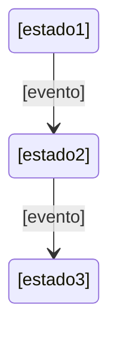

# 🔄 **Cortex para Projetos Legados**
**Adotando Desenvolvimento Orientado por Contexto para Bases de Código Existentes**

---

## 📋 Índice

- [Visão Geral](#-visão-geral)
- [Por que Adotar o Cortex para Projetos Legados?](#-por-que-adotar-o-cortex-para-projetos-legados)
- [Estratégia de Adoção](#-estratégia-de-adoção)
- [Fase 1: Fundação e Documentação](#-fase-1-fundação-e-documentação)
- [Fase 2: Arquitetura de Contexto](#-fase-2-arquitetura-de-contexto)
- [Fase 3: Integração de Processos](#-fase-3-integração-de-processos)
- [Fase 4: Adoção Completa](#-fase-4-adoção-completa)
- [Desafios Comuns e Soluções](#-desafios-comuns-e-soluções)
- [Melhores Práticas](#-melhores-práticas)
- [Métricas de Sucesso](#-métricas-de-sucesso)

---

## 🎯 Visão Geral

Este guia ajuda equipes a adotarem o Cortex para **projetos existentes que não foram construídos com assistência de IA**. A abordagem foca em adoção incremental, permitindo que equipes gradualmente integrem a metodologia orientada por contexto do Cortex sem interromper o desenvolvimento em andamento.

**Princípio Chave**: Comece com documentação, depois gradualmente integre processos e automação.

---

## 💡 Por que Adotar o Cortex para Projetos Legados?

### Benefícios para Bases de Código Legadas

✅ **Melhor Colaboração com IA**
- Assistentes de IA ganham contexto profundo sobre sua base de código existente
- Alucinações reduzidas e sugestões de código mais precisas
- Melhor compreensão de padrões e restrições legadas

✅ **Preservação de Conhecimento**
- Capturar conhecimento institucional antes que seja perdido
- Documentar decisões e padrões não documentados
- Criar material de onboarding para novos membros da equipe

✅ **Modernização Gradual**
- Identificar débito técnico sistematicamente
- Planejar melhorias arquiteturais com contexto completo
- Rastrear evolução através de Architecture Decision Records

✅ **Melhorias de Qualidade**
- Estabelecer portões de qualidade para novo desenvolvimento
- Garantir consistência entre código legado e novo
- Prevenir regressão e scope creep

✅ **Eficiência da Equipe**
- Onboarding mais rápido para novos desenvolvedores (humanos e IA)
- Tempo reduzido explicando contexto
- Melhor colaboração entre equipes

---

## 🗺️ Estratégia de Adoção

### Visão Geral das Fases

```
Fase 1: Fundação (1-2 semanas)
   ↓
Fase 2: Arquitetura de Contexto (2-3 semanas)
   ↓
Fase 3: Integração de Processos (2-4 semanas)
   ↓
Fase 4: Adoção Completa (Contínuo)
```

**Tempo Total para Adoção Básica**: 4-6 semanas
**Tempo Total para Integração Completa**: 2-3 meses

### Princípios Orientadores

1. **Adoção Incremental** - Não tente fazer tudo de uma vez
2. **Documentação Primeiro** - Contexto antes de automação
3. **Adesão da Equipe** - Envolver a equipe em cada etapa
4. **Valor Prático** - Foco em benefícios imediatos
5. **Iteração Contínua** - Melhorar baseado em feedback

---

## 📚 Fase 1: Fundação e Documentação
**Duração**: 1-2 semanas
**Objetivo**: Criar documentação de contexto básica sem interromper fluxos de trabalho atuais

### Passo 1.1: Configurar Framework Cortex

```bash
# 1. Clone ou copie Cortex para seu projeto
cd seu-projeto/
mkdir -p .windsurf/  # ou .cursor/ dependendo da sua IDE

# 2. Copie agentes e comandos do Cortex
cp -r caminho/para/cortex-v1/.windsurf/agents .windsurf/
cp -r caminho/para/cortex-v1/.windsurf/commands .windsurf/

# 3. Crie estrutura de documentação
mkdir -p docs/business-context
mkdir -p docs/technical-context
mkdir -p docs/master-docs
```

### Passo 1.2: Documentar Estado Atual (Contexto Técnico)

**Prioridade: ALTA** - Comece aqui para benefícios imediatos com IA

#### A. Criar Charter do Projeto
```bash
# Use o comando warm-up para começar
/warm-up "documentação de projeto legado"
```

Crie `docs/technical-context/project_charter.md`:

```markdown
# Charter do Projeto: [Nome do Seu Projeto]

## Declaração de Visão
[Por que este projeto existe? Que problema ele resolve?]

## Estado Atual
- **Idade**: Há quanto tempo este projeto está rodando?
- **Tamanho da Equipe**: Equipe de desenvolvimento atual
- **Stack Tecnológico**: Principais tecnologias usadas
- **Escala**: Usuários, transações, volume de dados, etc.

## Critérios de Sucesso
[Como você mede sucesso hoje?]

## Limites de Escopo
### No Escopo
- [Features e funcionalidades principais]
- [Plataformas/ambientes suportados]

### Fora do Escopo
- [Features explicitamente excluídas]
- [Limitações técnicas]

## Principais Stakeholders
- **Usuários**: [Quem usa este sistema?]
- **Mantenedores**: [Quem o mantém?]
- **Tomadores de Decisão**: [Quem aprova mudanças?]

## Restrições Técnicas
- **Requisitos de Performance**: [SLAs, requisitos de latência]
- **Conformidade**: [GDPR, HIPAA, SOC2, etc.]
- **Restrições Legadas**: [Sistemas antigos para integrar]
- **Restrições de Orçamento/Recursos**: [Tamanho da equipe, limites de infraestrutura]
```

#### B. Criar Guia da Base de Código

**Use IA para ajudar a gerar isso**:

```bash
# Peça à IA para analisar sua base de código
"Por favor analise a estrutura do projeto e crie um CODEBASE_GUIDE.md
seguindo o template de contexto técnico do Cortex. Foque em:
- Estrutura de diretórios e propósito de cada diretório
- Arquivos-chave e seus papéis
- Padrões de fluxo de dados
- Pontos de integração
- Arquitetura de deployment"
```

Crie `docs/technical-context/CODEBASE_GUIDE.md`:

```markdown
# Guia de Navegação da Base de Código

## Estrutura de Diretórios
```
/src
  /[nome-modulo]     # [Propósito deste módulo]
  /[nome-modulo]     # [Propósito deste módulo]
  ...
```

## Arquivos-Chave e Seus Papéis
- **`[arquivo-importante.ext]`**: [O que faz e por que é importante]
- **`[arquivo-config.ext]`**: [Configuração e setup de ambiente]

## Padrões de Fluxo de Dados
### [Fluxo de Dados Principal 1]
[Descreva como dados fluem pelo sistema]

### [Fluxo de Dados Principal 2]
[Outro fluxo importante]

## Pontos de Integração
- **[Sistema Externo 1]**: [Como e por que integramos]
- **[Sistema Externo 2]**: [Padrão de integração usado]

## Arquitetura de Deployment
[Descreva como a aplicação é deployada]
- Infraestrutura: [Provedor cloud, on-prem, etc.]
- Ambientes: [dev, staging, production]
- CI/CD: [Pipeline de build e deployment]

## Problemas Conhecidos e Gotchas
[Documente problemas comuns e workarounds]
```

#### C. Documentar Decisões Arquiteturais (ADRs)

Para cada decisão arquitetural importante no seu sistema legado:

Crie `docs/technical-context/adr/001-[nome-decisao].md`:

```markdown
# ADR-001: [Título da Decisão]
**Data**: [Quando foi decidido - aproximado se desconhecido]
**Status**: Aceito | Depreciado | Substituído
**Decisores**: [Quem fez esta decisão]

## Contexto
Qual foi a situação que levou a esta decisão?
- Restrições técnicas
- Requisitos de negócio
- Pressões de prazo

## Decisão
O que decidimos fazer?

## Justificativa
Por que escolhemos esta abordagem?
- Benefícios técnicos
- Benefícios de negócio
- Mitigação de riscos

## Consequências
### Positivas
- [Resultados bons desta decisão]

### Negativas
- [Débito técnico ou limitações criadas]
- [Trade-offs aceitos]

## Alternativas Consideradas
1. **[Alternativa 1]**: [Por que não escolhemos esta]
2. **[Alternativa 2]**: [Por que não escolhemos esta]

## Lições Aprendidas
[Com retrospectiva, o que sabemos agora?]
```

**Comece com as decisões mais importantes**:
1. Escolha de framework/linguagem
2. Escolha de banco de dados
3. Abordagem de autenticação/autorização
4. Padrão de design de API
5. Estratégia de deployment

#### D. Criar Guia de Desenvolvimento com IA

Crie `docs/technical-context/CLAUDE.meta.md`:

```markdown
# Guia de Desenvolvimento com IA - [Nome do Projeto]

## Preferências de Estilo de Código
### Convenções Específicas da Linguagem
- [Seus padrões de código]
- [Convenções de nomenclatura]
- [Padrões de organização de arquivos]

### Exemplos de Padrões
```[linguagem]
// Exemplo de padrão preferido
[exemplo de código]
```

## Abordagem de Testes
- **Framework**: [Jest, PyTest, etc.]
- **Localização de Testes**: [Onde os testes ficam]
- **Requisitos de Cobertura**: [Percentual mínimo de cobertura]
- **Dados de Teste**: [Como gerenciar dados de teste]

### Exemplo de Estrutura de Teste
```[linguagem]
[Exemplo de teste mostrando suas convenções]
```

## Padrões Comuns nesta Base de Código
### [Nome do Padrão 1]
**Propósito**: [O que este padrão resolve]
**Uso**: [Quando usá-lo]
**Exemplo**:
```[linguagem]
[Exemplo de código]
```

### [Nome do Padrão 2]
[Mesma estrutura]

## Gotchas e Anti-padrões
### ❌ Não Faça Isso
```[linguagem]
// Exemplo de padrão ruim
```
**Por quê**: [Explicação]

### ✅ Faça Isto Ao Invés
```[linguagem]
// Exemplo de padrão bom
```

## Considerações de Performance
- [Padrões de consulta ao banco de dados]
- [Estratégias de cache]
- [Gerenciamento de recursos]

## Requisitos de Segurança
- [Padrões de autenticação]
- [Verificações de autorização]
- [Validação de entrada]
- [Tratamento de dados sensíveis]

## Padrões de Integração
### [Sistema Externo 1]
- **Autenticação**: [Como autenticamos]
- **Tratamento de Erros**: [Como lidamos com falhas]
- **Rate Limiting**: [Considerações]

## Diretrizes de Código Legado
### Trabalhando com Código Legado
- **Antes de modificar**: [Passos a tomar]
- **Testes**: [Como garantir que você não quebrou nada]
- **Refatoração**: [Quando e como refatorar]

### Áreas Problemáticas Conhecidas
- **[Nome do Módulo/Arquivo]**: [Problemas conhecidos e workarounds]
```

### Passo 1.3: Capturar Contexto Empresarial (Opcional mas Recomendado)

Mesmo para projetos técnicos, contexto empresarial ajuda a IA a tomar melhores decisões.

#### Criar Documentação Empresarial Leve

```bash
/build-business-docs "analisar materiais de projeto existentes"
```

**No mínimo, crie**:

1. `docs/business-context/CUSTOMER_PERSONAS.md` - Quem usa este sistema?
2. `docs/business-context/PRODUCT_STRATEGY.md` - Por que ele existe?
3. `docs/business-context/FEATURE_CATALOG.md` - O que ele faz?

Veja [template de contexto empresarial](../cortex-v1/.windsurf/commands/master-docs-commands/common/templates/business_context_template.md) para detalhes.

### Passo 1.4: Criar Índice de Documentação

Crie `docs/technical-context/index.md`:

```markdown
# Contexto Técnico - [Nome do Projeto]

## Perfil de Contexto do Projeto
[Copiar de project_charter.md]

---

## Camada 1: Contexto Central do Projeto
- [Charter do Projeto](project_charter.md)
- [Architecture Decision Records](adr/)

## Camada 2: Arquivos de Contexto Otimizados para IA
- [Guia de Desenvolvimento com IA](CLAUDE.meta.md)
- [Guia de Navegação da Base de Código](CODEBASE_GUIDE.md)

## Camada 3: Contexto Específico de Domínio
- [Documentação de Lógica de Negócio](BUSINESS_LOGIC.md) *(se criado)*
- [Especificações de API](API_SPECIFICATION.md) *(se existe)*

## Camada 4: Contexto de Fluxo de Trabalho de Desenvolvimento
- [Guia de Contribuição](CONTRIBUTING.md) *(se existe)*
- [Guia de Solução de Problemas](TROUBLESHOOTING.md) *(se criado)*

---

## Desafios Arquiteturais
[Link para débito técnico conhecido e áreas de melhoria]

## Caminho de Evolução
[Melhorias arquiteturais futuras planejadas]
```

### ✅ Checklist de Conclusão da Fase 1

- [ ] Framework Cortex copiado para o projeto
- [ ] `project_charter.md` criado com estado atual
- [ ] `CODEBASE_GUIDE.md` documentando estrutura
- [ ] Pelo menos 3-5 ADRs para decisões importantes
- [ ] `CLAUDE.meta.md` com padrões de código e gotchas
- [ ] `index.md` linkando toda documentação
- [ ] Revisão e feedback da equipe sobre documentação
- [ ] Documentação está precisa e útil para IA

**Resultado Esperado**: Assistentes de IA agora podem entender o contexto da sua base de código e fornecer melhores sugestões.

---

## 🏗️ Fase 2: Arquitetura de Contexto
**Duração**: 2-3 semanas
**Objetivo**: Estabelecer master docs e portões de qualidade

### Passo 2.1: Criar Master Docs

Master Docs definem a "constituição" do seu projeto - regras não negociáveis.

#### Identificar Regras Não Negociáveis

Workshop com sua equipe para identificar:

1. **Princípios Arquiteturais**
   - Quais padrões DEVEM ser seguidos?
   - Quais padrões DEVEM ser evitados?
   - Quais são as restrições não negociáveis?

2. **Padrões de Qualidade de Código**
   - Cobertura mínima de testes
   - Requisitos de segurança
   - Requisitos de performance
   - Requisitos de revisão de código

3. **Requisitos de Documentação**
   - O que deve ser documentado?
   - Padrões de formato de documentação

#### Criar Master Docs

Crie `docs/master-docs/index.md`:

```markdown
# Master Docs - Constituição do Projeto

## Princípios Centrais
1. **[Princípio 1]**: [Descrição e justificativa]
2. **[Princípio 2]**: [Descrição e justificativa]
3. **[Princípio 3]**: [Descrição e justificativa]

## Regras Arquiteturais
### OBRIGATÓRIO (Sempre seguir)
- [ ] [Regra 1 com justificativa]
- [ ] [Regra 2 com justificativa]

### RECOMENDADO (Deve seguir a menos que exceção justificada)
- [ ] [Diretriz 1]
- [ ] [Diretriz 2]

### PROIBIDO (Nunca faça isso)
- [ ] [Anti-padrão 1 e por quê]
- [ ] [Anti-padrão 2 e por quê]

## Portões de Qualidade
### Antes de Todo PR
- [ ] Todos os testes passando
- [ ] Cobertura de código >= [X]%
- [ ] Sem vulnerabilidades de segurança
- [ ] Documentação atualizada
- [ ] ADR criado para mudanças arquiteturais

### Antes de Todo Release
- [ ] Benchmarks de performance atingidos
- [ ] Auditoria de segurança aprovada
- [ ] Documentação completa
- [ ] Changelog atualizado

## Processo de Exceção
Quando regras precisam ser quebradas:
1. Documentar por quê em ADR
2. Obter aprovação de [pessoa/equipe]
3. Criar ticket de débito técnico
4. Planejar remediação
```

Crie `docs/master-docs/architectural-principles.md`:

```markdown
# Princípios Arquiteturais

## Princípios Fundamentais

### 1. [Nome do Princípio]
**Descrição**: [O que é este princípio?]
**Justificativa**: [Por que seguimos isto?]
**Implicações**: [O que isso significa para desenvolvimento?]
**Exceções**: [Quando pode ser violado?]

### 2. [Próximo Princípio]
[Mesma estrutura]

## Restrições Técnicas

### Banco de Dados
- **Padrão**: [Como interagimos com banco de dados]
- **Por quê**: [Performance, consistência, etc.]
- **Exemplo**:
```[linguagem]
[Exemplo de código mostrando padrão correto]
```

### Design de API
- **Padrão**: [RESTful, GraphQL, etc.]
- **Por quê**: [Consistência, necessidades do cliente]
- **Padrões**: [OpenAPI, etc.]

### Tratamento de Erros
- **Padrão**: [Como tratamos erros]
- **Por quê**: [Observabilidade, experiência do usuário]
- **Exemplo**:
```[linguagem]
[Exemplo de código]
```

### Segurança
- **Autenticação**: [Padrão usado]
- **Autorização**: [Como controlamos acesso]
- **Proteção de Dados**: [Criptografia, sanitização]

## Integração com Sistema Legado

### Interagindo com Componentes Legados
**Diretrizes**:
1. [Diretriz 1]
2. [Diretriz 2]

**Anti-padrões**:
- ❌ [Não faça isso]
- ❌ [Não faça aquilo]

## Estratégia de Migração

### Novas Features
[Como novas features devem ser construídas]

### Refatorando Código Legado
[Quando e como refatorar]

### Gerenciamento de Débito Técnico
[Processo para gerenciar débito técnico]
```

### Passo 2.2: Documentar Débito Técnico Atual

Crie `docs/technical-context/ARCHITECTURE_CHALLENGES.md`:

```markdown
# Desafios Arquiteturais e Débito Técnico

## Débito Técnico Conhecido

### Alta Prioridade
1. **[Nome do Problema]**
   - **Impacto**: [Impacto empresarial/técnico]
   - **Esforço**: [Esforço estimado para corrigir]
   - **Risco**: [O que acontece se não corrigido]
   - **Plano**: [Como planejamos abordar]

### Média Prioridade
[Mesma estrutura]

### Baixa Prioridade
[Mesma estrutura]

## Restrições Legadas

### [Restrição 1]
- **Descrição**: [O que é a restrição?]
- **Impacto**: [Como nos limita?]
- **Mitigação**: [Como trabalhamos em torno dela]
- **Plano de Remoção**: [Se/quando podemos removê-la]

## Roadmap de Melhoria

### Curto Prazo (0-3 meses)
- [ ] [Melhoria 1]
- [ ] [Melhoria 2]

### Médio Prazo (3-12 meses)
- [ ] [Melhoria 3]
- [ ] [Melhoria 4]

### Longo Prazo (12+ meses)
- [ ] [Mudança arquitetural importante 1]
- [ ] [Mudança arquitetural importante 2]

## Áreas Requerendo Documentação
[Partes do sistema que precisam de melhores docs]

## Lacunas de Testes
[Áreas sem cobertura de testes]
```

### Passo 2.3: Criar Guia de Solução de Problemas

Crie `docs/technical-context/TROUBLESHOOTING.md`:

```markdown
# Guia de Solução de Problemas

## Problemas Comuns

### [Categoria de Problema 1]

#### Problema: [Nome do Problema]
**Sintomas**: [Como você sabe que isto está acontecendo]
**Causa**: [Por que isto acontece]
**Solução**:
```bash
[Passos para corrigir]
```
**Prevenção**: [Como evitar no futuro]

### [Categoria de Problema 2]
[Mesma estrutura]

## Estratégias de Debug

### [Nome do Componente/Módulo]
**Logging**: [Onde encontrar logs]
**Problemas Comuns**: [Problemas frequentes]
**Comandos de Debug**:
```bash
[Comandos úteis de debug]
```

## Problemas de Performance

### [Tipo de Problema de Performance]
**Sintomas**: [Como identificar]
**Passos de Investigação**:
1. [Passo 1]
2. [Passo 2]
**Causas Comuns**: [Causas raiz típicas]
**Soluções**: [Como corrigir]

## Problemas de Integração

### [Nome do Sistema Externo]
**Falhas Comuns**: [O que dá errado]
**Debug**: [Como debugar]
**Estratégia de Fallback**: [O que fazer quando falhar]

## Procedimentos de Recuperação

### [Cenário de Desastre]
**Passos para Recuperar**:
1. [Passo 1]
2. [Passo 2]
**Validação**: [Como confirmar recuperação]
**Pós-Incidente**: [O que fazer depois]
```

### ✅ Checklist de Conclusão da Fase 2

- [ ] Master Docs criados definindo regras do projeto
- [ ] Princípios arquiteturais documentados
- [ ] Débito técnico catalogado
- [ ] Guia de solução de problemas criado
- [ ] Alinhamento da equipe sobre master docs
- [ ] Agente `@master-docs-gate-keeper` testado

**Resultado Esperado**: Portões de qualidade estabelecidos, violações podem ser detectadas automaticamente.

---

## 🔄 Fase 3: Integração de Processos
**Duração**: 2-4 semanas
**Objetivo**: Integrar fluxos de trabalho Cortex para novo desenvolvimento

### Passo 3.1: Adotar Fluxo de Trabalho de Desenvolvimento de Features

#### Para Novas Features

Comece a usar o fluxo de desenvolvimento de features do Cortex:

```bash
# 1. Documentar a feature
/collect "descrição da nova feature"
/refine "refinar requisitos"

# 2. Planejar arquitetura
/start "nome-da-feature"
# - Cria context.md e architecture.md

# 3. Criar plano de execução
/plan "nome-da-feature"
# - Cria plan.md faseado

# 4. Desenvolver iterativamente
/work ".windsurf/sessions/nome-da-feature"
# - Executar fase por fase com validação

# 5. Portões de qualidade
/pre-pr
# - Valida contra master docs
# - Revisão de código
# - Cobertura de testes

# 6. Entregar
/pr
# - Criar pull request
```

#### Para Correções de Bugs

Versão leve:

```bash
# 1. Documentar o bug
/collect "descrição do bug"

# 2. Investigar e corrigir
# Usar contexto de código existente
# Seguir princípios dos master docs

# 3. Validar
/pre-pr
# Verificar alinhamento com master docs

# 4. Entregar
/pr
```

### Passo 3.2: Estabelecer Processo de PR

Atualize seu template de PR para incluir validação Cortex:

```markdown
## Checklist de PR

### Conformidade Cortex
- [ ] Segue princípios dos master docs
- [ ] ADR criado para mudanças arquiteturais
- [ ] Documentação atualizada
- [ ] Testes adicionados/atualizados

### Qualidade de Código
- [ ] Todos os testes passando
- [ ] Cobertura de código mantida/melhorada
- [ ] Sem novas vulnerabilidades de segurança
- [ ] Impacto de performance avaliado

### Documentação
- [ ] CODEBASE_GUIDE atualizado (se estrutura mudou)
- [ ] API_SPECIFICATION atualizado (se API mudou)
- [ ] TROUBLESHOOTING atualizado (se novos problemas/soluções)
- [ ] Changelog atualizado

### Validação Master Docs
- [ ] Executou comando `/pre-pr`
- [ ] Aprovação do `@master-docs-gate-keeper`
- [ ] Todas violações tratadas ou justificadas
```

### Passo 3.3: Treinamento da Equipe

#### Sessões de Treinamento

1. **Sessão 1: Visão Geral do Cortex** (1 hora)
   - O que é o Cortex?
   - Por que estamos adotando?
   - O que muda para desenvolvedores?

2. **Sessão 2: Documentação** (1 hora)
   - Como usar documentação existente
   - Como atualizar documentação
   - Padrões de documentação

3. **Sessão 3: Fluxos de Trabalho** (1 hora)
   - Fluxo de desenvolvimento de features
   - Usando comandos slash
   - Trabalhando com agentes

4. **Sessão 4: Master Docs** (1 hora)
   - Entendendo master docs
   - Portões de qualidade
   - Processo de exceção

#### Criar Guia da Equipe

Crie `docs/TEAM_GUIDE.md`:

```markdown
# Início Rápido Cortex para Equipe

## Fluxo de Trabalho Diário

### Iniciando Trabalho
```bash
/warm-up "nome-da-tarefa"
```

### Desenvolvendo Features
```bash
/start "nome-da-feature"
/plan "nome-da-feature"
/work ".windsurf/sessions/nome-da-feature"
```

### Antes do PR
```bash
/pre-pr
```

### Criando PR
```bash
/pr
```

## Usando Documentação

### Encontrando Informação
- **Perguntas sobre arquitetura**: Veja `docs/technical-context/CODEBASE_GUIDE.md`
- **Padrões de código**: Veja `docs/technical-context/CLAUDE.meta.md`
- **Por que decisões foram feitas**: Veja `docs/technical-context/adr/`
- **Problemas comuns**: Veja `docs/technical-context/TROUBLESHOOTING.md`

### Atualizando Documentação
Quando você fizer mudanças, atualize:
- [ ] Arquivos de documentação relevantes
- [ ] ADRs se mudanças arquiteturais
- [ ] Troubleshooting se você resolveu novos problemas

## Master Docs

### O que são Master Docs?
[Breve explicação]

### Regras Chave
1. [Regra mais importante]
2. [Segunda regra mais importante]
3. [Terceira regra mais importante]

### Em Caso de Dúvida
Pergunte à equipe ou veja `docs/master-docs/index.md`

## Obtendo Ajuda

### Da IA
Use `/warm-up` para dar contexto à IA sobre sua tarefa

### Da Equipe
[Canais de comunicação da equipe]

### Da Documentação
[Onde encontrar o quê]
```

### ✅ Checklist de Conclusão da Fase 3

- [ ] Fluxo de trabalho de desenvolvimento de features documentado
- [ ] Processo de PR atualizado com verificações Cortex
- [ ] Equipe treinada em fluxos de trabalho
- [ ] Guia da equipe criado
- [ ] Pelo menos 2-3 features desenvolvidas usando fluxo Cortex
- [ ] Feedback coletado e incorporado

**Resultado Esperado**: Equipe está usando fluxos de trabalho Cortex para novo desenvolvimento.

---

## 🚀 Fase 4: Adoção Completa
**Duração**: Contínuo
**Objetivo**: Melhoria contínua e integração completa

### Passo 4.1: Expandir Cobertura de Documentação

#### Documentação de API

Se você tem APIs, crie `docs/technical-context/API_SPECIFICATION.md`:

```markdown
# Especificação de API

## Visão Geral
- **URL Base**: [URL de produção]
- **Autenticação**: [Como autenticar]
- **Rate Limiting**: [Limites de taxa]
- **Versionamento**: [Como APIs são versionadas]

## Endpoints

### [Grupo de Endpoints]

#### `[MÉTODO] /caminho/para/endpoint`
**Propósito**: [O que este endpoint faz]

**Autenticação**: [Nível de auth requerido]

**Request**:
```json
{
  "campo": "tipo"
}
```

**Response**:
```json
{
  "campo": "tipo"
}
```

**Erros**:
- `400`: [Cenários de bad request]
- `401`: [Cenários de não autorizado]
- `500`: [Cenários de erro do servidor]

**Exemplo**:
```bash
curl -X [MÉTODO] \
  [URL] \
  -H "Authorization: Bearer [token]" \
  -d '[payload]'
```

## Modelos de Dados
[Documente seus schemas de dados]

## Tratamento de Erros
[Formato e códigos de erro padrão]

## Estratégia de Versionamento
[Como você lida com versões de API]

## Processo de Depreciação
[Como você deprecia APIs]
```

#### Documentação de Lógica de Negócio

Para domínios complexos, crie `docs/technical-context/BUSINESS_LOGIC.md`:

```markdown
# Documentação de Lógica de Negócio

## Conceitos de Domínio

### [Conceito 1]
**Definição**: [O que é este conceito?]
**Atributos**: [Atributos-chave]
**Relacionamentos**: [Como se relaciona com outros conceitos]
**Regras de Negócio**: [Regras governando este conceito]

## Regras de Negócio

### [Categoria de Regra]

#### Regra: [Nome da Regra]
**Descrição**: [O que é esta regra?]
**Justificativa**: [Por que temos esta regra?]
**Implementação**: [Como é aplicada no código?]
**Casos Extremos**: [Cenários especiais]

**Exemplo**:
```[linguagem]
// Código mostrando implementação da regra
```

## Fluxos de Trabalho

### [Nome do Fluxo]
**Gatilho**: [O que inicia este fluxo?]
**Passos**:
1. [Passo 1]
2. [Passo 2]
**Sucesso**: [O que indica sucesso?]
**Falha**: [Cenários de falha e tratamento]

## Cálculos

### [Nome do Cálculo]
**Propósito**: [O que isto calcula?]
**Fórmula**: [Fórmula matemática ou pseudocódigo]
**Entradas**: [Entradas requeridas]
**Saídas**: [O que é produzido]
**Casos Extremos**: [Cenários especiais]

## Máquinas de Estado

### Máquina de Estado de [Entidade]
**Estados**: [Lista de estados possíveis]
**Transições**: [Como entidade se move entre estados]
**Regras de Negócio**: [Regras governando transições]


```

### Passo 4.2: Melhoria Contínua

#### Processo de Revisão Mensal

1. **Revisão de Documentação** (1 hora/mês)
   - A documentação ainda está precisa?
   - O que está faltando?
   - O que está desatualizado?

2. **Revisão de Master Docs** (1 hora/trimestre)
   - As regras ainda são relevantes?
   - Novas regras necessárias?
   - Regras depreciadas?

3. **Revisão de Processo** (1 hora/trimestre)
   - O fluxo de trabalho Cortex está ajudando?
   - Quais pontos de fricção?
   - Como melhorar?

#### Métricas para Rastrear

```markdown
## Métricas de Adoção do Cortex

### Saúde da Documentação
- Cobertura de documentação: [X]% da base de código documentada
- Precisão da documentação: [X]% precisa (baseado em feedback da equipe)
- ADRs criados: [X] este trimestre

### Adoção de Processo
- Features usando fluxo Cortex: [X]%
- PRs com validação master docs: [X]%
- Tempo médio para onboarding de novos desenvolvedores: [X] dias

### Impacto de Qualidade
- Bugs em código novo: [tendência]
- Taxa de rejeição de PR: [tendência]
- Tempo para revisar PRs: [tendência]
- Cobertura de testes: [tendência]

### Satisfação da Equipe
- Equipe achando documentação útil: [X]%
- Avaliação de qualidade de assistência IA: [X]/10
- Satisfação com fluxo de trabalho Cortex: [X]/10
```

### Passo 4.3: Refatorando Código Legado

Conforme você toca código legado, gradualmente melhore-o:

#### Checklist de Refatoração

Ao modificar código legado:
- [ ] Adicionar testes se ausentes
- [ ] Documentar em CLAUDE.meta.md se padrão não está claro
- [ ] Criar ADR se mudando arquitetura
- [ ] Atualizar TROUBLESHOOTING se você corrigiu problemas não documentados
- [ ] Adicionar comentários explicando lógica não óbvia
- [ ] Considerar criar BUSINESS_LOGIC.md se domínio é complexo

#### Estratégia de Refatoração

```markdown
## Estratégia de Refatoração de Código Legado

### Abordagem: Melhoria Gradual
Não reescreva, gradualmente melhore conforme você toca o código.

### Áreas Prioritárias
1. [Área mais crítica/frequentemente modificada]
2. [Segunda prioridade]
3. [Terceira prioridade]

### Diretrizes de Refatoração
1. **Adicionar testes primeiro** - Sem refatoração sem testes
2. **Mudanças pequenas** - Melhorias incrementais
3. **Documentar decisões** - Criar ADRs para mudanças significativas
4. **Manter compatibilidade retroativa** - A menos que explicitamente quebrando
5. **Atualizar documentação** - Manter docs sincronizados

### Quando Refatorar
- [ ] Ao adicionar feature em área legada
- [ ] Ao corrigir bug em área legada
- [ ] Quando problemas de performance são identificados
- [ ] Quando problemas de segurança são encontrados

### Quando NÃO Refatorar
- [ ] Só porque código é feio
- [ ] Sem testes
- [ ] Sob pressão de tempo
- [ ] Em código que você não entende
```

### ✅ Checklist de Conclusão da Fase 4

- [ ] Todas áreas críticas documentadas
- [ ] Processo de melhoria contínua estabelecido
- [ ] Métricas sendo rastreadas
- [ ] Equipe confortável com fluxos de trabalho
- [ ] Código legado gradualmente melhorando
- [ ] Novas features seguem padrões Cortex

**Resultado Esperado**: Cortex está totalmente integrado, qualidade do projeto melhorando, colaboração com IA excelente.

---

## ⚠️ Desafios Comuns e Soluções

### Desafio 1: "Documentação toma muito tempo"

**Solução**:
- Comece com documentação de alto valor (CLAUDE.meta.md, CODEBASE_GUIDE.md)
- Documente conforme você vai, não tudo de uma vez
- Use IA para ajudar a gerar rascunhos iniciais
- Priorize precisão sobre completude
- 15 minutos de documentação economizam horas de confusão

### Desafio 2: "Resistência da equipe a novos processos"

**Solução**:
- Mostre valor imediato (melhor assistência de IA)
- Comece com adoção voluntária
- Celebre vitórias iniciais
- Aborde pontos de fricção rapidamente
- Obtenha input da equipe sobre processos
- Lidere pelo exemplo

### Desafio 3: "Documentação fica dessincronizada"

**Solução**:
- Faça documentação parte dos requisitos de PR
- Revise documentação em code reviews
- Use master docs para aplicar documentação
- Mantenha documentação perto do código
- Automatize o que pode ser automatizado
- Sessões regulares de revisão de documentação

### Desafio 4: "Muito código legado para documentar"

**Solução**:
- Não documente tudo antecipadamente
- Documente conforme você toca o código
- Priorize áreas frequentemente modificadas
- Use a regra 80/20 (20% do código recebe 80% das mudanças)
- Foque em áreas de alto risco/alto valor

### Desafio 5: "Master docs muito restritivos"

**Solução**:
- Comece com regras mínimas, adicione conforme necessário
- Tenha processo de exceção
- Revise e atualize regularmente
- Balance consistência com flexibilidade
- Foque em "deve ter" não "seria legal ter"

### Desafio 6: "IA ainda não entende nosso código"

**Solução**:
- Melhore CLAUDE.meta.md com mais exemplos
- Documente o "por quê" não só o "o quê"
- Adicione mais contexto em pastas de sessão
- Use `/warm-up` para preparar IA para tarefas específicas
- Forneça loop de feedback (o que IA errou, por quê)

### Desafio 7: "Não está claro o que documentar"

**Solução**:
- Pergunte: "O que novos desenvolvedores sempre perguntam?"
- Pergunte: "O que causa bugs ou confusão?"
- Pergunte: "O que a IA precisaria saber?"
- Pergunte: "O que decidimos e por quê?"
- Foque em coisas não óbvias

### Desafio 8: "Processo parece burocrático"

**Solução**:
- Simplifique para mudanças pequenas
- Processo completo apenas para mudanças significativas
- Automatize o que pode ser automatizado
- Revise e simplifique regularmente
- Faça parecer suporte, não overhead

---

## ✅ Melhores Práticas

### Documentação

1. **Escreva para IA e Humanos** - Ambas audiências importam
2. **Inclua Exemplos** - Exemplos de código valem 1000 palavras
3. **Explique o Por Quê** - Contexto importa mais que detalhes
4. **Mantenha Atualizado** - Docs desatualizados são piores que sem docs
5. **Torne Pesquisável** - Cabeçalhos claros, boa estrutura

### Processo

1. **Comece Pequeno** - Não ferva o oceano
2. **Itere** - Melhore baseado em feedback
3. **Seja Pragmático** - Perfeito é inimigo do bom
4. **Meça Impacto** - Rastreie o que importa
5. **Celebre Vitórias** - Mostre valor para equipe

### Master Docs

1. **Regras Mínimas** - Apenas não negociáveis
2. **Justificativa Clara** - Explique por que cada regra existe
3. **Fácil de Seguir** - Torne conformidade fácil
4. **Revisão Regular** - Mantenha regras relevantes
5. **Processo de Exceção** - Tenha válvula de escape

### Adoção da Equipe

1. **Envolva a Equipe** - Obtenha input cedo
2. **Mostre Valor** - Demonstre benefícios
3. **Forneça Treinamento** - Não assuma compreensão
4. **Aborde Preocupações** - Ouça e adapte
5. **Lidere pelo Exemplo** - Gestão deve participar

---

## 📊 Métricas de Sucesso

### Curto Prazo (1-3 meses)

**Métricas de Documentação**:
- [ ] Documentação central criada (Charter, Codebase Guide, CLAUDE.meta.md)
- [ ] 5+ ADRs documentando decisões-chave
- [ ] Master docs estabelecidos e equipe alinhada

**Métricas de Adoção**:
- [ ] Equipe treinada em fluxos de trabalho Cortex
- [ ] 50%+ de novas features usando fluxo Cortex
- [ ] Processo de PR atualizado com portões de qualidade

**Métricas de Qualidade**:
- [ ] Qualidade de assistência IA melhorada (feedback da equipe)
- [ ] Tempo de onboarding para novos devs reduzido
- [ ] Documentação usada em code reviews

### Médio Prazo (3-6 meses)

**Métricas de Documentação**:
- [ ] 80%+ de áreas da base de código documentadas
- [ ] Guia de troubleshooting abrangente
- [ ] Documentação de API completa (se aplicável)
- [ ] Lógica de negócio documentada (se domínio complexo)

**Métricas de Adoção**:
- [ ] 80%+ de desenvolvimento usando fluxos Cortex
- [ ] Master docs aplicados em todos PRs
- [ ] Equipe confortável com todos comandos

**Métricas de Qualidade**:
- [ ] Redução mensurável em bugs
- [ ] Ciclos de revisão de PR mais rápidos
- [ ] Cobertura de testes melhorada
- [ ] Tempo reduzido para resolver problemas

### Longo Prazo (6-12 meses)

**Métricas de Documentação**:
- [ ] Documentação abrangente e precisa
- [ ] Processo regular de revisão estabelecido
- [ ] Documentação atualizada automaticamente onde possível

**Métricas de Adoção**:
- [ ] Adoção completa do Cortex pela equipe
- [ ] Agentes customizados criados para necessidades do projeto
- [ ] Processo continuamente melhorando baseado em feedback

**Métricas de Qualidade**:
- [ ] Débito técnico diminuindo
- [ ] Código legado gradualmente modernizado
- [ ] Redução significativa de tempo de onboarding
- [ ] Alta satisfação da equipe com Cortex

**Impacto no Negócio**:
- [ ] Entrega de features mais rápida
- [ ] Maior qualidade de código
- [ ] Melhores decisões arquiteturais
- [ ] Produtividade da equipe melhorada

---

## 🎯 Resumo

Adotar o Cortex para projetos legados é uma jornada, não um destino. Foque em:

1. **Comece com Documentação** - Crie contexto primeiro
2. **Estabeleça Padrões** - Defina master docs
3. **Integre Processos** - Adote fluxos de trabalho gradualmente
4. **Melhoria Contínua** - Continue evoluindo

**Fatores Chave de Sucesso**:
- Adesão e participação da equipe
- Abordagem pragmática (não perfeição)
- Foco em valor sobre cerimônia
- Feedback e iteração regulares
- Paciência e persistência

**Lembre-se**: O objetivo não é documentação perfeita ou processos rígidos. O objetivo é **habilitar melhor colaboração com IA, preservar conhecimento e melhorar qualidade de código** - tudo enquanto entrega valor aos usuários.

---

## 📚 Recursos

- [Documentação Principal do Cortex](CORTEX.md)
- [Template de Contexto Empresarial](../.windsurf/commands/master-docs-commands/common/templates/business_context_template.md)
- [Template de Contexto Técnico](../.windsurf/commands/master-docs-commands/common/templates/technical_context_template.md)
- [Referência de Agentes](../.windsurf/agents/)
- [Referência de Comandos](../.windsurf/commands/)

---

**Pronto para começar?** Inicie com Fase 1, Passo 1.1: Configurar Framework Cortex.

**Dúvidas?** Revise este guia ou entre em contato com a comunidade Cortex.

**Boa sorte transformando seu projeto legado!** 🚀
